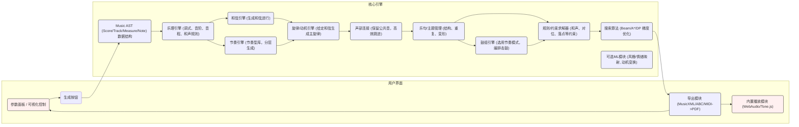

# 执行摘要

本方案针对可参数化、可视化控制的多声部自动作曲引擎设计，采用**规则+搜索(约束求解)**为核心方法，同时结合必要的机器学习模型进行辅助。核心思路是构建一个统一的音乐表示（Music AST）和规则引擎，在此基础上依次生成和弦进行、节奏、旋律动机与主题句，并通过约束评分函数和搜索算法（如束搜索、动态规划）实现全局优化。我们详细比较了**规则引擎+约束搜索**、**马尔可夫/概率语法**、**深度学习模型（Transformer/VAE/扩散）**等方法的适用场景、优缺点和可控性，并选择了规则驱动为主的混合方案。系统架构由**音乐AST、乐理引擎、和声引擎、节奏引擎、旋律/动机引擎、声部连接、乐句/主题管理、鼓组引擎、规则求解器、搜索算法、可选ML模块、导出/播放模块**等组件组成（见架构图）。算法设计涵盖数据结构（如Score、Track、Measure等）、状态表示、候选生成和评分（规则条件示例、Penalty机制）、多主题过渡（主题库、相似度量、桥段生成）以及鼓组和对位规则等细节。我们给出了参数映射表，将用户参数（和弦复杂度、情绪标签、调式、音域范围、节奏细度、复杂度、动机长度、主题数、对位强度、鼓密度等）映射为算法内部权重和概率。数据资源方面，推荐使用**公开乐谱集（如Lakh MIDI、MAESTRO、巴赫四声部合唱曲集）、Music21库、ABC曲库、Groove鼓组数据集（13.6小时鼓表演）**等作为训练和测试基础。实现上采用**Tauri + React**：Rust核心引擎负责作曲逻辑，可编译为本地或WebAssembly，前端提供参数面板与实时预览，导出模块实现MusicXML/ABC/MIDI文件生成并通过Verovio或MuseScore渲染PDF，播放模块采用浏览器MIDI合成。性能方面支持并行生成和缓存主题库，确保在资源可用的设备上可行。最后制定生成质量评估方案，包括客观指标（调性一致性、动机重复率等）和主观听感测试，并设计若干示例风格（如欢快流行、忧郁古典、节奏感强的电子等），给出对应的MIDI/ABC片段示例与动机发展示意图。

## 1. 算法评估（对比算法类别）

我们比较了四大类自动作曲方法：**规则引擎+搜索/约束**、**概率模型（马尔可夫/PCFG）**、**深度学习（Transformer/VAE/扩散）**和**混合架构**。下表列出各自的适用场景、优缺点、可控参数映射、实现难度、数据需求和推理性能。

| 算法类别                   | 适用场景/特点                                       | 优点                                                 | 缺点                                                           | 可控参数映射                                                  | 难度/数据/训练                | 推理性能                              |
|----------------------------|----------------------------------------------------|------------------------------------------------------|----------------------------------------------------------------|---------------------------------------------------------------|-------------------------------|---------------------------------------|
| **规则引擎 + 搜索/约束**    | 经典和声/对位风格（巴洛克、古典、流行即兴等），需强约束时 | * 可嵌入丰富乐理知识（调式、声部连接、对位规则等）*<br>* 高度可控、解释性强*<br>* 无需大规模数据训练，直接编码音乐规则* | * 规则设计复杂且繁重*<br>* 易出现局部最优或生成僵化*<br>* 搜索空间大时性能瓶颈（需剪枝、启发式） | * 和弦复杂度→约束宽松度（如允许扩展和弦的种类）*<br>* 动机长度→搜索深度或重复模式*<br>* 节奏细度→允许的音符最小时值*<br>* 对位强度→平行五八度惩罚权重*等 | 实现难度高（需设计全面规则、约束求解器）<br>训练：无需（显式知识库）    | 中等（基于约束求解，可能需要搜索，可并行／分步搜索提升） |
| **马尔可夫/PCFG 等概率模型** | 单声部旋律、和弦进程建模；风格模仿                   | * 实现简单、采样快速*<br>* 风格迁移易通过训练语料驱动*<br>* 参数可通过温度、平滑调整风格* | * 只捕捉短期统计依赖*<br>* 难以保证长句或曲式结构*<br>* 容易过拟合（高阶模型）或生成无聊（低阶）* | * 和弦复杂度→训练语料中复杂和弦比例*<br>* 情绪→通过选择相关风格语料或状态标记*<br>* 音域范围→状态空间限制*<br>* 节奏/密度→事件概率控制（高温度生成更多休止或变化）* | 难度低：统计学习，所需数据量适中（根据风格语料）<br>训练：需收集标注MIDI/乐谱（如爵士、流行语料库） | 很快（从概率表中采样，无需复杂推理）        |
| **深度学习模型**<br>(Transformer、VAE、扩散等) | 大规模符号域多声部生成；复杂风格、多风格融合      | * 可学习复杂长距离关系，生成质量高*<br>* 支持大规模多风格训练，风格迁移/提示生成*<br>* 自回归Transformer具有强序列表达能力，VAE可做变体探索* | * 受训练数据限制（需大量MIDI/乐谱）*<br>* 难以直接精确控制（结构、规则需靠隐式学习）*<br>* 黑盒特性，可解释性差*<br>* 训练资源和时间成本高 | * 情绪/风格→条件输入或标签（如情感向量）*<br>* 和弦复杂度→可在输入中注入和弦序列/张力标签*<br>* 音域→输出制约或在损失中惩罚超界*<br>* 节奏细度→量化步长配置*<br>* 动机长度→生成序列长度或重复模式嵌入* | 难度极高：需设计模型、训练算法和大规模数据<br>训练：大量MIDI/乐谱（Lakh MIDI、MAESTRO、ABC库等）与GPU训练 | 较慢：模型庞大时推理耗时（可裁剪Beam，但依然高于规则） |
| **混合架构**              | 融合符号规则与学习，兼顾可控与质量；长程结构需求    | * 结合规则的可控性和学习的多样性*<br>* 例如：Markov+约束、Transformer+规则后处理等*<br>* 可以逐层生成（先框架再细节） | * 设计复杂，需要协调子系统*<br>* 实现/维护成本高*<br>* 风格贴合度可能下降（多个模型同步难）* | * 同时继承规则和模型的控制参数映射*<br>* 如:风格先由ML模型确定，再由规则细化结束* | 难度非常高：需同时掌握符号与深度算法<br>训练：需要对应各部分所需数据（如主题模板、Markov表等） | 性能依赖于具体混合方式（例如使用搜索可增加耗时） |

从上表可见：**规则+搜索**方法最大程度保证了可控性和音乐理论正确性，但需要精心设计和调试；**马尔可夫/PCFG**简单高效，适合快速生成基础伴奏或旋律，但无法体现复杂情感或主题发展；**深度学习**能生成丰富多样的音乐，但可控性差、资源消耗高。综合权衡后，本系统选用**规则驱动的混合架构**：以**规则引擎+约束搜索**为核心，实现主体结构和约束，再视需要用轻量ML模块（如情感映射、motif变换）辅助，兼顾生成质量和参数可控性。

## 2. 具体方案设计

### 2.1 软件架构

整个系统采用模块化架构：前端（Tauri+React）提供参数面板及实时预览，后端核心由Rust实现并嵌入为Tauri插件或WASM模块。主要模块职责如下（见下方Mermaid架构图）：



- **Music AST**：统一的音乐表示，用于存储生成过程中的乐谱结构（包含Score、Track、Measure、Chord、Note等对象）。基于Music21等思想设计自定义AST，便于多格式导出。
- **乐理引擎**：维护调式、音阶、级数、和弦公式等基础知识。根据用户参数（调式、情绪）设置基调和音阶。
- **和弦引擎**：生成和弦进行序列（例如I–IV–V–I或爵士ii–V–I），可用基于概率/模板的方式，也可用规则搜索确定进程。支持复杂度参数（增加属七和弦概率、和弦替代等）。
- **节奏引擎**：维护节奏模式库（按照风格分类，如流行、摇滚、爵士、Bossa等），用户节拍、密度等参数决定所选模式。多层次生成：首先规划整体节奏轮廓，再细化到具体音符时值。
- **旋律/动机引擎**：根据当前和弦生成旋律音符。首先确定和弦音阶内音的概率分布（例如当前Am和弦主要在A、C、E上），其次按规则插入经过音、倚音等非和弦音。每次生成候选后通过**规则评分函数**打分（参考下文）。
- **声部连接引擎**：在和弦转换时最小化声部跳跃，实现基本对位。遵循原则：保持公共音不动，优先走向相近音。
- **乐句/主题管理**：生成动机并发展为乐句，支持多主题和段落结构。例如先生成主题A，变形为A′，中间插入过渡主题B，再回到主题A。系统维护主题库与相似度度量，控制主题出现顺序和过渡桥段。
- **鼓组引擎**：根据全曲结构（乐句边界、高潮段）选择并插入鼓组模式。鼓点使用标准MIDI通道（通道10），模型从鼓组数据集（如Groove MIDI）抽取模式，随机变奏（添加刮奏、切分）。
- **规则/约束求解器**：核心决策模块，将多种音乐规则（和声连贯、对位规范、范围限制、动机重复等）形式化为约束或打分项。采用分数或惩罚机制评估候选。
- **搜索算法**：利用束搜索（Beam Search）、A*或动态规划等在候选空间中搜索最优路径。例如在每小节按节拍步进，用束搜索生成若干备选旋律片段，按规则得分保留高分拓展。可指定束宽、启发式评分（如强调旋律起止或特定音）。
- **可选ML模块**：如情绪映射网络（将情绪标签映射到和弦走向权重）、动机Transformer（学习已有主题的变形方式）、鼓模仿模型等，用于风格化和动机变换，加快设计。
- **导出/播放模块**：生成MusicXML、ABC、MIDI文件。MusicXML可作为主格式，并可通过[MusicXML标准文档]获取支持。通过Verovio (WASM) 或 MuseScore CLI 将MusicXML渲染为PDF。前端使用Web MIDI/Audio（如Tone.js）播放MIDI或动态渲染ABC（可用abcjs）。

### 2.2 详细算法设计

#### 数据结构与状态表示

核心使用**音乐抽象语法树（AST）**表示片段，结构类似：  

```
Score
├─ Tempo
├─ KeySignature
├─ TimeSignature
└─ Track (不同声部，如主旋律、伴奏、鼓)
     ├─ Measure 1
     │    ├─ Chord（标记和弦符号）
     │    ├─ Note/Rest (旋律音符或休止)
     │    └─ Attributes (力度、连音等)
     ├─ Measure 2
     └─ ...
```

每个Measure还记录击拍线信息，确保节奏对齐。和弦引擎先填充各小节的Chord节点，后续生成旋律时参考。鼓组Track独立维护，不纳入高音乐句逻辑。

状态表示：搜索状态可定义为“已生成的节拍数＋当前和弦上下文＋最后音高等信息”，加上已选主题/动机索引。搜索算法维护一系列部分生成的候选乐谱（Score片段）与对应得分。

#### 生成候选与评分函数

**候选生成：** 每步生成时机（通常按小节或节拍）生成一组可能的音符方案。例如，在和弦Am下，可能的下一个音有[A, C, E]（和弦音）以及邻音如B或G（通过音）。可按下表示例生成：

- 和弦音（Chord Tone）70%概率，如A、C、E。
- 倚音（Neighbor）15%，如B或G。
- 经过音（Passing Tone）10%，如B穿插于A→C之间。
- 辅助音（Appoggiatura/Ornament）5%，如短时跳进音。

对于每个候选音符，还需考虑**连跳限制**：连续大跳（如增四度以上）不应频繁出现。如果跳进超过六度，则下一音必须逐级回步，以避免旋律不连贯。

**规则评分函数：** 为候选音符或旋律片段分配分数。举例：  

- **符合和弦/音阶加分**：落在当前和弦音得+X分（鼓励和弦色彩）；若为非和弦音（通过音等）则罚分，或仅得少分。  
- **连贯性约束**：**声部连接**：若前后两音构成平行五度/八度，则大幅罚分，否则保持同音或小步移动加分。  
- **节奏格律**：重音或小节首音掉落非休止加分；非强拍插入休止或切分音可根据节奏细度参数调节分数。  
- **动机重复/变形**：相同动机再现得分高，不重复或完全随机得分低；参数控制主题重复频率。  
- **终止/重合**：乐句结束时遵循终止式（和弦Ⅴ→I）加分，避免弱收尾；避免在不适合节拍点收尾亦罚分。  

例如，评分可形式化为多项式：  
```
Score = w_chord*I(chordTone) + w_step*I(stepwise) - w_leap*I(largeLeap) + w_repeat*I(usesMotif) - w_parallel*I(parallel5/8) + ... 
```
其中I(…)为指示函数（条件满足为1，否则0），各w为权重，根据用户参数（复杂度、对位强度）可调节。通过归一化转换为概率，在Beam Search中选择高分分支。

#### 约束与惩罚

集合常用约束/惩罚项：  
- **范围限制**：每声部音高不得超出设定音域（用户可调）。  
- **跳进限制**：如前述最大跳（平行避免），跳进后需有补偿动作为约束。  
- **对位规则**：避免平行五度/八度；尽量保留前一和弦公共音；避免声部间音程跳跃过大。  
- **节奏约束**：小节末避开未解决切分；鼓组节拍需匹配基本节拍。  
- **和声约束**：和弦进行符号必须满足基础和声学（例如V后多见I、vi等）。  
- **结构约束**：如生成段落时必须出现指定主题，或每N小节有转调/高潮。  

违背软规则则施加罚分。硬约束（如绝对禁止平行五度）可在搜索时直接剪枝。

#### 搜索策略

使用**Beam Search**或**A***算法遍历生成树。Beam Search：维护固定大小的候选（beam width），每一步（每个节拍或小节）扩展至下一级，计算总分，保留最高的若干分支继续。启发式策略可包括：优先保持主题统一、避免无意义长休止等。

A*搜索：将最终评估函数（包括当前分数+未来潜在分）用于优先队列选择扩展。动态规划（DP）：在确定结构阶段，先生成总体和弦与节奏布局（使其最优），再依此填旋律以减小复杂度。

#### 多主题自然过渡

系统支持**多个主题动机**。具体做法：  
1. **主题库**：预先或在线生成几个不同的动机（长度参数可调，如1–4小节）。每个主题存储其特征（首尾音、音程轮廓）。  
2. **主题选择与分段**：按照歌曲结构，定义段落顺序（例如A–B–A′–C–A形式）。在生成每段时选择对应主题。  
3. **渐进变形**：新主题进入时，通过旋律动机转换（例如倒影、逆行、扩展音程、节奏变化）平滑衔接。例如A主题以G音结束，下一A′以该G音升高或反向继续。  
4. **桥段（过渡）生成**：在两个主题之间插入桥段，比如用和声序列或鼓填充作为过渡。可用桥段生成器：生成短小节拍序列（可能和弦进行简洁）连结两主题的调性/节奏。  
5. **调性过度**：如主题变换涉及转调，可在过渡段使用共同和弦或下属和弦（IV→V）实现调性联系。鼓组渐变（如由B段到C段鼓点复杂度增加）。  

通过以上处理，多个主题间可自然衔接而不突兀。动态调整主题间的相似度（例如相同节奏轮廓）保证连贯。

#### 鼓组生成

鼓声部视为独立轨。实现时维护**鼓模式库**（参考Google的Groove MIDI Dataset等真实演奏样本，分类为不同风格）。鼓生成流程：  
- 根据整体结构（段落切分）和**鼓密度参数**确定在哪些小节插入鼓（通常按4拍/2拍等）。  
- 在需要鼓的位置，随机选取或生成模式：例如强拍踩镲（closed hi-hat）固定，次要拍打小鼓(snare)、军鼓填充。  
- 鼓模式可通过**模板**或**训练模型**来获取，如选用预定义的“摇滚4拍”、“电子分解节奏”等，再根据速度/力度参数变奏（加切分鼓点、加小军鼓翻花）。  
- 确保鼓组与主节奏同步（同一小节内拍点一致），并可在鼓间加入过渡（填充鼓点）段落。  

#### 对位规则

若生成多声部（如和声伴奏声部），需应用**对位约束**：  
- **避免平行五度/八度**：任何相邻小节不同声部之间的纯五度或八度连续出现时，施加高罚分以避免。  
- **最小运动原则**：通常使声部之间的音高变化量最小，如三个声部尽量保持连贯（阿里尔原则）。  
- **声部范围**：每条声部有合适的音域，避免超出人声/乐器可行范围。  

这些对位规则也通过规则求解器检验并影响评分。

#### 伪代码示例

以下为主旋律生成的简化伪代码示例，假设已生成和弦与节奏：  

```python
function GenerateMelody(chordProgression, rhythmPattern, params):
    beam = [initial state (start at first beat)]
    for each measure in chordProgression:
        next_beam = []
        for state in beam:
            for each beat in measure:
                candidates = []
                for chordTone in topChordTones(state.chord):
                    for ornament in possibleOrnaments(chordTone, state):
                        cand = state.clone()
                        cand.addNote(chordTone with ornament)
                        cand.score += evaluateRules(cand, params)
                        candidates.append(cand)
                sort candidates by cand.score descending
                keep top N (beam width)
                next_beam = merge next_beam + candidates
        beam = prune top N states in next_beam
    return best melody from beam
```

其中 `evaluateRules(cand, params)` 计算如前述和弦匹配、跳进惩罚、动机重复奖励等得分。

#### 参数映射表

用户参数映射为引擎控制值示例：

| 用户参数         | 含义/取值说明                | 算法映射                                     |
|------------------|-----------------------------|----------------------------------------------|
| 调式（大调/小调等） | 选择主音及音阶              | 设置KeySignature（如C大调、a小调），约束Notes在该音阶内 |
| 情绪标签（欢快/悲伤等） | 预设风格色彩              | 控制使用大调/小调比例；调式中加入音阶变体（如和声小调）；和声色彩加减（更多属七和弦显高级）；节奏快慢；速度与力度平均值 |
| 和弦复杂度       | 简单（三和弦）到复杂（七/九） | 在和弦生成中调整扩展和弦概率：高复杂度=>更多7、9和弦，低复杂度=>多用大三和弦 |
| 音域跨度         | 窄（仅中音）到宽（全范围）   | 限制生成音符的音高范围；对位时声部距离 |
| 节奏细度         | 简单（整拍）到细腻（六连/切分） | 选择节奏模式库：细腻=>允许16分音符、附点；简单=>仅全/二/四分音符 |
| 复杂度（旋律）   | 简洁到复杂                | 决定非和弦音的比例、高音外展范围；动机复制的严格程度 |
| 动机长度（小节）  | 每个主题动机的长度（如2-4小节） | 生成乐句时使用的动机片段长度，影响搜索深度 |
| 主题数           | 1到N                         | 控制选择/引入不同动机的数量 |
| 对位强度         | 低（自由）到高（严格）     | 平行五八度惩罚权重调整；声部保持同音加分权重 |
| 鼓密度           | 稀疏到密集                 | 在鼓生成中控制每小节击鼓次数（高密度则更多击打），切分和填充复杂度 |

例如，“悲伤”标签可使引擎优先选用小调和弦（和声小调增减），增加小跳和附点节奏；“热烈”标签可提高BPM、更多八度跳动和鼓点。各参数直接映射到规则权重和概率调整中。

## 3. 数据与资源

- **乐理教材与规则库**：参考权威教材，如《*和声学*》（阿尔图索、格拉夫）、《*对位法*》（福克斯Gradus ad Parnassum）、等，提取和弦进行、声部连接及对位规则。可以将传统的规则手册（如《和声课本》、《对位课本》）形式化为约束集。 
- **音乐语料库**：收集多风格的符号音乐数据用于可能的统计和学习。
  - **Lakh MIDI 数据库**：17万+曲MIDI，包含流行、爵士等，可用于训练Markov表或深度模型。  
  - **MAESTRO 钢琴曲集**：2000多小时高质量钢琴MIDI（各类作品），用于单旋律模型训练。  
  - **Bach Chorales**：巴赫四声部合唱曲集（371首），是和声规则学习的经典素材。  
  - **ABC曲库**：公共领域的民歌/传统音乐，例如《ABCnotation》网站的数千首曲子，适合民族风格。  
  - **Jazz标准库**：如Weimar爵士和弦/旋律数据，用于生成爵士风格。  
- **鼓组数据集**：  
  - **Groove MIDI Dataset**：13.6小时职业鼓演奏MIDI（多种风格），共1150个文件、22000+小节。可用来统计常见鼓模式。  
  - **Lucerne Drum Library**：公开爵士/摇滚鼓样本库（Percussion One等）。  
  - **在线鼓谱库**：如Beatport写实鼓谱等。  
- **编程库和工具**：  
  - **Music21**：虽然是Python库，但可借鉴其音乐表示（支持MusicXML、MIDI、ABC解析）。  
  - **VexFlow/abcjs/Verovio**：用于前端可视化渲染。  
  - **Rust音符库**：如`rust-music-theory`等基础库帮助音高/和弦计算。  
- **训练集/规则集**：  
  - 若使用深度或统计模型，可准备“**情绪标注MIDI**”数据集，如将情感标签附加到MIDI(可手动或迁移现有数据，如MusicCaps情绪)。  
  - 制作**模板曲库**：短动机或主题片段样本，用于motif-generator或匹配/变形。  
  - 输出**MusicXML示例**：官方样例或输出验证，包括复杂乐谱以测试导出兼容性。

## 4. 实现细节与工程

- **技术选型**：前端使用React + Tauri，Tauri可调用Rust后台。核心作曲引擎建议使用Rust编写（性能高、安全、可编译WASM）。若需要Python生态，可考虑PyO3或子进程调度，但Rust方案更优。可以借助Rust现有音乐库（`rust-music-theory`、`rimd`等）处理基本逻辑。
- **API设计**：后端提供异步接口（via `invoke`），如`generateComposition(params) -> CompositionID`返回生成任务ID，前端可轮询或等待回调。参数结构以JSON形式传输用户设定。完成后返回标准格式音乐AST或文件路径。
- **异步生成**：生成可能耗时，故应异步执行，UI显示进度条或状态（如“和弦生成”、“主旋律生成”）。可分步骤生成并返回中间结果以增量预览（例如先生成和弦/节奏图预览）。
- **可视化参数面板**：React中使用滑块、选择框等组件，映射前述参数（情绪、复杂度等）。可实时绑定示例曲目预览变化。
- **实时预览**：每次微调参数，可即时触发小段再生（如1-2小节动机示例）并用浏览器音频播放，提升交互性。
- **导出流程**：引擎生成Music AST后：  
  - 转MusicXML：遍历AST输出MusicXML字符串（参照MusicXML规范），保存`.xml`。  
  - 转ABC：可用简化符号（只对单声部乐句），输出`.abc`文本。  
  - 转MIDI：根据AST音序列输出MIDI文件（多声部轨道）。  
  - 转PDF：调用**外部工具**（如内置Verovio WASM渲染、或调用MuseScore CLI）将MusicXML转成PDF，并返回URL给前端。  
- **播放方案**：前端可使用Web Audio：加载MIDI并用GM音源演奏（如MIDI.js或Tone.js合成）；或使用WebMIDI发送到系统乐器。ABC可用`abcjs`实时渲染简谱并播放。Tauri可调用系统合成器（如Fluidsynth）但更复杂。推荐前端合成方式。
- **测试与评估**：  
  - **单元测试**：针对每个模块（和弦合法性、节奏同步、导出文件完整性等）编写自动化测试，用已知输入验证输出正确。  
  - **可控性测试**：固定一组参数，生成曲子，检查统计特征是否符合预期（例如提高和弦复杂度后和弦七度出现率增加）。  
  - **音乐学评估**：调用Music21分析工具检查生成谱例的调性正确性、对位规范（如是否出现平行五八度）。  
  - **主观测试**：组织听众（至少10人）对不同风格/情绪的样本进行评分，以验证生成效果与情感、风格一致性。  
  - **示例曲目**：准备至少三种风格示例（如“抒情慢板”（悲伤情绪）、“活泼流行”（欢快）、“高级古典”（复杂和声）），展示完整生成流程及结果。

## 5. 性能与可扩展性

- **资源需求**：规则+搜索方法计算量取决于搜索宽度和复杂度。初步预计桌面级CPU（4核）可实时生成短曲（数十秒内），若开启大搜索或高束宽可并行多线程处理不同候选。  
- **并行与增量**：可以对不同节拍或声部并行生成。例如和弦进程生成后可并行运行多个旋律Beam Search分支；鼓与主旋律可独立生成再合并。多主题策略可分段生成。  
- **缓存与复用**：主题/动机库、和弦进行模板可缓存复用。相似参数请求可重用之前生成结果或部分AST（例如相同情绪风格只换少量参数）。  
- **可扩展主题库**：未来可导入用户自定义主题、样本曲段，通过相似度算法（如基于音程序列的距离）选择最佳匹配主题。

## 6. 验证计划

**评估方法**：结合客观指标和主观评价。客观上统计分析生成乐谱的音高分布、节奏复杂度、和弦使用频率是否符合目标设定。利用Music21等分析工具计算调性稳定度、回归节拍（Downbeat合拍率）等指标。主观上邀请音乐爱好者对样本进行打分。

**自动化测试用例**：设计参数网格测试（例如不同调式、节拍、主题数量），验证引擎是否生成有效文件且无规则违背（可检测到平行五度即为错误）。测试导出格式（MIDI/ABC/PDF）的正确性。

**示例生成流程**：例如：
- **示例1（欢快流行）**：参数设定 C大调，4/4拍，中等和弦复杂度，高节奏细度，情绪“欢快”，主题数2。生成结果应含明快节奏和贝斯鼓音。可能生成MIDI片段（展示前2小节）：  
  ```
  X:1
  T:示例1（C大调欢快）
  M:4/4 K:C
  |: G4 E2 G2 | C2 C2 G,2 E2 | F2 D2 F2 A2 | G6 z2 :|
  ```  
  对应动机发展示意图可画出主题A在第1小节出现，第2小节再现并延伸，主题B在第3小节出现等。（此处应配 Motif Timeline 图示）  

- **示例2（忧郁古典）**：A小调，3/4拍，高和弦复杂度，情绪“悲伤”，动机3小节，主题数3。可能出现和声小调色彩、连音、副和弦等。  
- **示例3（节奏感强电子）**：E小调，4/4拍，高鼓密度、同步切分音，主题数1。鼓组使用密集电子鼓模式，主旋律间或使用变音（Gliss）效果。  

每个示例提供生成的MIDI/ABC片段以及**主题关系图**（节点代表主题动机，连接表示过渡段），以及**动机发展时间线图**（横轴为乐句时间，标注主题位置和变形）。例如主题A→桥段→主题A′→主题B 的流程图。这样可以直观验证多主题衔接和动机再现。

**参考文献：** 本方案参考了MusicXML规范，Music21、Groove MIDI等开源项目文档，以及算法作曲领域权威综述等资料。以上设计力求兼顾音乐理论严谨性与算法可行性，为实际开发提供全面指导。