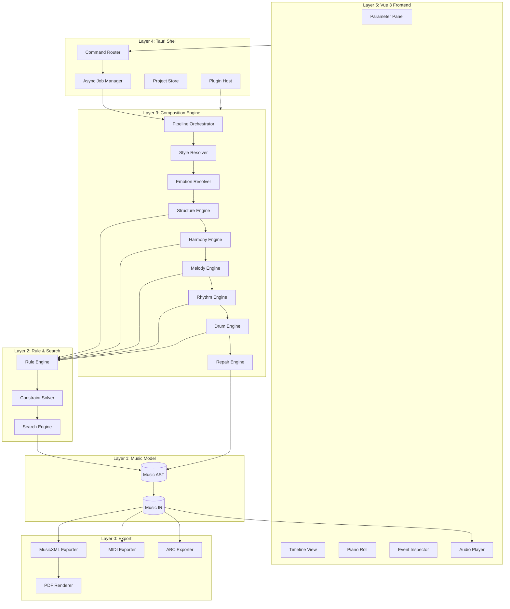

# System Architecture

**Document:** Aurora Composer — System Architecture  
**Version:** 0.1  
**Status:** Draft

---

## 1. Architectural Style

Aurora Composer follows a **layered pipeline architecture** with:

- **Single representation** (Music AST) at the center
- **Unidirectional data flow** during generation (parameters → AST → export)
- **Bidirectional flow** during editing (UI ↔ AST)
- **Plugin extension points** at pipeline stage boundaries
- **Specification-first** governance

Comparable systems: compiler toolchain (AST → IR → output), game engine (scene graph → render pipeline).

---

## 2. Layer Model

```text
┌─────────────────────────────────────────────┐
│ Layer 5: Presentation (Vue 3 + Tauri)      │
├─────────────────────────────────────────────┤
│ Layer 4: Application Services               │
│   Job Manager · Project Store · Plugin Host │
├─────────────────────────────────────────────┤
│ Layer 3: Composition Pipeline               │
│   Stage Orchestrator · Algorithm Engines    │
├─────────────────────────────────────────────┤
│ Layer 2: Rule & Search Infrastructure       │
│   Rule Engine · Constraint Solver · Search  │
├─────────────────────────────────────────────┤
│ Layer 1: Music Model (AST + IR)             │
├─────────────────────────────────────────────┤
│ Layer 0: Export & Playback                  │
└─────────────────────────────────────────────┘
```

### Layer Responsibilities

| Layer | May Read | May Write | Must Not |
|-------|----------|-----------|----------|
| L5 Presentation | AST (via IPC) | Parameters, edits | Generate music directly |
| L4 Application | AST, jobs | Project metadata | Implement algorithms |
| L3 Pipeline | AST, params | AST (via stages) | Export formats |
| L2 Rule/Search | AST snapshots | Scores, violations | Modify AST permanently |
| L1 Music Model | — | AST structure | Export |
| L0 Export | IR | Files, audio buffers | Modify AST |

---

## 3. Component Diagram



---

## 4. Data Flow

### 4.1 Generation Flow

```text
1. User sets parameters in UI
2. Frontend invokes Tauri command: generate_composition(params)
3. Job Manager creates async task
4. Pipeline Orchestrator executes stages sequentially
5. Each stage:
   a. Reads AST + parameters
   b. Generates candidates
   c. Rule Engine scores candidates
   d. Search Engine selects best
   e. Writes result to AST with provenance
6. Validation stage checks hard constraints
7. AST projected to IR
8. Job completes; frontend receives Composition handle
9. User previews (IR → audio) or exports (IR → files)
```

### 4.2 Edit Flow

```text
1. User selects event in Inspector/Piano Roll
2. UI displays provenance chain
3. User modifies note or requests regeneration of section
4. Edit applied as AST patch (with manual_edit provenance)
5. Optional: Repair stage re-validates surrounding context
6. IR re-projected; preview updated
```

---

## 5. Concurrency Model

| Operation | Model |
|-----------|-------|
| Full composition generation | Async background job (Tauri) |
| Section regeneration | Async sub-job |
| Parameter preview (1–2 bars) | Async with cancellation |
| UI rendering | Main thread (Vue reactivity) |
| Parallel beam search branches | Rust thread pool (Rayon) |
| Export | Async I/O |

Progress reporting: pipeline stage name + percentage via Tauri events.

---

## 6. State Management

### 6.1 Project State

```text
Project
├── metadata (name, created, modified)
├── parameters (current user settings)
├── composition (AST root)
├── history (undo stack of AST patches)
└── exports (cached file paths)
```

### 6.2 Search State (Transient)

During generation, search maintains:

```text
SearchState
├── ast_snapshot (copy-on-write)
├── step_index
├── accumulated_score
├── applied_rules[]
├── beam_rank
└── parent_ref
```

Search states are discarded after selection; provenance is copied to AST events.

---

## 7. Error Handling

| Error Type | Response |
|------------|----------|
| Hard constraint unsatisfiable | Abort stage; report to UI with conflicting rules |
| Soft constraint only violations | Proceed to Repair stage |
| Search exhaustion (empty beam) | Relax parameters or retry with wider beam |
| Plugin load failure | Disable plugin; warn user; continue with defaults |
| Export failure | Return error with format-specific diagnostics |

---

## 8. Security Considerations

- Plugins run in sandboxed context (Tauri capabilities model)
- No network access for core engine
- AI plugins: explicit user opt-in; API keys stored in OS keychain
- File I/O restricted to project directory + user-selected export paths

---

## 9. Related Documents

- [Module Overview](module-overview.md)
- [Pipeline](pipeline.md)
- [Backend Architecture](backend.md)
- [Frontend Architecture](frontend.md)
- [ACAS v0.1](../00-overview/acas-v0.1.md)
