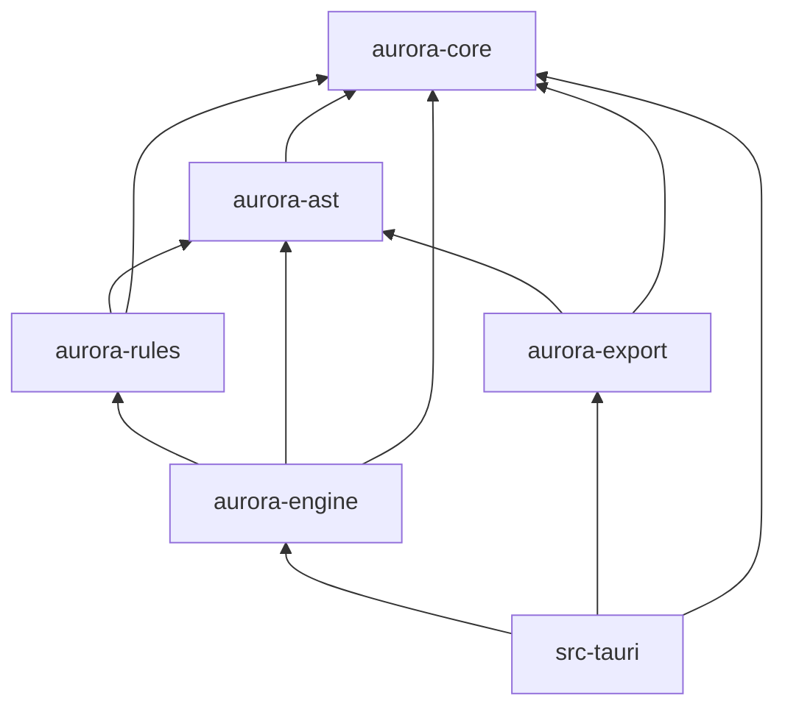

# Rust Backend Architecture Specification

**Version:** 0.1  
**Status:** Draft  
**Agent:** Engineering Research Agent (Tauri / Backend)  
**Dependencies:** [architecture.md](architecture.md), [module-overview.md](module-overview.md), [pipeline.md](pipeline.md), [acas-v0.1.md](../00-overview/acas-v0.1.md), [ADR-003](../../decisions/ADR-003-search-algorithm-primary.md), [deep-research-report.md](../../deep-research-report.md), `research/engineering-research-notes.md`

---

## Table of Contents

1. [Background](#1-background)
2. [Existing Solutions](#2-existing-solutions)
3. [Academic / Theoretical Foundation](#3-academic--theoretical-foundation)
4. [Engineering Analysis](#4-engineering-analysis)
5. [Comparison of Approaches](#5-comparison-of-approaches)
6. [Recommended Solution](#6-recommended-solution)
7. [Architecture](#7-architecture)
8. [Data Structures](#8-data-structures)
9. [Algorithms](#9-algorithms)
10. [Interfaces](#10-interfaces)
11. [Parameter Mappings](#11-parameter-mappings)
12. [Explainability Model](#12-explainability-model)
13. [Future Expansion](#13-future-expansion)
14. [Open Questions](#14-open-questions)
15. [References](#15-references)

**Appendices:** [A. Crate Manifest](#appendix-a-crate-manifest) · [B. Tauri Command Catalog](#appendix-b-tauri-command-catalog) · [C. Error Code Registry](#appendix-c-error-code-registry)

---

## 1. Background

### 1.1 Purpose

This specification defines the **Rust backend architecture** for Aurora Composer: crate boundaries, Tauri integration layer, async job system, parallel search infrastructure, and unified error handling. It complements [architecture.md](architecture.md) (system-wide view) and defers UI details to [frontend.md](frontend.md) and `docs/08-ui/`.

The backend must satisfy ACAS constraints:

- **Performance:** 32-bar multi-voice generation in <30s on 4-core desktop CPU
- **Explainability:** Provenance preserved through all backend operations
- **Safety:** No network I/O in core engine; plugins sandboxed via Tauri capabilities
- **Specification-first:** This document is normative for Phase 2 implementation

### 1.2 Scope

**In scope:**

- Cargo workspace crate structure (`aurora-core`, `aurora-ast`, `aurora-rules`, `aurora-engine`, `aurora-export`)
- Tauri 2.x shell integration (`src-tauri/`)
- Async job manager with Rayon thread pool for CPU-bound search
- Error type hierarchy and IPC serialization
- Project persistence and plugin host boundaries

**Out of scope:**

- Algorithm stage internals (see `docs/04-algorithms/`)
- Rule DSL grammar (see [rule-dsl.md](../05-rule-engine/rule-dsl.md))
- Frontend component design (see [frontend.md](frontend.md))

### 1.3 Position in Stack

```text
Vue 3 Frontend
      │  JSON IPC (Tauri invoke + events)
      ▼
src-tauri/  ─── CommandRouter, JobManager, ProjectStore, PluginHost
      │
      ├── aurora-engine   (pipeline orchestration)
      │       ├── aurora-rules
      │       └── aurora-ast
      ├── aurora-export   (IR + format serializers)
      └── aurora-core     (shared types, errors, config)
```

---

## 2. Existing Solutions

### 2.1 Tauri Application Patterns

Tauri 2.x applications typically structure Rust code as:

- `src-tauri/src/lib.rs` — command handlers
- `src-tauri/src/main.rs` — entry point
- Separate crates for domain logic (recommended for testability)

Reference implementations: Zed-adjacent tools, Helix plugin hosts, Rust audio apps (e.g., Cytomic-style DSP shells). Aurora follows the **multi-crate workspace** pattern used by Bevy ecosystem apps.

### 2.2 Rust Music Engine Projects

| Project | Architecture | Lesson for Aurora |
|---------|-------------|-------------------|
| **Helio** | C++ core, pattern sequencer | Separation of pattern vs score |
| **Lenardo** | Track/clip DAW model | Reject as AST model; borrow async job UX |
| **Music21** | Python monolith | Borrow analysis validation; reject runtime |
| **OpenMusic** | Lisp CLOS + search | Borrow plugin stage injection |

No existing Rust project combines rule-based search, provenance AST, and desktop IPC — Aurora defines its own crate split.

### 2.3 Async Job Systems

| Pattern | Example | Fit |
|---------|---------|-----|
| Tokio `spawn_blocking` | Web servers offloading CPU | **Primary** for generation jobs |
| Dedicated thread pool | Rayon | **Primary** for beam branch eval |
| Actor model (Actix) | Chat servers | Overkill for single-user desktop |
| Process isolation | ML inference | Phase 3 AI plugins only |

---

## 3. Academic / Theoretical Foundation

Backend architecture is not music-theoretic; it applies established software engineering principles:

| Principle | Application |
|-----------|-------------|
| **Separation of concerns** | Crates map to architectural layers (model / rules / engine / export) |
| **Compiler pipeline model** | AST as IR; stages as passes; export as code generation |
| **Copy-on-write (CoW)** | Functional data structures for search branching (Okasaki, *Purely Functional Data Structures*) |
| **Work-stealing parallelism** | Rayon for beam search (Blumofe & Leiserson) |
| **Capability-based security** | Tauri 2 capabilities restrict plugin file/network access |

Music-theoretic correctness is enforced in `aurora-rules` and validated by `aurora-engine` — the backend layer provides **execution infrastructure only**.

---

## 4. Engineering Analysis

| Criterion | Assessment |
|-----------|------------|
| **Correctness** | Crate boundaries enforce layer rules from [architecture.md](architecture.md) §2 |
| **Controllability** | JobManager exposes cancel, progress, partial pipeline modes |
| **Explainability** | Errors carry rule IDs; job results include provenance handles |
| **Performance** | Rayon + CoW target <30s / 32-bar / 4-voice |
| **Extensibility** | `PluginHost` loads dynamic libs without recompiling engine |
| **Complexity** | 5 crates + Tauri shell — moderate; justified by test isolation |

### 4.1 Risk Register

| Risk | Mitigation |
|------|------------|
| IPC payload too large (full AST) | Projection DTOs; lazy node fetch |
| Rayon + Tokio deadlock | Never call blocking pool from async without `spawn_blocking` |
| Plugin ABI instability | Versioned `aurora-plugin-sdk` trait (Phase 3) |
| Error leakage across IPC | Stable `AuroraErrorCode` enum |

---

## 5. Comparison of Approaches

### 5.1 Crate Granularity

| Approach | Pros | Cons |
|----------|------|------|
| **Monolithic `aurora` crate** | Simple build | Slow compiles; tight coupling |
| **5-crate split (recommended)** | Clear deps; parallel tests | Workspace coordination |
| **Fine-grained (20+ crates)** | Max isolation | Overhead; premature |

### 5.2 Job Execution Model

| Approach | Pros | Cons |
|----------|------|------|
| **Tokio async only** | Unified runtime | Bad for CPU-bound search |
| **Rayon only** | Fast parallel | No async I/O integration |
| **Hybrid (recommended)** | Best of both | Two concurrency models to document |

### 5.3 AST Mutability During Search

| Approach | Pros | Cons |
|----------|------|------|
| Full clone per branch | Simple | Memory/time explosion |
| **CoW snapshot (recommended)** | Shared structure | Implementation complexity |
| In-place + undo stack | Minimal memory | Not thread-safe for parallel beam |

---

## 6. Recommended Solution

Adopt a **Cargo workspace with five domain crates** plus **`src-tauri` integration shell**:

| Crate | Responsibility |
|-------|---------------|
| `aurora-core` | IDs, config, errors, parameter types, job handles |
| `aurora-ast` | Music AST, patches, CoW snapshots, serialization |
| `aurora-rules` | Rule DSL compile, RuleEngine, ConstraintSolver, SearchEngine |
| `aurora-engine` | PipelineOrchestrator, algorithm stage traits, TheoryCore |
| `aurora-export` | IR projection, MusicXML/MIDI/ABC serializers |

Tauri shell owns **JobManager**, **ProjectStore**, **CommandRouter**, **PluginHost**, **FileService**.

CPU-bound generation runs on **Rayon thread pool** inside **`tokio::task::spawn_blocking`** workers. Progress emits via **Tauri events**.

---

## 7. Architecture

### 7.1 Workspace Layout

```text
aurora-composer/
├── Cargo.toml                    # [workspace] members
├── crates/
│   ├── aurora-core/
│   │   └── src/
│   │       ├── lib.rs
│   │       ├── error.rs
│   │       ├── config.rs
│   │       ├── ids.rs
│   │       └── params.rs
│   ├── aurora-ast/
│   │   └── src/
│   │       ├── composition.rs
│   │       ├── patch.rs
│   │       ├── snapshot.rs      # CoW for search
│   │       └── provenance.rs
│   ├── aurora-rules/
│   │   └── src/
│   │       ├── dsl/
│   │       ├── engine.rs
│   │       ├── constraint.rs
│   │       └── search/
│   │           ├── beam.rs
│   │           ├── astar.rs
│   │           └── dp.rs
│   ├── aurora-engine/
│   │   └── src/
│   │       ├── orchestrator.rs
│   │       ├── stages/          # one module per pipeline stage
│   │       ├── theory.rs
│   │       └── plugin.rs
│   └── aurora-export/
│       └── src/
│           ├── ir.rs
│           ├── musicxml/
│           ├── midi/
│           └── abc/
├── src-tauri/
│   ├── Cargo.toml               # depends on all crates
│   └── src/
│       ├── lib.rs               # Tauri commands
│       ├── jobs/
│       │   ├── manager.rs
│       │   └── worker.rs
│       ├── project/
│       │   └── store.rs
│       ├── commands/
│       │   ├── generate.rs
│       │   ├── export.rs
│       │   └── project.rs
│       └── plugin_host.rs
└── frontend/                    # Vue 3 (see frontend.md)
```

### 7.2 Crate Dependency Graph



**Dependency rules (enforced by crate docs + CI):**

- `aurora-export` MUST NOT depend on `aurora-engine`
- `aurora-ast` MUST NOT depend on `aurora-rules`
- `aurora-core` MUST NOT depend on any other Aurora crate

### 7.3 Tauri Integration Layer

```text
┌──────────────────────────────────────────────────────────────┐
│                     src-tauri (Shell)                         │
├──────────────────────────────────────────────────────────────┤
│  CommandRouter                                                │
│    invoke_handler!([generate, cancel, export, patch, ...])   │
├──────────────────────────────────────────────────────────────┤
│  JobManager                                                   │
│    submit(GenerationRequest) → JobId                          │
│    cancel(JobId)                                              │
│    on_progress → emit("job://progress", StageProgress)        │
├──────────────────────────────────────────────────────────────┤
│  ProjectStore                                                 │
│    load/save .aurora project files (AST + params + history)   │
├──────────────────────────────────────────────────────────────┤
│  PluginHost                                                   │
│    discover, load, lifecycle; capability-scoped                 │
├──────────────────────────────────────────────────────────────┤
│  FileService / ConfigStore / EventBus                         │
└──────────────────────────────────────────────────────────────┘
          │ calls
          ▼
┌──────────────────────────────────────────────────────────────┐
│  aurora-engine::PipelineOrchestrator                          │
│  aurora-export::ExportPipeline                                │
└──────────────────────────────────────────────────────────────┘
```

### 7.4 Async Job System

```text
Frontend: invoke("generate_composition", params)
    │
    ▼
CommandRouter validates params → JobManager::submit()
    │
    ▼
JobRecord { id, status: Queued, cancel_token }
    │
    ▼
tokio::spawn(async move {
    tokio::task::spawn_blocking(move || {
        rayon_pool.install(|| {
            orchestrator.run(params, progress_cb, cancel_token)
        })
    }).await
})
    │
    ├── progress_cb → app.emit("job://progress", ...)
    └── Ok(composition) → app.emit("job://complete", handle)
```

**Job states:** `Queued` → `Running` → `Completed` | `Failed` | `Cancelled`

**Concurrency limits:** Default max 1 active generation job (configurable `jobs.max_concurrent`). Preview jobs may preempt full jobs when `preview.preempt = true`.

### 7.5 Rayon Thread Pool

Dedicated pool for search parallelism — **not** the global Rayon pool:

```rust
// Initialized once at app startup in src-tauri
pub struct SearchThreadPool {
    inner: rayon::ThreadPool,
}

impl SearchThreadPool {
    pub fn new(config: &EngineConfig) -> Self {
        let threads = config.search_threads
            .unwrap_or_else(|| (num_cpus::get().saturating_sub(1)).clamp(2, 8));
        rayon::ThreadPoolBuilder::new()
            .num_threads(threads)
            .thread_name(|i| format!("aurora-search-{i}"))
            .build()
            .expect("search thread pool")
            .into()
    }
}
```

Beam search uses `pool.install(|| branches.par_iter().map(score).collect())` per expansion step.

---

## 8. Data Structures

### 8.1 Job Types (`aurora-core`)

```rust
#[derive(Clone, Debug, Serialize, Deserialize)]
pub struct JobId(pub Uuid);

#[derive(Clone, Debug, Serialize)]
pub struct JobStatus {
    pub id: JobId,
    pub state: JobState,
    pub stage: Option<StageProgress>,
    pub started_at: Option<DateTime<Utc>>,
    pub error: Option<AuroraError>,
}

#[derive(Clone, Debug, Serialize)]
pub enum JobState {
    Queued,
    Running,
    Completed { composition_id: CompositionId },
    Failed,
    Cancelled,
}

#[derive(Clone, Debug, Serialize)]
pub struct StageProgress {
    pub stage_name: String,
    pub stage_index: u8,
    pub total_stages: u8,
    pub percent: f32,
    pub message: String,
}
```

### 8.2 Project Persistence (`src-tauri`)

```rust
pub struct Project {
    pub metadata: ProjectMetadata,
    pub parameters: ParameterBundle,
    pub composition: Composition,      // from aurora-ast
    pub history: PatchHistory,
    pub schema_version: AstSchemaVersion,
}
```

On-disk format: JSON (`.aurora`) for Phase 2 prototype; optional MessagePack Phase 3.

### 8.3 Search Thread Pool Handle

Passed via `EngineContext` to pipeline stages:

```rust
pub struct EngineContext<'a> {
    pub config: &'a EngineConfig,
    pub rule_engine: &'a RuleEngine,
    pub search_pool: &'a SearchThreadPool,
    pub caches: &'a EngineCaches,
    pub progress: &'a dyn ProgressReporter,
    pub cancel: CancellationToken,
}
```

---

## 9. Algorithms

### 9.1 Job Scheduling

FIFO queue with priority override:

1. Preview jobs (`pipeline_mode = Preview`) jump queue when `preview.preempt = true`
2. Section regeneration shares orchestrator instance; reuses cached stages 1–4 if params unchanged
3. Cancelled jobs drain at next stage boundary or search step batch (every 64 expansions)

### 9.2 Progress Estimation

```text
overall_percent = (completed_stages + stage_local_percent) / total_stages
```

Stage weights (default):

| Stage | Weight |
|-------|--------|
| Melody | 0.25 |
| Counterpoint | 0.20 |
| Harmony | 0.15 |
| Bass | 0.10 |
| Others | 0.30 (combined) |

Melody/Counterpoint report sub-progress per measure.

### 9.3 CoW Snapshot Algorithm (Summary)

Detailed in [ast.md](../02-music-model/ast.md). Backend contract:

```rust
impl AstSnapshot {
    pub fn branch(&self) -> Self;           // O(1) Arc inc + empty overlay
    pub fn apply_patch(&mut self, p: Patch); // Overlay only
    pub fn materialize(&self) -> Composition; // Merge for stage commit
}
```

Search branches never call `materialize` until beam selection completes.

---

## 10. Interfaces

### 10.1 Pipeline Orchestrator (`aurora-engine`)

```rust
pub trait PipelineStage: Send + Sync {
    fn id(&self) -> StageId;
    fn run(
        &self,
        ctx: &EngineContext,
        ast: &mut Composition,
        params: &ParameterBundle,
    ) -> Result<StageOutput, AuroraError>;
}

pub struct PipelineOrchestrator {
    stages: Vec<Box<dyn PipelineStage>>,
}

impl PipelineOrchestrator {
    pub fn run_full(
        &self,
        params: GenerationParams,
        ctx: &EngineContext,
    ) -> Result<Composition, AuroraError>;
}
```

### 10.2 Job Manager (`src-tauri`)

```rust
pub struct JobManager {
    queue: Mutex<VecDeque<JobRequest>>,
    active: Mutex<Option<JobHandle>>,
    pool: SearchThreadPool,
}

impl JobManager {
    pub fn submit(&self, req: JobRequest) -> JobId;
    pub fn cancel(&self, id: JobId) -> Result<(), AuroraError>;
    pub fn status(&self, id: JobId) -> Option<JobStatus>;
}
```

### 10.3 Export Pipeline (`aurora-export`)

```rust
pub struct ExportPipeline;

impl ExportPipeline {
    pub fn ast_to_ir(ast: &Composition) -> Result<MusicIr, AuroraError>;
    pub fn export_musicxml(ir: &MusicIr, profile: ExportProfile) -> Result<Vec<u8>, AuroraError>;
    pub fn import_musicxml(bytes: &[u8]) -> Result<Composition, AuroraError>;
}
```

---

## 11. Parameter Mappings

Backend configuration parameters (distinct from musical parameters):

| User / Config Param | Backend Mapping |
|---------------------|-----------------|
| `search.threads` | Rayon pool size |
| `search.beam_width` | Passed to SearchEngine |
| `jobs.max_concurrent` | JobManager queue limit |
| `preview.preempt` | Queue priority flag |
| `export.profile` | MusicXML profile selection |
| `engine.cache_enabled` | EngineCaches toggle |
| `plugin.paths[]` | PluginHost scan directories |

Musical parameters flow unchanged from frontend → `ParameterBundle` → stage `run()`.

---

## 12. Explainability Model

Backend responsibilities for explainability:

| Mechanism | Implementation |
|-----------|----------------|
| Provenance attachment | Stages write `Provenance` on AST events via `aurora-ast` |
| Search trace | `SearchEngine` records `beam_rank`, `parent_state_id` |
| Error explainability | `AuroraError::ConstraintUnsat { rule_ids, reason }` |
| Job audit log | Optional `JobRecord.applied_rules_summary` for Inspector |

Backend MUST NOT strip provenance during export when profile = `interchange`.

IPC returns **provenance summaries** (not full rule evaluation traces) unless `debug.explain = true`.

---

## 13. Future Expansion

| Phase | Enhancement |
|-------|-------------|
| Phase 2 | Prototype: core crates + minimal Tauri shell |
| Phase 3 | `aurora-plugin-sdk` crate; dynamic loading |
| Phase 3 | WASM compilation target for `aurora-engine` (browser demo) |
| Phase 3 | Distributed job queue (cloud generation) — optional |
| Phase 3 | SQLite project index for large libraries |

---

## 14. Open Questions

| ID | Question | Blocker For |
|----|----------|-------------|
| B1 | MessagePack vs JSON for `.aurora` files? | ProjectStore impl |
| B2 | Plugin ABI: `cdylib` vs WASM modules? | PluginHost |
| B3 | Shared memory AST for piano roll vs IPC DTOs? | Frontend perf |
| B4 | Single vs multi-process plugin isolation? | Security model |
| B5 | Persist partial pipeline checkpoints to disk? | Crash recovery |

---

## 15. References

- [System Architecture](architecture.md)
- [Module Overview](module-overview.md)
- [Generation Pipeline](pipeline.md)
- [Music AST Specification](../02-music-model/ast.md)
- [Scoring and Search](../05-rule-engine/scoring.md)
- [ADR-003: Beam Search Primary](../../decisions/ADR-003-search-algorithm-primary.md)
- [Tauri 2 Commands Documentation](https://v2.tauri.app/develop/calls/command/)
- [Rayon Work-Stealing](https://github.com/rayon-rs/rayon)
- [Engineering Research Notes](../../research/engineering-research-notes.md)

---

## Appendix A: Crate Manifest

### `aurora-core/Cargo.toml`

```toml
[package]
name = "aurora-core"
version = "0.1.0"
edition = "2021"

[dependencies]
serde = { version = "1", features = ["derive"] }
serde_json = "1"
thiserror = "2"
uuid = { version = "1", features = ["v4", "serde"] }
chrono = { version = "0.4", features = ["serde"] }
```

### `aurora-ast/Cargo.toml`

```toml
[dependencies]
aurora-core = { path = "../aurora-core" }
serde = { version = "1", features = ["derive"] }
im = "15"          # persistent collections for CoW
```

### `aurora-rules/Cargo.toml`

```toml
[dependencies]
aurora-core = { path = "../aurora-core" }
aurora-ast = { path = "../aurora-ast" }
rayon = "1"
```

### `aurora-engine/Cargo.toml`

```toml
[dependencies]
aurora-core = { path = "../aurora-core" }
aurora-ast = { path = "../aurora-ast" }
aurora-rules = { path = "../aurora-rules" }
rayon = "1"
```

### `aurora-export/Cargo.toml`

```toml
[dependencies]
aurora-core = { path = "../aurora-core" }
aurora-ast = { path = "../aurora-ast" }
quick-xml = "0.37"
midly = "0.5"
```

---

## Appendix B: Tauri Command Catalog

| Command | Args | Returns | Async |
|---------|------|---------|-------|
| `generate_composition` | `GenerationParams` | `JobId` | yes |
| `cancel_job` | `JobId` | `()` | yes |
| `get_job_status` | `JobId` | `JobStatus` | yes |
| `get_timeline_projection` | `CompositionId` | `TimelineDto` | yes |
| `get_events_in_range` | `RangeQuery` | `EventDto[]` | yes |
| `apply_ast_patch` | `AstPatch` | `PatchResult` | yes |
| `export_musicxml` | `ExportRequest` | `ExportResult` | yes |
| `import_musicxml` | `ImportRequest` | `CompositionId` | yes |
| `save_project` | `SaveProjectRequest` | `()` | yes |
| `load_project` | `path: String` | `ProjectMetadata` | yes |
| `list_plugins` | `()` | `PluginInfo[]` | yes |

Events (backend → frontend):

| Event | Payload |
|-------|---------|
| `job://progress` | `StageProgress` |
| `job://complete` | `{ job_id, composition_id }` |
| `job://failed` | `{ job_id, error: AuroraError }` |

---

## Appendix C: Error Code Registry

### Error Type Hierarchy

```rust
// aurora-core/src/error.rs
#[derive(Debug, thiserror::Error, Serialize)]
#[serde(tag = "code", content = "details")]
pub enum AuroraError {
    #[error("invalid parameters: {0}")]
    InvalidParams(String),

    #[error("constraint unsatisfiable")]
    ConstraintUnsat {
        stage: String,
        rule_ids: Vec<RuleId>,
        reasons: Vec<String>,
        suggestions: Vec<String>,
    },

    #[error("search exhausted")]
    SearchExhausted {
        stage: String,
        beam_width: u32,
        relax_suggestions: Vec<String>,
    },

    #[error("export failed: {format}")]
    ExportFailed {
        format: String,
        diagnostics: Vec<String>,
    },

    #[error("import failed")]
    ImportFailed { path: String, line: Option<u32>, message: String },

    #[error("plugin error: {plugin_id}")]
    PluginError { plugin_id: String, message: String },

    #[error("job cancelled")]
    JobCancelled { job_id: JobId },

    #[error("internal error")]
    Internal { message: String },  // logged, generic in UI
}
```

### IPC Mapping

| Error | HTTP-like Severity | UI Action |
|-------|-------------------|-----------|
| `InvalidParams` | 400 | Highlight param field |
| `ConstraintUnsat` | 422 | Show conflicting rules in Inspector |
| `SearchExhausted` | 422 | Suggest relax beam / params |
| `ExportFailed` | 500 | Show export log |
| `JobCancelled` | — | Silent (user initiated) |
| `Internal` | 500 | Generic error toast + log file link |

Per [architecture.md](architecture.md) §7: hard constraint failure aborts stage; soft violations proceed to Repair.

---

*End of Rust Backend Architecture Specification v0.1*
