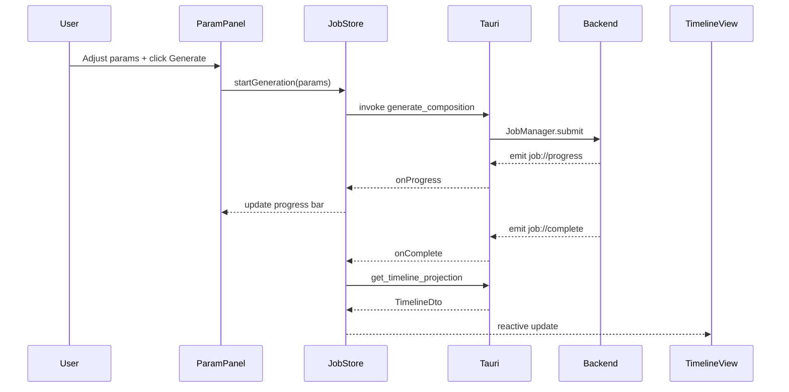

# Vue 3 Frontend Architecture Specification

**Version:** 0.1  
**Status:** Draft  
**Agent:** Engineering Research Agent (Vue / Frontend)  
**Dependencies:** [architecture.md](architecture.md), [backend.md](backend.md), [ADR-002](../../decisions/ADR-002-vue3-frontend.md), [acas-v0.1.md](../00-overview/acas-v0.1.md), `docs/08-ui/` *(pending detail specs)*, `research/engineering-research-notes.md`

---

## Table of Contents

1. [Background](#1-background)
2. [Existing Solutions](#2-existing-solutions)
3. [Academic / Theoretical Foundation](#3-academic--theoretical-foundation)
4. [Engineering Analysis](#4-engineering-analysis)
5. [Comparison of Approaches](#5-comparison-of-approaches)
6. [Recommended Solution](#6-recommended-solution)
7. [Architecture](#7-architecture)
8. [Data Structures](#8-data-structures)
9. [Algorithms](#9-algorithms)
10. [Interfaces](#10-interfaces)
11. [Parameter Mappings](#11-parameter-mappings)
12. [Explainability Model](#12-explainability-model)
13. [Future Expansion](#13-future-expansion)
14. [Open Questions](#14-open-questions)
15. [References](#15-references)

**Appendices:** [A. Component Tree](#appendix-a-component-tree) · [B. Pinia Store Schemas](#appendix-b-pinia-store-schemas) · [C. IPC Client Layer](#appendix-c-ipc-client-layer)

---

## 1. Background

### 1.1 Purpose

This document specifies the **Vue 3 frontend architecture** for Aurora Composer — application structure, state management, Tauri IPC integration, and module boundaries. It is an **architecture overview** that complements granular UI specifications in `docs/08-ui/`:

| Detail Spec (pending) | Focus |
|----------------------|-------|
| `docs/08-ui/vue.md` | Shell layout, routing, theming |
| `docs/08-ui/timeline-ui.md` | Section/measure timeline |
| `docs/08-ui/piano-roll.md` | Canvas note editor |
| `docs/08-ui/inspector.md` | Provenance display |
| `docs/08-ui/tauri.md` | IPC command bindings |

Per **ADR-002**, Aurora uses **Vue 3 + TypeScript**, not React (deep research report UI sections are technology-agnostic).

### 1.2 Design Constraints

From [philosophy.md](../00-overview/philosophy.md):

| Principle | Frontend Implication |
|-----------|---------------------|
| Everything Is Music AST | UI edits AST via patches, never local note arrays |
| Everything Is Explainable | Inspector shows provenance for selection |
| Everything Is Parameterized | ParamPanel binds ACAS parameter tree |
| Generation Is Search | Progress UI reflects pipeline stages |

Frontend **must not** implement generation logic. All composition runs in Rust backend via Tauri commands.

### 1.3 Scope

**In scope:** App shell, stores, IPC layer, module map, rendering strategy, audio preview integration.

**Out of scope:** Pixel-level mockups, CSS design system tokens (deferred to `vue.md`).

---

## 2. Existing Solutions

### 2.1 DAW / Notation UI References

| Application | UI Stack | Relevant Patterns |
|-------------|----------|-------------------|
| **MuseScore 4** | Qt, engraving canvas | Inspector panel, part tabs |
| **Helio** | Custom C++ UI | Pattern grid, parameter sidebar |
| **Lenardo** | Electron | Clip timeline, async render progress |
| **Flat.io** | Web SPA | Real-time collaboration model (Phase 3) |
| **Signal** (Vue DAW) | Vue 2 | Pinia-like stores, WebAudio |

Aurora borrows **timeline + piano roll + inspector** triad from DAW/notation tools; generation UX is unique (parameter-driven, not clip-based).

### 2.2 Vue 3 Music Projects

Open-source Vue music apps are sparse. Patterns adopted from general Vue 3 best practices:

- **Composition API** with `<script setup>`
- **Pinia** for global state (Vuex deprecated)
- **Composables** for IPC, audio, canvas interaction
- **Naive UI** or **PrimeVue** for form controls (ParamPanel)

### 2.3 Tauri + Vue Templates

Official Tauri 2 Vue template provides:

- Vite build pipeline
- `@tauri-apps/api` invoke/listen
- Dev/prod capability separation

Aurora extends with typed IPC client generated from Rust command schemas (manual Phase 2; `tauri-specta` Phase 3).

---

## 3. Academic / Theoretical Foundation

Frontend architecture applies **Model-View-ViewModel (MVVM)** with unidirectional data flow:

```text
User Action → View (Vue Component) → Store Action → IPC Command → Backend
Backend Event → Store Mutation → View Reactivity → DOM/Canvas Update
```

**Human-computer interaction (HCI)** principles for music tools:

| Principle | Aurora Application |
|-----------|-------------------|
| **Direct manipulation** | Piano roll drag edits map to AST patches |
| **Visibility of system status** | Stage progress bar during generation |
| **User control and freedom** | Cancel job, undo AST patches |
| **Recognition over recall** | Style presets, parameter tooltips with theory refs |
| **Error prevention** | Disable export until validation passes |

Parameter sliders map to continuous control theory — debounced preview regeneration avoids thrashing backend ([performance.md](../09-engineering/performance.md)).

---

## 4. Engineering Analysis

| Criterion | Assessment |
|-----------|------------|
| **Correctness** | IPC-only backend access prevents logic duplication |
| **Controllability** | ParamPanel mirrors full ACAS parameter tree |
| **Explainability** | Inspector binds to provenance DTOs |
| **Performance** | Canvas virtualizes piano roll; AST not fully loaded in FE |
| **Extensibility** | Plugin UI slots in ParamPanel and ExportDialog |
| **Complexity** | Moderate — 8 primary view modules + 4 stores |

### 4.1 Risk Register

| Risk | Mitigation |
|------|------------|
| Large AST over IPC | Projection DTOs; paginated event fetch |
| Canvas jank on 32-bar 4-voice | Virtual rendering; OffscreenCanvas Phase 3 |
| Preview audio latency | Tone.js buffer cache keyed by IR revision |
| Stale job results | JobId versioning; ignore outdated events |

---

## 5. Comparison of Approaches

### 5.1 State Management

| Approach | Pros | Cons |
|----------|------|------|
| **Pinia (recommended)** | Vue 3 official, TypeScript-friendly | — |
| Vuex 4 | Legacy docs | Deprecated pattern |
| Component-local only | Simple | Unmanageable for cross-panel sync |
| TanStack Query | Great for server state | Overlap with Tauri events |

### 5.2 Piano Roll Rendering

| Approach | Pros | Cons |
|----------|------|------|
| **HTML Canvas (recommended)** | Performance, custom hit testing | Manual accessibility |
| SVG | Easy DOM integration | Slow for 10k+ notes |
| WebGL | Maximum perf | Overkill Phase 2 |
| VexFlow | Notation-native | Poor editing UX |

### 5.3 AST in Frontend

| Approach | Pros | Cons |
|----------|------|------|
| Full AST in Pinia | Offline edit possible | Memory + sync burden |
| **Backend-authoritative + DTOs (recommended)** | Single source of truth | IPC round-trips |
| CRDT collaborative | Multi-user | Phase 3 only |

---

## 6. Recommended Solution

**Vue 3 + TypeScript + Vite + Pinia + Tauri 2 IPC**

Application structure:

```text
frontend/src/
├── main.ts
├── App.vue
├── router/
├── stores/           # Pinia
├── composables/      # useTauri, useAudio, usePianoRoll
├── ipc/              # Typed command wrappers
├── components/
│   ├── shell/        # AppShell, MenuBar, StatusBar
│   ├── params/       # ParamPanel, PresetSelector
│   ├── timeline/     # TimelineView
│   ├── piano-roll/   # PianoRollCanvas
│   ├── inspector/    # InspectorPanel
│   ├── player/       # TransportControls, WaveformStub
│   ├── export/       # ExportDialog
│   └── plugins/      # PluginManager
├── types/            # DTOs mirroring Rust serde types
└── assets/
```

Backend remains authoritative for AST; frontend holds **project handle**, **parameter state**, **UI selection**, and **cached projections**.

---

## 7. Architecture

### 7.1 Layer Diagram

```text
┌─────────────────────────────────────────────────────────────┐
│  Presentation Layer (Vue Components)                         │
│  ParamPanel · TimelineView · PianoRoll · Inspector · Player  │
└───────────────────────────┬─────────────────────────────────┘
                            │
┌───────────────────────────▼─────────────────────────────────┐
│  Application Layer (Pinia Stores + Composables)              │
│  useProjectStore · useParamStore · useJobStore · useUiStore    │
└───────────────────────────┬─────────────────────────────────┘
                            │
┌───────────────────────────▼─────────────────────────────────┐
│  IPC Layer (Typed Tauri Client)                              │
│  invoke commands · listen events · error normalization       │
└───────────────────────────┬─────────────────────────────────┘
                            │
┌───────────────────────────▼─────────────────────────────────┐
│  Tauri Backend (see backend.md)                              │
└─────────────────────────────────────────────────────────────┘
```

### 7.2 Module Map

| Frontend Module | Backend Counterpart | Primary Store |
|-----------------|---------------------|---------------|
| **ParamPanel** | `ParameterBundle` | `useParamStore` |
| **TimelineView** | Structure AST projection | `useProjectStore` |
| **PianoRoll** | Event range query + patches | `useProjectStore`, `useUiStore` |
| **Inspector** | Provenance query | `useUiStore` |
| **Player** | IR preview / MIDI buffer | `useProjectStore` |
| **ExportDialog** | `aurora-export` | `useJobStore` |
| **PluginManager** | `PluginHost` | `useProjectStore` |
| **ProjectBrowser** | `ProjectStore` | `useProjectStore` |

### 7.3 Application Shell Layout

```text
┌────────────────────────────────────────────────────────────┐
│ MenuBar · Toolbar (Generate · Cancel · Export · Undo)      │
├──────────────┬─────────────────────────────┬───────────────┤
│              │                             │               │
│  ParamPanel  │      TimelineView           │  Inspector    │
│  (left)      │      (top center)           │  (right)      │
│              ├─────────────────────────────┤               │
│              │      PianoRoll              │               │
│              │      (bottom center)        │               │
│              │                             │               │
├──────────────┴─────────────────────────────┴───────────────┤
│ TransportControls · ProgressBar · StatusMessage            │
└────────────────────────────────────────────────────────────┘
```

Responsive collapse: ParamPanel and Inspector dockable/hideable; piano roll expands.

### 7.4 Routing

Minimal router — single workspace view Phase 2:

| Route | Component | Phase |
|-------|-----------|-------|
| `/` | `WorkspaceView` | 2 |
| `/welcome` | `WelcomeView` | 2 |
| `/settings` | `SettingsView` | 3 |

Project switching via modal, not route param (simplifies AST lifecycle).

### 7.5 Event Flow: Generation



---

## 8. Data Structures

### 8.1 Frontend DTOs (TypeScript)

Mirror Rust serde types — manually synced Phase 2; codegen Phase 3.

```typescript
// types/composition.ts
export interface CompositionHandle {
  id: string;
  revision: number;
  barCount: number;
  voiceCount: number;
}

export interface TimelineDto {
  compositionId: string;
  sections: SectionDto[];
  measures: MeasureSummaryDto[];
  tempoMap: TempoMarkDto[];
  keyMap: KeyAreaDto[];
}

export interface EventDto {
  id: string;
  voiceIndex: number;
  measure: number;
  beat: number;
  durationBeats: number;
  pitchMidi?: number;
  kind: 'note' | 'rest' | 'chord';
  provenanceSummary?: ProvenanceSummaryDto;
}

export interface ProvenanceSummaryDto {
  stage: string;
  ruleIds: string[];
  beamRank?: number;
  scoreDelta?: number;
}
```

### 8.2 UI Selection State

```typescript
// stores/ui.ts
export interface UiState {
  selectedEventIds: string[];
  selectedMeasureRange: [number, number] | null;
  pianoRollZoom: { horizontal: number; vertical: number };
  inspectorTab: 'provenance' | 'theory' | 'params';
  panelVisibility: { params: boolean; inspector: boolean };
}
```

### 8.3 Parameter Store Shape

```typescript
// stores/params.ts — mirrors ACAS §6 parameter tree
export interface ParamState {
  bundle: ParameterBundle;
  dirty: boolean;
  activePreset: string | null;
  debounceMs: number;
}
```

---

## 9. Algorithms

### 9.1 Parameter Debounce for Preview

```typescript
function usePreviewDebounce(delayMs: number) {
  let timer: ReturnType<typeof setTimeout>;
  return (params: ParameterBundle, callback: () => void) => {
    clearTimeout(timer);
    timer = setTimeout(callback, delayMs);
  };
}
```

Default: 400ms debounce before triggering 2-bar preview job. Full generation requires explicit Generate click.

### 9.2 Piano Roll Viewport Culling

Only fetch/render events intersecting visible measure range ± buffer:

```typescript
function visibleMeasureRange(
  scrollX: number,
  zoom: number,
  viewportWidth: number,
  bufferMeasures = 2
): [number, number] {
  const start = Math.floor(scrollX / zoom) - bufferMeasures;
  const end = Math.ceil((scrollX + viewportWidth) / zoom) + bufferMeasures;
  return [Math.max(0, start), end];
}
```

IPC: `get_events_in_range({ compositionId, measureStart, measureEnd })`.

### 9.3 Undo/Redo

Frontend sends patch stack operations to backend — **not** local undo:

```typescript
async function undo() {
  await invoke('undo_patch', { projectId });
  await refreshProjections();
}
```

Backend maintains `PatchHistory` per [backend.md](backend.md).

### 9.4 Audio Preview Sync

1. On composition revision change, request `get_preview_midi(compositionId)`
2. Tone.js `Part` schedules notes from MIDI JSON
3. Transport links to TimelineView playhead

---

## 10. Interfaces

### 10.1 Composable: `useTauri`

```typescript
export function useTauri() {
  const invoke = async <T>(cmd: string, args?: Record<string, unknown>): Promise<T> => {
    try {
      return await tauriInvoke(cmd, args);
    } catch (e) {
      throw normalizeAuroraError(e);
    }
  };

  const listen = (event: string, handler: (payload: unknown) => void) =>
    tauriListen(event, (ev) => handler(ev.payload));

  return { invoke, listen };
}
```

### 10.2 Store: `useJobStore`

```typescript
export const useJobStore = defineStore('job', () => {
  const activeJobId = ref<string | null>(null);
  const progress = ref<StageProgress | null>(null);
  const status = ref<'idle' | 'running' | 'failed'>('idle');

  async function generate(params: ParameterBundle) { /* ... */ }
  async function cancel() { /* ... */ }

  return { activeJobId, progress, status, generate, cancel };
});
```

### 10.3 Component Contracts

| Component | Props | Emits |
|-----------|-------|-------|
| `ParamPanel` | `modelValue: ParameterBundle` | `update:modelValue`, `generate`, `preview` |
| `TimelineView` | `timeline: TimelineDto`, `selection` | `select-measure`, `select-section` |
| `PianoRoll` | `events: EventDto[]`, `range` | `select-events`, `edit-patch` |
| `Inspector` | `eventIds: string[]` | — |
| `ProgressBar` | `progress: StageProgress` | — |

---

## 11. Parameter Mappings

Frontend controls map 1:1 to ACAS parameter paths (see ACAS §6):

| UI Control | Parameter Path | Widget |
|------------|---------------|--------|
| Genre dropdown | `style.genre` | Select |
| Emotion valence slider | `emotion.valence` | Slider [-1, 1] |
| Beam width (advanced) | `search.beam_width` | Slider [1, 64] |
| Counterpoint strictness | `counterpoint.strictness` | Slider [0, 1] |
| Bar count | `form.length_bars` | Number input |
| Preview debounce | `ui.preview_debounce_ms` | Settings only |

ParamPanel groups mirror ACAS categories: Style, Emotion, Form, Harmony, Melody, Rhythm, Counterpoint, Drums, Search, Export.

Preset selector loads bundled JSON presets; user presets saved in project directory.

---

## 12. Explainability Model

| UI Surface | Data Source | Display |
|------------|-------------|---------|
| **Inspector → Provenance tab** | `get_provenance(eventId)` | Stage, rules, beam rank |
| **Inspector → Theory tab** | Rule metadata from `rule_ids` | Human-readable rule names |
| **Inspector → Params tab** | Parameter snapshot at generation | Weight deltas applied |
| **Timeline markers** | Section roles, theme refs | Color-coded sections |
| **Generation log** | Optional `debug.explain` | Full rule evaluation trace |

Clicking a rule ID in Inspector links to theory doc anchor (Phase 3 documentation browser).

Violations from failed validation surface in StatusBar with link to first offending event.

---

## 13. Future Expansion

| Phase | Feature |
|-------|---------|
| 2 | Minimal shell: ParamPanel + progress + MIDI preview |
| 3 | Full PianoRoll editing, Timeline, Inspector |
| 3 | Verovio embedded notation pane |
| 3 | Plugin-contributed ParamPanel sections |
| 3 | `tauri-specta` typed IPC codegen |
| 3 | Accessibility: keyboard navigation for piano roll |
| 3 | Theming: dark/light, high-contrast |

---

## 14. Open Questions

| ID | Question | Owner |
|----|----------|-------|
| F1 | Naive UI vs PrimeVue vs custom? | UI Agent |
| F2 | Single canvas vs multi-voice stacked lanes? | piano-roll.md |
| F3 | In-app notation pane vs external PDF? | vue.md |
| F4 | WebWorker for piano roll hit testing? | Performance |
| F5 | i18n framework (vue-i18n) timing? | Phase 3 |

---

## 15. References

- [ADR-002: Vue 3 Frontend](../../decisions/ADR-002-vue3-frontend.md)
- [Backend Architecture](backend.md)
- [System Architecture](architecture.md)
- [ACAS v0.1 §10 Technology Stack](../00-overview/acas-v0.1.md)
- [Performance Specification](../09-engineering/performance.md)
- [Coding Style](../09-engineering/coding-style.md)
- [Vue 3 Composition API](https://vuejs.org/guide/extras/composition-api-faq.html)
- [Pinia Documentation](https://pinia.vuejs.org/)
- [Tauri 2 Frontend Integration](https://v2.tauri.app/develop/)

---

## Appendix A: Component Tree

```text
App.vue
└── AppShell
    ├── MenuBar
    ├── WorkspaceView
    │   ├── ParamPanel
    │   │   ├── PresetSelector
    │   │   ├── ParamGroup (×N categories)
    │   │   └── AdvancedSearchParams
    │   ├── EditorColumn
    │   │   ├── TimelineView
    │   │   │   ├── SectionBlock
    │   │   │   └── MeasureRuler
    │   │   └── PianoRoll
    │   │       ├── PianoRollCanvas
    │   │       ├── PianoKeyboard
    │   │       └── RollToolbar
    │   └── InspectorPanel
    │       ├── ProvenanceTab
    │       ├── TheoryTab
    │       └── ParamsTab
    ├── TransportBar
    │   ├── PlayButton
    │   ├── StopButton
    │   └── ProgressBar
    └── StatusBar
```

---

## Appendix B: Pinia Store Schemas

| Store | State | Actions |
|-------|-------|---------|
| `useProjectStore` | `handle`, `timeline`, `revision` | `load`, `refresh`, `save` |
| `useParamStore` | `bundle`, `dirty`, `preset` | `update`, `loadPreset`, `reset` |
| `useJobStore` | `jobId`, `progress`, `status` | `generate`, `preview`, `cancel` |
| `useUiStore` | `selection`, `zoom`, `panels` | `select`, `togglePanel` |

Cross-store rule: **`useJobStore` never mutates `useParamStore`** — on complete, `useProjectStore.refresh()` only.

---

## Appendix C: IPC Client Layer

```typescript
// ipc/commands.ts
export const commands = {
  generateComposition: (params: ParameterBundle) =>
    invoke<JobId>('generate_composition', { params }),

  cancelJob: (jobId: JobId) =>
    invoke<void>('cancel_job', { jobId }),

  getTimelineProjection: (compositionId: string) =>
    invoke<TimelineDto>('get_timeline_projection', { compositionId }),

  getEventsInRange: (query: RangeQuery) =>
    invoke<EventDto[]>('get_events_in_range', { query }),

  applyAstPatch: (patch: AstPatch) =>
    invoke<PatchResult>('apply_ast_patch', { patch }),

  exportMusicxml: (req: ExportRequest) =>
    invoke<ExportResult>('export_musicxml', { req }),
} as const;
```

Event subscriptions initialized in `App.vue` `onMounted`:

```typescript
listen('job://progress', (p) => jobStore.onProgress(p as StageProgress));
listen('job://complete', (p) => jobStore.onComplete(p));
listen('job://failed', (p) => jobStore.onFailed(p));
```

---

*End of Vue 3 Frontend Architecture Specification v0.1*
