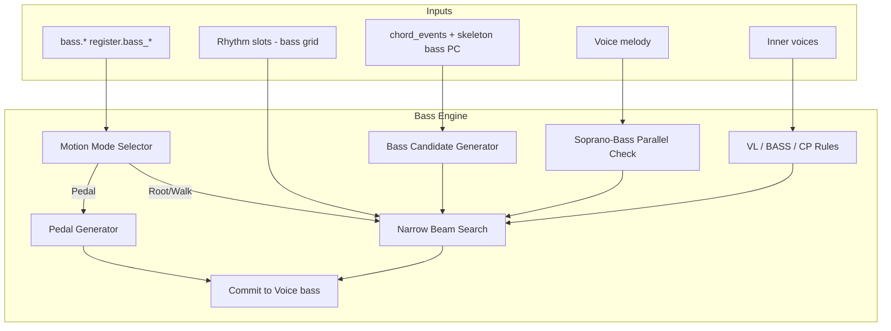

# Bass Engine Specification

**Version:** 0.1  
**Status:** Draft  
**Agent:** Algorithm Engines Research Agent (Bass)  
**Dependencies:** [pipeline.md](../01-architecture/pipeline.md), [ast.md](../02-music-model/ast.md), [harmony-engine.md](harmony-engine.md), [melody-engine.md](melody-engine.md), [counterpoint-engine.md](counterpoint-engine.md), [rhythm-engine.md](rhythm-engine.md), [voice-leading.md](../03-theory/voice-leading.md), [jazz.md](../03-theory/jazz.md), [scoring.md](../05-rule-engine/scoring.md), [constraint.md](../05-rule-engine/constraint.md), [voices.md](../02-music-model/voices.md)

---

## Table of Contents

1. [Background](#1-background)
2. [Existing Solutions](#2-existing-solutions)
3. [Academic / Theoretical Foundation](#3-academic--theoretical-foundation)
4. [Engineering Analysis](#4-engineering-analysis)
5. [Comparison of Approaches](#5-comparison-of-approaches)
6. [Recommended Solution](#6-recommended-solution)
7. [Architecture](#7-architecture)
8. [Data Structures](#8-data-structures)
9. [Algorithms](#9-algorithms)
10. [Interfaces](#10-interfaces)
11. [Parameter Mappings](#11-parameter-mappings)
12. [Explainability Model](#12-explainability-model)
13. [Future Expansion](#13-future-expansion)
14. [Open Questions](#14-open-questions)
15. [References](#15-references)

**Appendices:** [A. Pipeline I/O](#appendix-a-pipeline-io) · [B. Bass Motion Modes](#appendix-b-bass-motion-modes) · [C. Narrow Beam Pseudocode](#appendix-c-narrow-beam-pseudocode) · [D. Register Mapping](#appendix-d-register-mapping) · [E. Worked Examples](#appendix-e-worked-examples)

---

## 1. Background

### 1.1 Purpose

The **Bass Engine** implements **Pipeline Stage 9: Bass** — generation of the **bass line** after melody and inner voices are committed. It supports three primary motion styles: **root motion** (classical/pop), **walking bass** (jazz), and **pedal point** (organ, minimalist, dominant prolongation).

Search uses a **narrow beam** (default width **8**) because the bass pitch candidate space is smaller than melody but voice-leading constraints remain strict — especially against the outer-voice framework established in Stages 7–8.

### 1.2 Pipeline I/O

| Property | Value |
|----------|-------|
| **Stage** | 9 — Bass |
| **Search** | **Yes — narrow beam search** |
| **Beam Width** | `bass.beam_width` default **8** (preview 4, jazz walk 12) |
| **AST Read** | `chord_events`, harmony skeleton `bass` pitch classes, `Voice[melody]`, inner voices, rhythm skeleton, `register.bass_*`, `bass.*` |
| **AST Write** | `Voice[bass].note_events[]`, `Event.provenance` |

### 1.3 Harmony Skeleton Input

Stage 5 writes skeleton `bass` pitch class per chord event — the **harmonic root or slash bass**. Stage 9 **realizes** this into a registral bass line with smooth motion, not necessarily repeating the root on every attack.

```text
Harmony skeleton:  Am → Dm → G → C   (root PCs)
Bass engine output: A2 → A2 → G2 → F2 → E2 → ...  (realized line)
```

### 1.4 Design Principles

| Principle | Application |
|-----------|-------------|
| **Foundation role** | Bass defines harmonic anchor; errors propagate to perceived harmony |
| **Style modes** | Root / walk / pedal selected by style preset + `bass.motion_style` |
| **Register discipline** | `register.bass_min/max` HARD constraint |
| **Outer-voice framework** | Bass + soprano pair checked for CP-PAR (cross-ref counterpoint strictness) |

---

## 2. Existing Solutions

| System | Bass Generation | Aurora Assessment |
|--------|-----------------|-------------------|
| **Band-in-a-Box** | Root + walk templates | Template + search hybrid |
| **iReal Pro** | User-defined; playback roots | Not generative |
| **Music21** | Figured bass realization (analysis) | Baroque plugin reference |
| **Jazz pedagogical rules** | Root movement by interval class | Encode as BASS-* rules |
| **Deep research report** | Beam over bass candidates | **Basis for Aurora** |
| **Harmony engine skeleton** | Root PC only | Input constraint, not output |

---

## 3. Academic / Theoretical Foundation

### 3.1 Root Motion (Classical / Pop)

Bass typically articulates **chord root** on strong beats, with **arpeggiation** or **passing tones** on weak beats.

| Progression type | Preferred bass motion |
|------------------|----------------------|
| Diatonic | Stepwise or P4/P5 leaps |
| Circle of fifths | Descending P5 or ascending P4 |
| Chromatic | Half-step approach to target root |

Rules: VL-MOT-003 stepwise preference; CP-024 bass leap > P4 penalized at high strictness.

### 3.2 Walking Bass (Jazz)

Quarter-note (or eighth in up-tempo) line connecting chord changes:

```text
Target: one bass note per beat
Notes: chord tones (1, 3, 5, 7) + passing tones on weak beats
Approach: chromatic or diatonic to next chord root
```

Levine convention: **rootless voicings** in upper voices when walking bass present (JAZZ-VOICE-003 cross-check only).

### 3.3 Pedal Point

Sustained or repeated bass tone while harmony changes above:

| Pedal type | Use |
|------------|-----|
| Tonic pedal | Prolongation, build tension |
| Dominant pedal | Pre-cadential |
| Organ point | Minimalist / film |

Pedal mode **locks** bass pitch across harmony span; upper voices carry harmonic change.

### 3.4 Bass Register Conventions

| Style | Typical range ( MIDI ) |
|-------|------------------------|
| Classical SATB | E2 – G3 |
| Jazz acoustic bass | E1 – G3 (written, sounds 8vb) |
| Pop synth bass | C2 – C4 |
| Organ pedal | C2 – F3 |

User params `register.bass_min`, `register.bass_max`, `register.bass_register` override defaults ([Appendix D](#appendix-d-register-mapping)).

### 3.5 Interaction with Voice Leading

Bass participates in:

- **VL-CT-001:** Common tone retention across chord change
- **VL-MOT-010/011:** Tendency tone resolution (leading tone in bass rare; 7th downward)
- **CP-PAR-001..010:** Outer-voice (soprano–bass) parallel checks when `counterpoint.strictness ≥ 0.7`
- **VL-X-002:** Voice crossing with inner voices — HARD in SATB at high strictness

---

## 4. Engineering Analysis

### 4.1 Performance Targets

| Operation | Target |
|-----------|--------|
| Candidate generation per slot | < 1 ms |
| Beam step (width 8, ~8 candidates) | < 120 ms |
| 32-bar root motion bass | < 3 s |
| 32-bar walking bass | < 5 s |
| Preview 2-bar | < 400 ms (width 4) |

Narrow beam justified: average **6–10 pitch candidates** per slot vs. 12–20 for melody.

### 4.2 Candidate Space Reduction

| Motion style | Candidates per slot |
|--------------|---------------------|
| Root only | 1–3 (root + octave) |
| Root motion | 4–8 |
| Walking | 8–14 |
| Pedal | 1 (locked) |

### 4.3 Failure Modes

| Failure | Mitigation |
|---------|------------|
| No legal bass pitch in register | Expand octave; log REG warning |
| Walking line cannot reach next root | Insert chromatic approach; Repair stage |
| Pedal clashes with melody bass note | Prefer pedal PC not in melody doubling |
| Parallel P5 soprano–bass | Beam prune; relax only if strictness < 0.4 |

---

## 5. Comparison of Approaches

| Approach | Style fit | Voice-leading | Performance | Verdict |
|----------|-----------|---------------|-------------|---------|
| Root PC from harmony skeleton only | Pop OK | Poor | Instant | Preview / root_only mode |
| Greedy nearest root | Moderate | Weak | Fast | Fallback |
| **Narrow beam + VL/CP rules** | All | Good | **Acceptable** | **Primary** |
| Markov bass n-grams | Jazz-ish | Variable | Fast | Style plugin data |
| Full-width beam (= melody) | Best | Best | Slow | Unnecessary |
| CSP simultaneous with inner voices | Optimal | Best | Very slow | Rejected v0.1 |

---

## 6. Recommended Solution

### 6.1 Mode Selection

```text
function select_bass_mode(params, section):
    if params.bass.motion_style != auto:
        return params.bass.motion_style

    if params.style.genre in JAZZ_GENRES:
        return Walking
    if section.has_dominant_pedal_hint or params.bass.pedal_probability > 0.7:
        return Pedal
    if params.texture.homophony_polyphony_balance > 0.8:
        return RootMotion
    return RootMotion  // default
```

### 6.2 Generation Flow

```text
mode = select_bass_mode(params, section)
slots = iterate_bass_slots(ast, mode)  // may coarsen grid for root_only

if mode == Pedal:
    write_pedal_bass(ast, params)
else:
    beam = [initial_bass_state(section.start)]

    for slot in slots:
        beam = bass_beam_step(beam, slot, ast, params, mode, width=8)

    winner = argmax(beam, eval_score)
    commit_bass_path(winner, ast)

return ast
```

---

## 7. Architecture



---

## 8. Data Structures

### 8.1 Search State

```rust
struct BassSearchState {
    id: StateId,
    ast_snapshot: AstSnapshot,
    slot_index: u32,
    last_pitch: Option<Pitch>,
    last_motion_semitones: i8,
    current_harmony_span: HarmonySpanId,
    eval_score: f64,
    parent: Option<StateId>,
    applied_rules: Vec<RuleEvalResult>,
    pedal_locked: bool,
}

struct BassCandidate {
    pitch: Pitch,
    slot: RhythmicSlot,
    candidate_type: BassCandidateType,
    target_chord_root: PitchClass,
}

enum BassCandidateType {
    Root,
    ChordTone,           // 3rd, 5th, 7th
    PassingTone,
    ApproachTone,        // chromatic/diatonic to next root
    Pedal,
    Rest,
}

enum BassMotionStyle {
    RootOnly,
    RootMotion,
    Walking,
    Pedal,
    Auto,
}
```

### 8.2 Pedal Plan

```rust
struct PedalPlan {
    pitch: Pitch,
    start_beat: Rational,
    end_beat: Rational,
    pedal_type: PedalType,   // Tonic, Dominant, Ornamental
    harmony_spans: Vec<HarmonySpanId>,
}

enum PedalType {
    Tonic,
    Dominant,
    Ornamental,
}
```

### 8.3 Register Context

```rust
struct BassRegisterContext {
    min_midi: u8,               // from register.bass_min
    max_midi: u8,               // from register.bass_max
    preferred_center: u8,       // from register.bass_register center
    double_bass_8vb: bool,      // orchestration preset
}
```

---

## 9. Algorithms

### 9.1 Main Entry

```text
function generate_bass(ast, params, emotion_deltas):
    voice = ast.voice(Bass)
    register = build_bass_register_context(params)
    width = params.bass.beam_width ?? 8

    for section in ast.sections:
        mode = select_bass_mode(params, section)

        if mode == Pedal:
            plan = plan_pedal(section, ast, params)
            write_pedal_events(voice, plan, ast, register)
            continue

        slots = iterate_bass_slots(ast, section, mode, params)
        beam = [init_bass_state(section.start, register)]

        for slot in slots:
            beam = bass_beam_step(
                beam, slot, ast, params, mode, register, width, emotion_deltas
            )

        winner = argmax(beam, eval_score)
        commit_bass_path(winner, voice, ast)

    return ast
```

### 9.2 Bass Slot Iterator

Coarsens rhythm skeleton for non-walking modes:

```text
function iterate_bass_slots(ast, section, mode, params):
    all_slots = iterate_slots(ast, Bass)

    match mode:
        RootOnly =>
            return slots_at_harmony_boundaries_and_downbeats(all_slots)
        RootMotion =>
            return filter(all_slots, s => s.accent_weight >= 0.5 or s.aligns_harmony_change)
        Walking =>
            return quarter_note_slots(section)  // 4 per 4/4 bar minimum
        Pedal =>
            unreachable  // handled separately
```

### 9.3 Narrow Beam Step

```text
function bass_beam_step(beam, slot, ast, params, mode, register, width, emotion_deltas):
    candidates = []
    chord = chord_at(slot, ast)
    skeleton_bass_pc = chord.bass_pc  // from harmony skeleton
    soprano_pitch = ast.voice(Melody).pitch_at(slot.beat)

    for state in beam parallel:
        patches = generate_bass_candidates(
            state, slot, chord, skeleton_bass_pc, mode, register, params
        )

        for patch in patches:
            if !check_register(patch.pitch, register): continue  // REG HARD
            if !check_bass_hard(state, patch, ast, params): continue

            score = state.eval_score
            score += evaluate_bass_soft(state, patch, chord, mode, params)
            score += evaluate_vl_transition(state, patch, chord)
            score += outer_voice_check(soprano_pitch, state.last_pitch, patch.pitch, params)
            score += emotion_deltas_bass(emotion_deltas)

            child = state.extend(patch, score)
            candidates.append(child)

    sort candidates by eval_score desc
    return candidates[0:width]
```

### 9.4 Candidate Generation by Mode

#### Root Motion

```text
function generate_bass_candidates_root(state, slot, chord, skeleton_pc, register):
    pool = []

    // Primary: chord root in register
    pool += root_octaves(skeleton_pc, register)

    // On weak beats: fifth or third
    if slot.accent_weight < 0.6:
        pool += chord_tone_octaves(chord, [5th, 3rd], register)

    // Passing tone between last pitch and next harmony root
    if state.last_pitch and next_harmony_change_within(slot, 2 beats):
        pool += diatonic_passing(state.last_pitch, next_root, register)

    return dedupe(pool)[0:8]
```

#### Walking Bass

```text
function generate_bass_candidates_walk(state, slot, chord, register, params):
    pool = []

    // Quarter note walk: chord tones + chromatic approaches
    for pc in walking_tone_set(chord):  // 1, 3, 5, 7
        pool += octaves_in_range(pc, register)

    if slot.is_last_beat_before_harmony_change:
        next_root = next_chord(slot).root_pc
        pool += approach_tones(state.last_pitch, next_root, chromatic = true)

    // Avoid repeating same pitch > 2 consecutive beats (BASS-WALK-003)
    pool = filter_no_repeat(pool, state, max_repeat = 2)

    return pool[0:12]
```

#### Root Only

```text
function generate_bass_candidates_root_only(chord, skeleton_pc, register):
    return root_octaves(skeleton_pc, register)[0:2]  // root + octave double
```

### 9.5 Pedal Generator

```text
function plan_pedal(section, ast, params):
    // Detect dominant prolongation or user pedal hint
    spans = harmony_spans(section)
    if phrase_ends_with_cadence(section) and params.bass.pedal_on_dominant:
        return PedalPlan {
            pitch: dominant_pc_in_key(section.key),
            start: spans[penultimate].start,
            end: spans.last.end,
            pedal_type: Dominant,
        }

    // Tonic pedal for intro/outro
    if section.role in {Intro, Outro}:
        return PedalPlan { pitch: tonic_root(section.key), ... }

    return default_pedal_from_params(params)

function write_pedal_events(voice, plan, ast, register):
    pitch = clamp_register(plan.pitch, register)
    for beat in beats(plan.start, plan.end):
        write_note(voice, pitch, beat, duration = slot_duration)
        provenance = { reason: "dominant pedal", rule: "BASS-PED-001" }
```

### 9.6 Scoring Rules (Soft)

| Rule ID | Description | Mode |
|---------|-------------|------|
| BASS-001 | Root on strong beat / harmony change | Root, Walk |
| BASS-002 | Stepwise motion preference | All |
| BASS-003 | Fifth motion to fifth motion (circle) rewarded | Root |
| BASS-004 | Leap > P4 penalized unless compensated | Root |
| BASS-WALK-001 | Beat coverage: all quarter slots filled | Walk |
| BASS-WALK-002 | Approach next root by half-step from below/above | Walk |
| BASS-WALK-003 | No pitch repeat > 2 beats | Walk |
| BASS-PED-001 | Pedal PC stable across span | Pedal |
| BASS-PED-002 | Upper voices form changing harmony above pedal | Pedal |
| VL-CT-001 | Common tone across chord change | All |
| CP-PAR-001..010 | Outer voice parallels soprano–bass | strictness ≥ 0.7 |

```text
function evaluate_bass_soft(state, patch, chord, mode, params):
    score = 0.0

    if patch.candidate_type == Root and slot.is_strong:
        score += weight(BASS-001)

    motion = semitones(state.last_pitch, patch.pitch)
    if abs(motion) <= 2:
        score += weight(BASS-002) * params.voice.stepwise_preference
    elif abs(motion) > 5:
        score -= weight(BASS-004)

    if mode == Walking:
        if patch.candidate_type == ApproachTone:
            score += weight(BASS-WALK-002)
        if is_chord_tone(patch.pitch, chord):
            score += weight(BASS-WALK-001) * 0.5

    // Reward matching skeleton bass PC on harmony change
    if slot.aligns_harmony_change and patch.pitch.pc == chord.bass_pc:
        score += weight(BASS-001) * 1.5

    return score
```

### 9.7 Outer-Voice Parallel Check

```text
function outer_voice_check(soprano_now, bass_prev, bass_now, params):
    if params.counterpoint.strictness < 0.7:
        return 0.0

    if bass_prev is None or soprano_prev is None:
        return 0.0

    interval_prev = interval(bass_prev, soprano_prev)
    interval_now = interval(bass_now, soprano_now)

    if motion_parallel(bass_prev, bass_now, soprano_prev, soprano_now):
        if interval_prev in {P5, P8} and interval_now in {P5, P8}:
            return -parallel_penalty(params)  // CP-PAR; should have been HARD pruned

    return contrary_motion_bonus(bass_prev, bass_now, soprano_prev, soprano_now)  // CP-020
```

### 9.8 Hard Constraints

| Constraint | Source |
|------------|--------|
| Register min/max | `register.bass_min/max` REG-001 |
| Slash chord bass PC on change | BASS-001 HARD when `bass.root_enforcement > 0.9` |
| Voice overlap inner voices | VL-X HARD SATB |
| Double bass 8vb export range | ORCH-RNG-009 (orchestration preset) |

---

## 10. Interfaces

```rust
pub trait BassEngine {
    fn generate(
        &self,
        ast: &mut Composition,
        params: &Parameters,
        emotion: &WeightDeltaTable,
    ) -> BassResult;
}

pub trait BassPlugin {
    fn motion_style_override(&self, section: &Section) -> Option<BassMotionStyle>;

    fn augment_candidates(
        &self,
        state: &BassSearchState,
        slot: &RhythmicSlot,
        chord: &ChordEvent,
    ) -> Vec<BassCandidate>;
}

pub struct BassResult {
    pub mode_used: BassMotionStyle,
    pub note_count: u32,
}
```

---

## 11. Parameter Mappings

| Parameter | Effect | Rules | Default |
|-----------|--------|-------|---------|
| `register.bass_min` | HARD lower bound (MIDI) | REG-001, VL-RNG | E2 (40) |
| `register.bass_max` | HARD upper bound (MIDI) | REG-001, VL-RNG | G3 (55) |
| `register.bass_register` | Preferred center; soft pull | REG-002 | E2–C3 |
| `bass.motion_style` | Root / Walk / Pedal / Auto | mode select | auto |
| `bass.beam_width` | Narrow beam size | — | 8 |
| `bass.root_enforcement` | Require skeleton PC on change | BASS-001 | 0.85 |
| `bass.walking_chromaticism` | Approach tone weight | BASS-WALK-002 | 0.6 |
| `bass.pedal_probability` | Pedal mode trigger | BASS-PED-* | 0.2 |
| `bass.pedal_on_dominant` | Dominant pedal before cadence | BASS-PED-001 | true |
| `bass.leap_limit_semitones` | Max leap without penalty | BASS-004 | 7 |
| `counterpoint.strictness` | Outer-voice parallel mode | CP-PAR | 0.5 |
| `voice.stepwise_preference` | Stepwise reward scale | BASS-002, VL-MOT | 0.7 |
| `harmony.complexity` | Walking vs root bias | — | 0.5 |
| `style.genre` | Default motion style | — | — |
| `rhythm.subdivision` | Walk grid resolution | BASS-WALK-001 | 0.5 |
| `search.beam_width` | Fallback if bass.beam_width unset | — | 16 |

**Register mapping:**

```text
function build_bass_register_context(params):
    range = params.register.bass_register  // PitchRange preset
    return BassRegisterContext {
        min_midi: params.register.bass_min ?? range.min_midi,
        max_midi: params.register.bass_max ?? range.max_midi,
        preferred_center: (min_midi + max_midi) / 2,
        double_bass_8vb: params.style.orchestration == "orchestral",
    }
```

**Score equation:**

```text
eval_score = parent.eval_score
           + Σ BASS-* soft rewards
           + Σ VL transition rewards
           − leap_penalties
           − parallel_penalties (outer voice)
           + root_match_bonus on harmony change
```

---

## 12. Explainability Model

```text
Provenance {
    reason: "Walking approach: chromatic F#2 to G2 before Dm change",
    rule_id: "BASS-WALK-002",
    score_delta: +11.0,
    eval_score_running: 98.4,
    search_step: 14,
    beam_rank: 0,
    motion_style: "Walking",
    candidate_type: "ApproachTone",
    skeleton_bass_pc: "G",
    register: { min: 40, max: 55 },
}
```

**Inspector:**

- Bass motion style badge (Root / Walk / Pedal)
- Root match indicators at harmony boundaries
- Outer-voice interval strip (soprano–bass)
- Register band overlay from `register.bass_register`

---

## 13. Future Expansion

- Figured bass realization plugin (Baroque) — replaces root motion mode
- Slap/pop rhythmic bass (funk preset)
- Synth bass sub-octave doubling rules
- User-pinned bass notes
- AI plugin proposes walk patterns; rule engine selects
- Re-bass on harmony-only regeneration (preserve rhythm)

---

## 14. Open Questions

1. **Slash chords:** Always enforce skeleton `bass` PC on change, or allow passing tone over slash?
2. **Jazz rootless:** When walking, confirm upper voices omit root (JAZZ-VOICE-003) automatically?
3. **Pedal + walking transition:** How to hand off when section changes mode mid-piece?
4. **Double bass 8vb:** Apply at AST write or export-only (ORCH-RNG-009)?

---

## 15. References

- Levine, M. *Jazz Theory Book* — walking bass
- Kostka & Payne — bass arpeggiation
- Aldwell & Schachter — root motion, pedals
- [harmony-engine.md](harmony-engine.md) — skeleton bass PC
- [counterpoint-engine.md](counterpoint-engine.md) — outer-voice framework
- [voice-leading.md](../03-theory/voice-leading.md)
- [jazz.md](../03-theory/jazz.md) — JAZZ-VOICE-003
- [scoring.md](../05-rule-engine/scoring.md)
- [voices.md](../02-music-model/voices.md) — register computation
- [deep-research-report.md](../../deep-research-report.md)

---

## Appendix A: Pipeline I/O

**Stage 9 · Narrow beam width 8 · Writes `Voice[bass].note_events`**

| Read | Write |
|------|-------|
| `chord_events`, skeleton `bass` PC | Bass note events |
| `Voice[melody]`, inner voices | Provenance per note |
| Rhythm skeleton (possibly coarsened) | Pedal metadata if applicable |
| `register.bass_*`, `bass.*` | Motion style in section metadata |

---

## Appendix B: Bass Motion Modes

| Mode | Grid | Typical genres | Search |
|------|------|----------------|--------|
| **RootOnly** | Harmony boundaries | Pad, ambient, preview | Minimal (greedy) |
| **RootMotion** | Strong beats + changes | Classical, pop, rock | Narrow beam |
| **Walking** | Quarter notes (min) | Jazz, swing, blues | Narrow beam (w=12) |
| **Pedal** | Sustained / repeated | Organ, minimalist, film | No search |

Mode selection precedence: explicit `bass.motion_style` > style preset > section role hints.

---

## Appendix C: Narrow Beam Pseudocode

```text
// Width 8 vs melody 16: fewer candidates, tighter pruning
function bass_beam_step(..., width):
    // See §9.3
    // Terminal: all bass slots in section filled
    // Winner: max eval_score

// Preview mode
if params.preview_mode:
    width = 4
    mode = RootOnly if mode == Walking  // speed fallback
```

Commit uses same `commit_search_result` as melody/counterpoint ([scoring.md](../05-rule-engine/scoring.md) §12.4).

---

## Appendix D: Register Mapping

| Preset | `register.bass_register` | MIDI min–max | Notes |
|--------|--------------------------|--------------|-------|
| SATB choral | E2–G3 | 40–55 | Default |
| Jazz acoustic | E1–G3 written | 28–55 | 8vb playback |
| Pop synth | C2–C4 | 36–60 | Wider |
| Orchestral | E1–C3 | 28–48 | ORCH-RNG-009 |

```text
function clamp_register(pitch, ctx):
    while pitch.midi < ctx.min_midi: pitch += octave
    while pitch.midi > ctx.max_midi: pitch -= octave
    if still out of range: HARD fail candidate

function register_center_pull(pitch, ctx):
    distance = abs(pitch.midi - ctx.preferred_center)
    return -distance * weight(REG-002)  // soft penalty
```

Parameters:

| Param | Type | Default | Description |
|-------|------|---------|-------------|
| `register.bass_min` | MIDI | 40 | Hard floor |
| `register.bass_max` | MIDI | 55 | Hard ceiling |
| `register.bass_register` | PitchRange | E2–G3 | Preset range + center |

---

## Appendix E: Worked Examples

### E.1 Root Motion (Pop)

**Harmony:** C → Am → F → G (1 bar each)

**Output bass:** C2 – C2 – A2 – A2 – F2 – F2 – G2 – G2 (eighths on strong beats)

**Rules:** BASS-001 root on change; BASS-002 stepwise C→A via passing optional.

### E.2 Walking Bass (Jazz)

**Harmony:** Dm7 (bar 1) → G7 (bar 2)

**Output:** D2 – F2 – A2 – C3 | B2 – Bb2 – A2 – G2 (approach to G7 root)

**Rules:** BASS-WALK-001, BASS-WALK-002 chromatic approach.

### E.3 Dominant Pedal

**Harmony:** Dm – G – C (G pedal under first two chords)

**Output:** G1 whole notes × 2 bars while harmony changes

**Rules:** BASS-PED-001, BASS-PED-002; resolves to C root at cadence.

---

*End of Bass Engine Specification v0.1*
