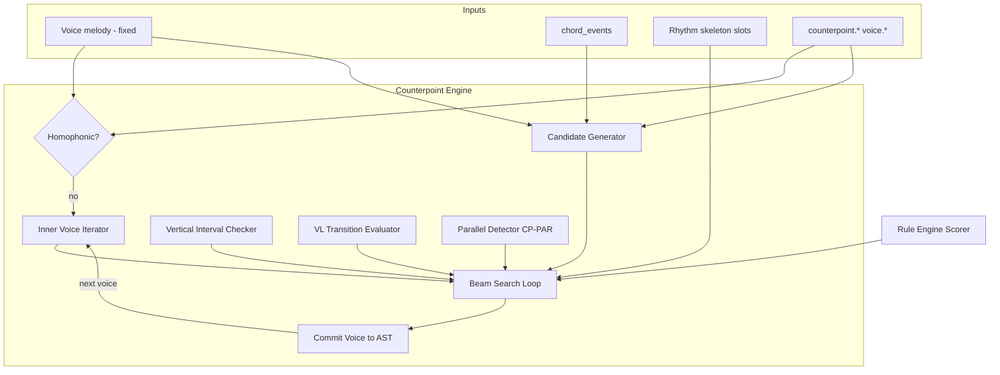

# Counterpoint Engine Specification

**Version:** 0.1  
**Status:** Draft  
**Agent:** Algorithm Engines Research Agent (Counterpoint)  
**Dependencies:** [pipeline.md](../01-architecture/pipeline.md), [ast.md](../02-music-model/ast.md), [melody-engine.md](melody-engine.md), [harmony-engine.md](harmony-engine.md), [rhythm-engine.md](rhythm-engine.md), [counterpoint.md](../03-theory/counterpoint.md), [voice-leading.md](../03-theory/voice-leading.md), [scoring.md](../05-rule-engine/scoring.md), [constraint.md](../05-rule-engine/constraint.md), [voices.md](../02-music-model/voices.md)

---

## Table of Contents

1. [Background](#1-background)
2. [Existing Solutions](#2-existing-solutions)
3. [Academic / Theoretical Foundation](#3-academic--theoretical-foundation)
4. [Engineering Analysis](#4-engineering-analysis)
5. [Comparison of Approaches](#5-comparison-of-approaches)
6. [Recommended Solution](#6-recommended-solution)
7. [Architecture](#7-architecture)
8. [Data Structures](#8-data-structures)
9. [Algorithms](#9-algorithms)
10. [Interfaces](#10-interfaces)
11. [Parameter Mappings](#11-parameter-mappings)
12. [Explainability Model](#12-explainability-model)
13. [Future Expansion](#13-future-expansion)
14. [Open Questions](#14-open-questions)
15. [References](#15-references)

**Appendices:** [A. Pipeline I/O](#appendix-a-pipeline-io) · [B. Beam Search Pseudocode](#appendix-b-beam-search-pseudocode) · [C. CP/VL Rule Integration Matrix](#appendix-c-cpvl-rule-integration-matrix) · [D. Strictness Mapping Table](#appendix-d-strictness-mapping-table) · [E. Worked Example (SATB)](#appendix-e-worked-example-satb)

---

## 1. Background

### 1.1 Purpose

The **Counterpoint Engine** implements **Pipeline Stage 8: Counterpoint** — generation of **inner voices** (alto, tenor, and optional additional polyphonic lines) after the primary melody is committed in Stage 7. It uses **beam search** over pitch candidates at each rhythmic slot, scored by **CP-*** counterpoint rules and **VL-*** voice-leading rules from the theory registry.

The cantus firmus (fixed melody) is **not modified** by this stage. Bass generation is deferred to Stage 9. Counterpoint stage may **skip entirely** when texture is homophonic (`texture.homophony_polyphony_balance > 0.85`, CP-034).

### 1.2 Pipeline I/O

| Property | Value |
|----------|-------|
| **Stage** | 8 — Counterpoint |
| **Search** | **Yes — beam search per inner voice** |
| **Beam Width** | `counterpoint.beam_width` default **12** (preview 4, chorale strict 16) |
| **AST Read** | `Voice[melody].note_events`, `chord_events`, rhythm skeleton, `counterpoint.*`, `voice.*`, register params |
| **AST Write** | `Voice[inner].note_events[]` (alto, tenor, …), vertical provenance, `Event.provenance` |

### 1.3 Voice Generation Order

For SATB layout (default when `voice.voice_count >= 4`):

```text
1. Soprano (melody) — fixed from Stage 7
2. Alto — beam search (this stage)
3. Tenor — beam search (this stage), reads alto as context
4. Bass — Stage 9 (not this engine)
```

Sequential voice filling avoids simultaneous multi-voice state explosion while preserving pairwise interval checking against all committed voices.

### 1.4 Relationship to Theory Docs

| Theory doc | Engine role |
|------------|-------------|
| [counterpoint.md](../03-theory/counterpoint.md) | CP-* rules: vertical intervals, parallels, species |
| [voice-leading.md](../03-theory/voice-leading.md) | VL-* rules: transitions, common tones, tendency tones |
| [harmony-engine.md](harmony-engine.md) | Chord tones + guide tones as pitch-class priors |

---

## 2. Existing Solutions

| System | Counterpoint Generation | Aurora Assessment |
|--------|------------------------|-------------------|
| **Fux tutors / automated graders** | Post-hoc rule check | Generative inversion needed |
| **OpenMusic / Strasheela** | User-defined CP constraints | Flexible; adopt rule ID model |
| **Morris / Maxwell CSP** | Species CSP prototypes | Research reference |
| **Music21** | `parallel.fifths` analysis | Validation benchmark |
| **Bach chorale ML** | Neural harmonization | Black box; rejected as primary |
| **Melody engine reuse** | Same beam infrastructure | **Shared search framework** |
| **Deep research report** | Beam + CP/VL scoring | **Basis for Aurora** |

---

## 3. Academic / Theoretical Foundation

### 3.1 Species Counterpoint as Search Prior

Species levels (Fux) inform **candidate density** and **dissonance policy**, not literal whole-note cantus in florid mode:

| Species | Notes per CF note | Engine mapping |
|---------|-------------------|----------------|
| 1st | 1:1 | `complexity < 0.3`: one candidate per harmony span |
| 2nd | 2:1 | Half-beat subdivision minimum |
| 3rd | 4:1 | Default at `complexity ≈ 0.5` |
| 4th | Syncopated | Suspension candidates when `complexity > 0.7` |
| 5th (florid) | Mixed | Default production mode |

### 3.2 Vertical Consonance (CP-S1, CP-S2)

At each simultaneous snapshot:

- **Perfect consonances:** P1, P5, P8 — restricted (P1 doubling policy)
- **Imperfect consonances:** m3, M3, m6, M6 — preferred
- **Dissonances:** m2, M2, m7, M7, tritone; P4 above bass in 2-voice — context-dependent

Strong-beat consonance HARD when `counterpoint.strictness ≥ 0.8` (CP-S5-002).

### 3.3 Parallel Interval Avoidance (CP-PAR)

Forbidden parallels: P1, P5, P8 between any voice pair across adjacent vertical snapshots.

**Hidden parallels:** Similar motion into P5/P8 — penalized via CP-PAR-007..010; severity scales with strictness.

### 3.4 Voice Leading (VL Integration)

Counterpoint engine evaluates **both**:

1. **Vertical snapshot** at beat *t* → CP-S*, CP-PAR, CP-050+
2. **Transition** from *t−1* to *t* per voice → VL-CT, VL-MOT, VL-RNG, VL-X

Parallel detection **delegates** to shared module used by Repair stage — single implementation, dual-tagged CP-PAR + VL-PAR.

### 3.5 Melodic Independence (CP-050+)

Inner voices must not shadow the melody within M2 for extended duration. Rhythmic differentiation rewarded when alto/tenor use different slot subsets than soprano.

---

## 4. Engineering Analysis

### 4.1 Performance Targets

| Operation | Target |
|-----------|--------|
| Vertical interval check (4 voices) | < 1 ms |
| Soft rule eval per candidate | < 2 ms |
| Beam step (width 12, ~10 candidates) | < 200 ms |
| Alto + tenor, 32 bars | < 8 s |
| Preview 2-bar inner voice | < 1 s (width 4) |
| Full SATB inner (skip bass) 64 bars | < 15 s |

### 4.2 State Space

Per inner voice beam search:

- **Pitch candidates per slot:** 8–20 (chord tones + passing/neighbor in range)
- **Effective branching:** reduced by CP HARD prune (~40–70% rejection at strictness 0.9)
- **Memory:** O(beam_width × slots × voice_count) — manageable at width 12

### 4.3 Skip Conditions

```text
skip_counterpoint_stage(params):
    return params.texture.homophony_polyphony_balance > 0.85
        OR params.voice.voice_count <= 2
        OR params.style.preset == "solo_melody"
```

When skipped, provenance records `CP-034` with reason.

---

## 5. Comparison of Approaches

| Approach | Correctness | Order bias | Performance | Verdict |
|----------|-------------|------------|-------------|---------|
| Sequential greedy per voice | Moderate | High (tenor follows alto) | Fast | Preview fallback |
| **Sequential beam per voice** | Good | Moderate | **Acceptable** | **Primary** |
| Simultaneous multi-voice beam | Best | Low | Exponential | Rejected v0.1 |
| Species scaffold then fill | Pedagogical | Low | Two-pass cost | Optional mode |
| Post-hoc repair only | Poor | N/A | Fast | Insufficient alone |
| CSP single-shot | Optimal local | None | Slow | Validation only |

---

## 6. Recommended Solution

### 6.1 Generation Flow

```text
if skip_counterpoint_stage(params): return ast

cantus = ast.voice(Melody)  // fixed
inner_voices = resolve_inner_voices(params)  // alto, tenor typically

for voice in inner_voices in order (alto → tenor):
    species = resolve_species_config(params, voice)
    slots = iterate_slots(ast, voice)  // from rhythm skeleton

    beam = [initial_state(voice, slots[0])]

    for slot in slots:
        beam = beam_step_counterpoint(
            beam, slot, cantus, committed_voices, ast, params, species
        )

    winner = argmax(beam, eval_score)
    commit_inner_voice(winner, voice, ast)

return ast
```

### 6.2 Scoring Composition

```text
eval_score = parent.eval_score
           + Σ CP soft rewards/penalties (scaled by strictness)
           + Σ VL soft rewards/penalties
           + chord_tone_bonus on strong beats
           + common_tone_bonus (VL-CT-001)
           − parallel_penalty (CP-PAR, scaled)
           − voice_crossing_penalty (VL-X)
           − independence_penalty (CP-050..055)
```

Hard constraints prune before scoring ([constraint.md](../05-rule-engine/constraint.md)).

---

## 7. Architecture



### 7.1 Shared Modules

| Module | Location | Used by |
|--------|----------|---------|
| `ParallelDetector` | Rule engine | Counterpoint, Repair |
| `VerticalSnapshotBuilder` | Rule engine | Counterpoint, Validation |
| `TransitionEvaluator` | Rule engine | Counterpoint, Harmony voicing |
| `BeamSearchFramework` | scoring.md | Melody, Counterpoint, Bass |

---

## 8. Data Structures

### 8.1 Search State

```rust
struct CounterpointSearchState {
    id: StateId,
    voice_id: VoiceId,              // alto or tenor being generated
    ast_snapshot: AstSnapshot,
    slot_index: u32,
    last_pitch: Option<Pitch>,
    last_interval: Option<Interval>,
    vertical_history: Vec<VerticalSnapshot>,  // last 2 beats
    eval_score: f64,
    parent: Option<StateId>,
    applied_rules: Vec<RuleEvalResult>,
    requires_resolution: bool,      // suspension / tendency flag
}

struct VerticalSnapshot {
    beat: Rational,
    pitches: HashMap<VoiceId, Pitch>,  // melody + committed inner + current candidate
    intervals: Vec<(VoicePair, Interval)>,
    motion_records: Vec<MotionRecord>,
}

struct MotionRecord {
    voice_pair: (VoiceId, VoiceId),
    motion_type: MotionType,        // Contrary, Oblique, Similar, Parallel
    interval_from: Interval,
    interval_to: Interval,
}
```

### 8.2 Species Configuration

```rust
struct SpeciesConfig {
    level: u8,                      // 0 = florid auto, 1–5 = species
    cantus_voice: VoiceId,          // always Melody in Stage 8
    dissonance_beat_mask: BitMask,  // which subdivisions allow dissonance
    max_leap_semitones: u8,
    strong_beat_consonance: bool,   // from strictness
}

struct InnerVoiceCandidate {
    pitch: Pitch,
    slot: RhythmicSlot,
    candidate_type: InnerCandidateType,
    is_common_tone: bool,
    is_chord_tone: bool,
}

enum InnerCandidateType {
    ChordTone,
    PassingTone,
    NeighborTone,
    Suspension,                   // species 4+
    Anticipation,
    Rest,
}
```

### 8.3 Strictness Profile

```rust
struct StrictnessProfile {
    parallel_mode: RuleMode,        // Hard | Soft | Disabled
    hidden_parallel_weight: f32,
    dissonance_beat_policy: DissonancePolicy,
    voice_crossing_mode: RuleMode,
    tendency_tone_mode: RuleMode,
    min_spacing_semitones: u8,      // CP-055
}

enum RuleMode {
    Hard,
    Soft { weight: f32 },
    Disabled,
}
```

Built once per generation from `counterpoint.strictness` ([Appendix D](#appendix-d-strictness-mapping-table)).

---

## 9. Algorithms

### 9.1 Main Entry

```text
function generate_counterpoint(ast, params, emotion_deltas):
    if skip_counterpoint_stage(params):
        record_skip_provenance(ast, "CP-034")
        return ast

    profile = build_strictness_profile(params.counterpoint.strictness)
    cantus_voice = ast.voice(Melody)
    width = params.counterpoint.beam_width ?? params.search.beam_width / 2  // default 12

    for inner_voice in inner_voices_ordered(ast, params):
        config = resolve_species_config(params, inner_voice)
        slots = iterate_slots(ast, inner_voice.role)

        beam = [init_counterpoint_state(inner_voice, slots[0], ast)]

        for slot in slots:
            committed = all_committed_pitches(ast, slot.beat, exclude = inner_voice)
            beam = beam_step_counterpoint(
                beam, slot, cantus_voice, committed, ast, params, config, profile, width
            )

        winner = argmax(beam, eval_score)
        commit_search_result(winner, inner_voice, ast)

    return ast
```

### 9.2 Beam Step

```text
function beam_step_counterpoint(beam, slot, cantus, committed, ast, params, config, profile, width):
    candidates = []

    for state in beam parallel:
        chord = chord_at(slot, ast)
        cantus_pitch = cantus.pitch_at(slot.beat)
        patches = generate_inner_candidates(state, slot, chord, cantus_pitch, params, config)

        for patch in patches:
            snapshot = build_vertical_snapshot(
                cantus, committed, state.voice_id, patch.pitch, slot.beat
            )

            // HARD prune
            if !check_cp_hard(snapshot, profile): continue
            if !check_vl_hard(state, patch, profile): continue
            if !check_range(inner_voice, patch.pitch, params): continue

            score = state.eval_score
            score += evaluate_cp_soft(snapshot, state.vertical_history, profile)
            score += evaluate_vl_soft(state, patch, chord, params)
            score += emotion_weight_adjustments(emotion_deltas)

            child = state.extend(patch, snapshot, score)
            candidates.append(child)

    sort candidates by eval_score desc
    return candidates[0:width]
```

### 9.3 Candidate Generation

```text
function generate_inner_candidates(state, slot, chord, cantus_pitch, params, config):
    pool = []
    range = register_for_voice(state.voice_id, params)

    // Chord tones in range (primary)
    for pc in chord.tones:
        for octave in octaves_in_range(pc, range):
            pool.append(InnerVoiceCandidate(octave, slot, ChordTone, ...))

    // Passing / neighbor if species >= 2
    if config.level >= 2 or config.level == 0:
        pool += passing_neighbors(state.last_pitch, slot, chord, range)

    // Suspension candidates (species 4+, strong beat)
    if config.level >= 4 and slot.accent_weight > 0.7:
        pool += suspension_candidates(state, cantus_pitch, slot)

    // Common tone preference: boost existing pitch if in next chord
    if state.last_pitch in chord.tones:
        mark_common_tone(pool, state.last_pitch)

    // Rest option when rhythm slot allows
    if slot.slot_type == Rest or slot.slot_type == Optional:
        pool.append(rest_candidate(slot))

    return dedupe_by_pitch(pool)[0:max_candidates(config)]
```

Default max candidates: 12 florid, 6 species 1.

### 9.4 Parallel Fifth/Octave Detection

```text
function check_cp_hard(snapshot, prev_snapshot, profile):
    if prev_snapshot is None: return true

    for pair in voice_pairs(snapshot):
        motion = classify_motion(pair, prev_snapshot, snapshot)
        if motion == Parallel:
            i0 = interval_at(prev_snapshot, pair)
            i1 = interval_at(snapshot, pair)
            if i0 in {P1, P5, P8} and i1 in {P1, P5, P8}:
                if profile.parallel_mode == Hard:
                    return false
    return true

function evaluate_cp_soft(...):
    // Similar motion into P5/P8, hidden parallels
    apply CP-PAR-007..010 with profile.hidden_parallel_weight
    apply CP-020 contrary motion bonus
    apply CP-050..055 independence metrics
```

### 9.5 Voice Leading Transition Evaluation

```text
function evaluate_vl_soft(state, patch, chord, params):
    score = 0.0

    if patch.is_common_tone:
        score += weight(VL-CT-001) * params.voice.stepwise_preference

    motion = semitones(state.last_pitch, patch.pitch)
    if abs(motion) <= 2:
        score += weight(VL-MOT-003)  // stepwise preference
    elif abs(motion) > 7:
        score -= weight(VL-MOT-007)  // large leap penalty

    // Tendency tones
    if state.last_pitch is chord_7th:
        if patch.pitch != resolve_down(state.last_pitch):
            score -= tendency_penalty(profile)
        else:
            score += weight(VL-MOT-010)

    // Voice crossing
    if crosses_assigned_voice(state, patch, ast):
        score -= crossing_penalty(profile)  // VL-X-002

    return score
```

### 9.6 Strictness Profile Builder

```text
function build_strictness_profile(s):
    return StrictnessProfile {
        parallel_mode: if s >= 0.7 { Hard } else if s >= 0.4 { Soft { weight: s * 100 } } else { Disabled },
        hidden_parallel_weight: lerp(0.5, 1.5, s),
        dissonance_beat_policy: if s >= 0.8 { StrongBeatConsonanceHard } else { FloridSoft },
        voice_crossing_mode: if s >= 0.75 { Hard } else { Soft { weight: 50 * s } },
        tendency_tone_mode: if s >= 0.6 { Hard } else { Soft { weight: 80 * s } },
        min_spacing_semitones: if s >= 0.9 { 3 } else { 2 },
    }
```

Full mapping in [Appendix D](#appendix-d-strictness-mapping-table).

### 9.7 Species Preset Resolution

```text
function resolve_species_config(params, voice):
    if params.counterpoint.species_preset != auto:
        return species_preset(params.counterpoint.species_preset)

    // Auto from complexity + strictness
    level = 0  // florid
    if params.counterpoint.strictness > 0.9 and params.harmony.complexity < 0.4:
        level = 1  // chorale strict → near first species
    elif params.harmony.complexity > 0.75:
        level = 0  // florid for jazz dense harmony

    return SpeciesConfig {
        level,
        cantus_voice: Melody,
        dissonance_beat_mask: beat_mask_for_level(level),
        max_leap_semitones: if level <= 1 { 12 } else { 14 },
        strong_beat_consonance: params.counterpoint.strictness >= 0.8,
    }
```

---

## 10. Interfaces

```rust
pub trait CounterpointEngine {
    fn generate(
        &self,
        ast: &mut Composition,
        params: &Parameters,
        emotion: &WeightDeltaTable,
    ) -> CounterpointResult;
}

pub trait CounterpointPlugin {
    /// Override species config or add voice-specific rules
    fn species_override(&self, voice: VoiceRole) -> Option<SpeciesConfig>;

    /// Inject candidates (e.g., Bach chorale style)
    fn augment_candidates(
        &self,
        state: &CounterpointSearchState,
        slot: &RhythmicSlot,
    ) -> Vec<InnerVoiceCandidate>;
}

pub struct CounterpointResult {
    pub voices_written: Vec<VoiceId>,
    pub skipped: bool,
    pub skip_reason: Option<String>,
}
```

### 10.1 Rule Engine Hooks

```rust
pub fn evaluate_vertical_cp(
    snapshot: &VerticalSnapshot,
    prev: Option<&VerticalSnapshot>,
    profile: &StrictnessProfile,
) -> (f64, Vec<RuleEvalResult>);

pub fn evaluate_transition_vl(
    state: &CounterpointSearchState,
    patch: &InnerVoiceCandidate,
    ctx: &HarmonicContext,
    profile: &StrictnessProfile,
) -> (f64, Vec<RuleEvalResult>);
```

---

## 11. Parameter Mappings

| Parameter | Effect | Rules | Default |
|-----------|--------|-------|---------|
| `counterpoint.strictness` | CP-PAR Hard/Soft flip; VL tendency mode | CP-PAR-*, VL-MOT-010/011 | 0.5 |
| `counterpoint.parallel_penalty` | Soft parallel weight scale | CP-PAR-001..010 soft | 50 |
| `counterpoint.beam_width` | Beam size | — | 12 |
| `counterpoint.species_preset` | Species 1–5 or florid | CP-S1..S5 | auto |
| `voice.voice_count` | Enable alto/tenor | CP-030..033 | 4 |
| `voice.density` | Inner voice activation | CP-033 | 0.5 |
| `voice.stepwise_preference` | VL stepwise reward | VL-MOT-003 | 0.7 |
| `texture.homophony_polyphony_balance` | Skip stage threshold | CP-034 | 0.5 |
| `harmony.complexity` | Species level; dissonance tolerance | CP-S5, HARM-010 | 0.5 |
| `harmony.dissonance_tolerance` | Passing tone allowance | CP-S2-003, CP-S3-003 | 0.3 |
| `register.alto_register` | VL-RNG bounds alto | CP-058, VL-RNG | SATB default |
| `register.tenor_register` | VL-RNG bounds tenor | CP-058, VL-RNG | SATB default |
| `rhythm.subdivision` | Slot granularity | CP-S2..S4 | 0.5 |
| `search.beam_width` | Fallback if counterpoint.beam_width unset | — | 16 |
| `search.temperature` | Tie-breaking | — | 0.0 |
| `emotion.tension` | Dissonance penalty reduction | CP-S3 | — |

**Score equation:**

```text
parallel_penalty = lerp(0, 100, counterpoint.strictness) × counterpoint.parallel_penalty / 100

eval_score = parent.eval_score
           + Σ cp_soft_rewards
           − Σ cp_soft_penalties (including parallel_penalty)
           + Σ vl_soft_rewards
           − Σ vl_soft_penalties
```

Cross-reference [rule-dsl.md](../05-rule-engine/rule-dsl.md) §parameter bundles:

```text
counterpoint.strictness >= 0.8  → CP-PAR-001..003 mode: hard
counterpoint.strictness 0.4..0.8 → mode: soft, weight scaled
counterpoint.strictness < 0.4   → CP-PAR-001..003 disabled via bundle
```

---

## 12. Explainability Model

### 12.1 Per-Note Provenance

```text
Provenance {
    reason: "Alto chord tone E4; contrary motion to soprano; common tone from prev chord",
    rule_id: "VL-CT-001",
    score_delta: +8.5,
    eval_score_running: 124.3,
    search_step: 28,
    beam_rank: 1,
    voice: "alto",
    vertical_intervals: [
        { pair: ["soprano", "alto"], interval: "M6", motion: "contrary" }
    ],
    candidate_type: "ChordTone",
    strictness_profile: 0.75,
}
```

### 12.2 Vertical Check Record

Shared at each beat for all voices:

```json
{
  "vertical_check": {
    "beat": "2.0",
    "intervals": [
      { "pair": ["soprano", "alto"], "interval": "M3", "motion": "contrary", "rules": ["CP-020"] },
      { "pair": ["alto", "tenor"], "interval": "P5", "motion": "oblique", "rules": [] }
    ],
    "violations": []
  }
}
```

### 12.3 Parallel Violation Example

```json
{
  "violation": "CP-PAR-001",
  "voices": ["alto", "tenor"],
  "measure": 5,
  "beat": "1.0",
  "detail": "Parallel P5 D–A to E–B",
  "strictness": 0.85,
  "action": "pruned_in_search"
}
```

**Inspector:** voice-pair interval timeline; strictness slider shows which rules flip Hard/Soft.

---

## 13. Future Expansion

- Simultaneous 2-voice beam (alto+tenor) for chorale optimality
- Imitation and canon rules (CP-070+ reserved)
- Invertible counterpoint at octave
- Fugue subject/answer plugin
- Palestrina early-music plugin (triadic consonance only)
- User-pinned inner voice notes as hard constraints

---

## 14. Open Questions

1. **P4 above bass:** Consonant in 3+ voice texture when not lowest pair — confirm SOFT only?
2. **Jazz guide tones:** Locked 3rd/7th from harmony skeleton — skip alto generation on those beats?
3. **Voice order:** Alto-before-tenor vs tenor-before-alto for different spacing defaults?
4. **Beam trace storage:** 64-bar SATB exceeds melody trace size — compress vertical snapshots?

---

## 15. References

- Fux, J.J. *Gradus ad Parnassum*
- Hindemith, P. *Traditional Harmony*
- Piston, W. *Counterpoint*
- Jeppesen, K. *The Style of Palestrina and the Dissonance*
- Bach 371 Chorales — validation corpus
- [counterpoint.md](../03-theory/counterpoint.md) — 62 CP rules
- [voice-leading.md](../03-theory/voice-leading.md) — 47 VL rules
- [melody-engine.md](melody-engine.md) — shared beam framework
- [scoring.md](../05-rule-engine/scoring.md) — search infrastructure
- [deep-research-report.md](../../deep-research-report.md)

---

## Appendix A: Pipeline I/O

**Stage 8 · Beam width default 12 · Writes inner `Voice.note_events`**

| Read | Write |
|------|-------|
| `Voice[melody]` (fixed cantus) | `Voice[alto].note_events` |
| `chord_events`, rhythm slots | `Voice[tenor].note_events` |
| `counterpoint.*`, `voice.*` | Vertical provenance records |
| Register params | Per-note `Provenance` |

**Does not write:** bass voice (Stage 9), melody modifications.

---

## Appendix B: Beam Search Pseudocode

```text
function beam_step_counterpoint(...):
    // See §9.2
    // Terminal: all slots filled for current inner voice
    // Winner: max eval_score; ties by stable pitch order

function commit_search_result(winner, voice, ast):
    walk parent chain from winner
    for each slot patch in path:
        write NoteEvent to ast.voice(voice)
        attach provenance from applied_rules at step
    invalidate vertical cache for measure range
```

Integrates with `commit_search_result` from [scoring.md](../05-rule-engine/scoring.md) §12.4.

---

## Appendix C: CP/VL Rule Integration Matrix

| Evaluation point | CP rules | VL rules |
|------------------|----------|----------|
| Vertical snapshot at *t* | CP-S1-002, CP-S2-002, CP-S5-002, CP-PAR-*, CP-032 | — |
| Motion between *t−1* and *t* | CP-020..028, CP-PAR-007..010 | VL-MOT-*, VL-CT-* |
| Range check | CP-058 | VL-RNG-* |
| Voice spacing | CP-055 | VL-X-* |
| Independence | CP-050..054 | VL-MOT (contour) |
| Phrase cadence | CP-S1-004 end consonance | VL-MOT-010/011 tendency |
| Strong beat | CP-S2-002, CP-S3-002 | HARM chord tone alignment |

**Hard prune order:**

1. Register (CP-058, VL-RNG HARD)
2. Parallel P5/P8/P1 (CP-PAR if strictness ≥ 0.7)
3. Strong beat dissonance (CP-S5-002 if strictness ≥ 0.8)
4. Voice crossing (VL-X HARD if strictness ≥ 0.75)
5. Spacing collapse m2 (VL-RNG HARD SATB)

Then soft scoring on survivors.

---

## Appendix D: Strictness Mapping Table

| `strictness` | CP-PAR-001 P5 | CP-PAR-002 P8 | Hidden P5/P8 | Strong beat consonance | VL tendency | Voice crossing |
|--------------|---------------|---------------|--------------|------------------------|-------------|----------------|
| 0.0 – 0.39 | Disabled | Disabled | weight 0.3 | SOFT 0.3 | SOFT 0.2 | SOFT |
| 0.4 – 0.69 | SOFT w×s | SOFT w×s | weight 0.8×s | SOFT 0.6 | SOFT 0.5×s | SOFT |
| 0.7 – 0.79 | **HARD** | **HARD** | weight 1.0×s | SOFT 0.8 | SOFT 0.7×s | SOFT |
| 0.8 – 0.89 | HARD | HARD | weight 1.2×s | **HARD** | HARD* | SOFT/HARD* |
| 0.9 – 1.0 | HARD | HARD | weight 1.5×s | HARD | HARD | **HARD** |

*w = `counterpoint.parallel_penalty` / 100; s = strictness*

\*VL tendency HARD: chord 7ths and leading tones must resolve (VL-MOT-010, VL-MOT-011).

Species preset overrides:

| Preset | Effective strictness floor |
|--------|---------------------------|
| `chorale_strict` | 0.95 |
| `classical_homophony` | 0.55 |
| `pop_polyphony` | 0.25 |
| `counterpoint_study` | per species table |

---

## Appendix E: Worked Example (SATB)

**Context:** 4/4, 2 bars, C major, strictness 0.85, alto then tenor generation.

**Harmony:** C (bar 1) → G (bar 2)

**Melody (fixed):** E4–F4–G4–G4 | A4–G4–F4–E4

**Alto beam (width 4, excerpt):**

| Slot | Candidates | Winner | Reason |
|------|------------|--------|--------|
| 1.0 | C4, E4, G4 | C4 | Chord tone; M6 with soprano |
| 1.5 | D4, B3 | D4 | Passing; stepwise |
| 2.0 | E4, C4 | E4 | Common tone prep |
| … | … | … | … |

**Tenor generation:** reads committed alto; avoids parallel P5 with alto on beats 1–2.

**Result provenance:** 0 CP-PAR violations; VL-CT-001 applied 3 times; eval_score 156.2 alto, 148.7 tenor.

---

*End of Counterpoint Engine Specification v0.1*
