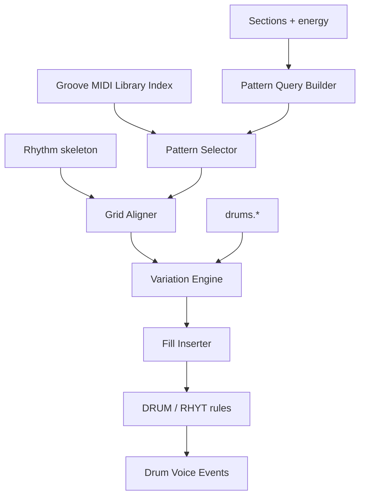

# Drum Engine Specification

**Version:** 0.1  
**Status:** Draft  
**Agent:** Algorithm Engines Research Agent (Drums)  
**Dependencies:** [pipeline.md](../01-architecture/pipeline.md), [ast.md](../02-music-model/ast.md), [rhythm.md](../03-theory/rhythm.md), [structure-engine.md](structure-engine.md), [scoring.md](../05-rule-engine/scoring.md)

---

## Table of Contents

1. [Background](#1-background)
2. [Existing Solutions](#2-existing-solutions)
3. [Academic / Theoretical Foundation](#3-academic--theoretical-foundation)
4. [Engineering Analysis](#4-engineering-analysis)
5. [Comparison of Approaches](#5-comparison-of-approaches)
6. [Recommended Solution](#6-recommended-solution)
7. [Architecture](#7-architecture)
8. [Data Structures](#8-data-structures)
9. [Algorithms](#9-algorithms)
10. [Interfaces](#10-interfaces)
11. [Parameter Mappings](#11-parameter-mappings)
12. [Explainability Model](#12-explainability-model)
13. [Future Expansion](#13-future-expansion)
14. [Open Questions](#14-open-questions)
15. [References](#15-references)

---

## 1. Background

### 1.1 Purpose

The **Drum Engine** implements **Pipeline Stage 10: Drums** — percussion pattern selection, density variation, fill insertion, and structural alignment using **Groove MIDI-derived taxonomy**.

Drums use MIDI channel 10 convention; independent from tonal phrase logic but synchronized to rhythm skeleton and section energy.

### 1.2 Pipeline I/O

| Property | Value |
|----------|-------|
| **Stage** | 10 — Drums |
| **Search** | No (pattern selection + greedy variation) |
| **Beam Width** | N/A; local search for fill placement width **4** optional |
| **AST Read** | `Section[]`, rhythm skeleton, `tempo_map`, section energy, `drums.*` params |
| **AST Write** | `Voice[drums].note_events[]` (unpitched percussion) |

---

## 2. Existing Solutions

| System | Drum Generation |
|--------|-----------------|
| **Groove MIDI Dataset** | 1150 performances, 22k+ bars | Primary data source |
| **Band-in-a-Box** | Style-specific drum patterns | Template approach |
| **Ableton** | Clip grooves | UI metaphor |
| **Deep research** | Pattern library + density param | Adopted |

---

## 3. Academic / Theoretical Foundation

### 3.1 Groove MIDI Taxonomy

Patterns classified by:

| Axis | Values |
|------|--------|
| **Style family** | rock, funk, jazz, hip-hop, latin, electronic |
| **Time signature** | 4/4, 6/8, 12/8, ... |
| **Subdivision** | 8th, 16th, triplet |
| **Tempo band** | slow / medium / fast BPM ranges |
| **Intensity** | sparse → dense hit count |

### 3.2 Drum Map (General MIDI)

| MIDI Note | Instrument |
|-----------|------------|
| 36 | Kick |
| 38 | Snare |
| 42 | Closed hi-hat |
| 46 | Open hi-hat |
| 49 | Crash |
| 51 | Ride |

### 3.3 Fills and Section Boundaries

Fills typically precede chorus or section changes (last 1–2 beats of phrase/section).

---

## 4. Engineering Analysis

Pattern selection is **O(library size)** with indexed lookup — < 100 ms typical. Variation and fill insertion < 50 ms per section.

No beam search — greedy scoring over pattern candidates (top 3–5).

---

## 5. Comparison of Approaches

| Approach | Verdict |
|----------|---------|
| Random hits | Rejected |
| Fixed rock beat | Default fallback |
| **Indexed Groove library + parametric variation** | **Primary** |
| ML drum transformer | Optional plugin |
| Live loop sampling | Out of scope |

---

## 6. Recommended Solution

```text
1. Build pattern query from style, tempo, time sig, drums.density
2. Select base pattern per section (or 4/8 bar loop)
3. Apply parametric variations (velocity, ghost notes, hi-hat openings)
4. Insert fills at section/phrase boundaries per drums.fill_frequency
5. Validate RHYT-* / DRUM-* rules; write events with provenance
```

---

## 7. Architecture



---

## 8. Data Structures

```rust
struct GroovePattern {
    id: PatternId,
    taxonomy: GrooveTaxonomy,
    hits: Vec<DrumHit>,           // (offset_in_beats, midi_note, velocity)
    length_beats: Rational,
    source: GrooveMidiFileId,
}

struct GrooveTaxonomy {
    style_family: StyleFamily,
    time_sig: TimeSignature,
    subdivision: Subdivision,
    tempo_min: u32,
    tempo_max: u32,
    density_score: f32,           // hits per bar normalized
}

struct DrumHit {
    beat_offset: Rational,
    note: u8,                     // GM percussion
    velocity: u8,
}

struct SectionDrumPlan {
    section_id: SectionId,
    pattern_id: PatternId,
    variation_seed: u64,
    fill_measures: Vec<u32>,
}
```

---

## 9. Algorithms

### 9.1 Main Entry

```text
function generate_drums(ast, params, emotion_deltas):
    library = load_groove_library(params.style.genre)
    voice = ast.voice(Drums)

    for section in ast.sections:
        query = build_query(section, ast.tempo_map, params, emotion_deltas)
        pattern = select_pattern(library, query)
        hits = align_to_rhythm_skeleton(pattern, section, ast)

        hits = apply_variation(hits, params.drums, section.energy, seed)
        hits = insert_fills(hits, section, params.drums.fill_frequency, library)

        if validate_drums(hits, DRUM-*, RHYT-*):
            write_drum_events(voice, section, hits)
        else:
            hits = fallback_simplified_beat(section)
            write_drum_events(voice, section, hits)

    return ast
```

### 9.2 Pattern Query Builder

```text
function build_query(section, tempo_map, params, emotion_deltas):
    bpm = tempo_map.at(section.start)
    return GrooveQuery {
        style: map_genre_to_groove_family(params.style.genre),
        time_sig: ast.time_signature,
        target_density: params.drums.density + emotion_deltas[DRUMS],
        tempo_band: classify_tempo(bpm),
        energy: section.energy,
        complexity: params.drums.pattern_complexity,
    }
```

### 9.3 Pattern Selection (Greedy)

```text
function select_pattern(library, query):
    candidates = library.index.query(query)  // inverted index
    scored = []
    for p in candidates:
        score = 0
        score -= abs(p.density_score - query.target_density) * w_density
        score += style_match(p, query) * w_style
        score += energy_match(p, query.energy) * w_energy
        scored.append((p, score))
    sort scored by score desc
    return top_k_random(scored, k=3, temperature=params.search.temperature)[0]
```

### 9.4 Grid Alignment

```text
function align_to_rhythm_skeleton(pattern, section, ast):
    grid = ast.rhythm_skeleton.in_section(section)
    hits = []
    for bar in section.measures:
        pattern_offset = bar.index % pattern_bars(pattern)
        for hit in pattern.hits_at_bar(pattern_offset):
            abs_offset = bar.start + hit.beat_offset
            if grid.allows_hit(abs_offset):  // RHYT sync
                hits.push(transpose_hit(hit, abs_offset))
    return hits
```

### 9.5 Variation Engine

```text
function apply_variation(hits, params, energy, seed):
    rng = seeded_rng(seed)
    for hit in hits:
        hit.velocity = clamp(hit.velocity * velocity_scale(energy, params), 1, 127)
        if hit.note == SNARE and rng() < params.drums.ghost_note_rate:
            add ghost snare before hit
        if hit.note == HI_HAT_CLOSED and rng() < params.drums.open_hihat_rate:
            occasionally swap to OPEN on offbeats
    if params.drums.humanize:
        hit.beat_offset += micro_timing_jitter(rng, params.drums.humanize_ms)
    return hits
```

### 9.6 Fill Insertion

```text
function insert_fills(hits, section, fill_frequency, library):
    fill_points = []
    if fill_frequency > 0:
        fill_points += section.boundaries  // last 2 beats before new section
        fill_points += phrase_boundaries_in(section) filtered by fill_frequency

    for point in fill_points:
        if random() < fill_frequency:
            fill = library.get_fill(style, length_beats=2)
            hits = merge_fill(hits, fill, point)

    return hits
```

Local search (width 4): pick fill variant maximizing DRUM-003 (fill at boundary) minus DRUM-005 (overlap clash).

### 9.7 Rule Integration

| Rule | Role |
|------|------|
| **DRUM-001** | Kick on downbeat (soft, genre-dependent) |
| **DRUM-002** | Snare on beats 2/4 (rock) |
| **DRUM-003** | Fill rewards at section boundary |
| **DRUM-004** | Density matches param |
| **DRUM-005** | No kick/snare collision same 32nd |
| **RHYT-008** | Rest compatibility with skeleton |
| **RHYT-005** | Syncopation alignment |

---

## 10. Interfaces

```rust
pub trait DrumEngine {
    fn generate(
        &self,
        ast: &mut Composition,
        params: &Parameters,
        emotion: &WeightDeltaTable,
    ) -> DrumResult;
}

pub trait DrumPlugin {
    fn pattern_overrides(&self, query: &GrooveQuery) -> Vec<GroovePattern>;
}
```

---

## 11. Parameter Mappings

| Parameter | Effect | Rules |
|-----------|--------|-------|
| `drums.density` | Target density_score in query | DRUM-004 |
| `drums.fill_frequency` | Fill insertion probability | DRUM-003 |
| `drums.pattern_complexity` | Filter complex patterns | — |
| `drums.ghost_note_rate` | Snare ghost probability | — |
| `drums.open_hihat_rate` | Hi-hat variation | — |
| `drums.humanize` | Micro-timing jitter | — |
| `drums.kick_busyness` | Extra kick candidates | DRUM-001 weight |
| `style.genre` | Groove taxonomy family | — |
| `emotion.arousal` | Density delta | DRUM-004 |
| `section.energy` | Velocity scale | — |

---

## 12. Explainability Model

```text
DrumProvenance {
    engine: "drums",
    stage: 10,
    pattern_id: "groove_rock_4_4_16_med_042",
    source_file: "GrooveMIDI/eval_session/...",
    variation_seed: u64,
    fill_at: Option<MeasureId>,
    rule_ids: ["DRUM-002", "DRUM-003"],
    selection_score: f64,
    alternatives: [pattern_id × 3],
}
```

Per-hit provenance optional (lightweight): reference section-level `DrumProvenance` unless fill hit (individual reason).

---

## 13. Future Expansion

- User-provided groove import (MIDI → pattern index)
- Live e-drums humanization profiles
- Polyrhythmic layers (hi-hat 3 over 4)
- ML groove matching embedding

---

## 14. Open Questions

1. Ship Groove subset in repo vs download on first run?
2. Separate crash ride rules for jazz vs rock?
3. Drum-less intro/outro — auto from structure `intro_measures`?

---

## 15. References

- Gillick et al., *Learning to Groove* — Groove MIDI Dataset
- [rhythm.md](../03-theory/rhythm.md)
- [structure-engine.md](structure-engine.md) — section energy
- [deep-research-report.md](../../deep-research-report.md) §2.2 drums

---

*End of Drum Engine Specification v0.1*
