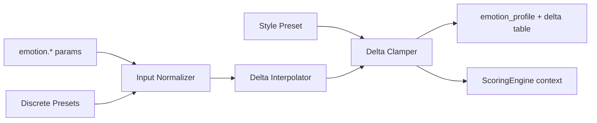

# Emotion Engine Specification

**Version:** 0.1  
**Status:** Draft  
**Agent:** Algorithm Engines Research Agent (Emotion)  
**Dependencies:** [pipeline.md](../01-architecture/pipeline.md), [acas-v0.1.md](../00-overview/acas-v0.1.md), [scoring.md](../05-rule-engine/scoring.md), [harmony.md](../03-theory/harmony.md), [deep-research-report.md](../../deep-research-report.md)

---

## Table of Contents

1. [Background](#1-background)
2. [Existing Solutions](#2-existing-solutions)
3. [Academic / Theoretical Foundation](#3-academic--theoretical-foundation)
4. [Engineering Analysis](#4-engineering-analysis)
5. [Comparison of Approaches](#5-comparison-of-approaches)
6. [Recommended Solution](#6-recommended-solution)
7. [Architecture](#7-architecture)
8. [Data Structures](#8-data-structures)
9. [Algorithms](#9-algorithms)
10. [Interfaces](#10-interfaces)
11. [Parameter Mappings](#11-parameter-mappings)
12. [Explainability Model](#12-explainability-model)
13. [Future Expansion](#13-future-expansion)
14. [Open Questions](#14-open-questions)
15. [References](#15-references)

---

## 1. Background

### 1.1 Purpose

The **Emotion Engine** implements **Pipeline Stage 2: Emotion Resolver**. It maps continuous emotion dimensions and optional discrete emotion labels to a **Weight Delta Table** consumed by all downstream generative stages and the Scoring Engine.

Emotion does not generate musical content directly — it **biases** rule weights, candidate probabilities, and structural parameters.

### 1.2 Pipeline Position

| Property | Value |
|----------|-------|
| **Stage** | 2 — Emotion Resolver |
| **Search** | No |
| **Beam Width** | N/A |
| **AST Read** | `Composition.metadata.parameters.emotion.*`, style preset |
| **AST Write** | `Composition.metadata.emotion_profile`, `WeightDeltaTable` (engine-internal, referenced by metadata) |

---

## 2. Existing Solutions

| System | Emotion Handling | Aurora Position |
|--------|------------------|-----------------|
| **AIVA** | Hidden conditioning vectors | Reject; explicit weight deltas |
| **Magenta Emotion models** | ML embedding → MIDI | Optional AI plugin only |
| **Russell circumplex UI** | Valence × arousal sliders | **Adopted** as primary axes |
| **Discrete tags** ("sad", "epic") | Preset bundles | Secondary; maps to circumplex |
| **Deep research** | Emotion → mode, tempo, chord color | Formalized as delta table |

---

## 3. Academic / Theoretical Foundation

### 3.1 Circumplex Model (Russell, 1980)

Two orthogonal dimensions:

- **Valence** — pleasant ↔ unpleasant (major/minor bias, consonance)
- **Arousal** — calm ↔ excited (tempo, rhythm density, leap size)

### 3.2 Tension as Third Axis

Aurora adds **tension** (or uses `tension_curve` over form):

- Harmonic dissonance tolerance
- Cadence strength preference
- Section energy curve target (Stage 3)

### 3.3 Music-Emotion Correspondences (Juslin & Laukka, 2004; Eerola & Vuoskoski)

| Cue | High Valence | Low Valence | High Arousal | Low Arousal |
|-----|-------------|-------------|--------------|-------------|
| Mode | Major | Minor | — | — |
| Tempo | — | — | Fast | Slow |
| Dynamics | — | — | Loud | Soft |
| Register | Higher | Lower | Wider leaps | Narrow range |
| Harmony | Consonant | Minor color, ♭VI | Dominant tension | Plagal, subdominant |

These inform delta direction, not fixed values — parameters remain user-overridable.

---

## 4. Engineering Analysis

### 4.1 Design Constraints

- Deltas are **multiplicative modifiers** on base weights: `w_eff = w_base × (1 + δ)`
- Deltas bounded to prevent rule inversion: `δ ∈ [-0.5, +0.5]` default
- Discrete presets are **compiled** to (valence, arousal, tension) triples
- Style preset may **clamp** emotion effects (Baroque preset limits dissonance delta)

### 4.2 Performance

Full resolution < 5 ms — table lookup and interpolation only.

---

## 5. Comparison of Approaches

| Approach | Controllability | Explainability | Verdict |
|----------|-----------------|----------------|---------|
| Fixed preset only | Medium | High | Base layer |
| Circumplex → delta table | **High** | **High** | **Primary** |
| Neural emotion encoder | Medium | Low | AI plugin optional |
| MIDI tag classifier | Low | None | Rejected for generation |

---

## 6. Recommended Solution

**Three-layer resolver:**

```text
Layer 1: Normalize inputs (discrete tag → circumplex if needed)
Layer 2: Interpolate delta table from valence, arousal, tension
Layer 3: Apply style preset clamps; write emotion_profile to AST
```

Output: `WeightDeltaTable` keyed by rule category and specific parameter aliases.

---

## 7. Architecture



Downstream consumers: Structure (tempo/energy), Harmony (mode, extensions), Melody (leap, ornament), Rhythm (density), Drums (density), Scoring (all soft weights).

---

## 8. Data Structures

```rust
struct EmotionProfile {
    valence: f32,           // 0.0 unpleasant → 1.0 pleasant
    arousal: f32,           // 0.0 calm → 1.0 excited
    tension: f32,           // 0.0 relaxed → 1.0 tense (global)
    tension_curve: TensionCurve,  // piecewise over normalized form position
    discrete_label: Option<EmotionLabel>,
    provenance: EmotionProvenance,
}

struct WeightDeltaTable {
    // Category-level deltas
    by_category: HashMap<RuleCategory, f32>,
    // Specific rule weight aliases
    by_alias: HashMap<String, f32>,
    // Parameter nudges (non-rule)
    param_nudges: HashMap<ParamId, f32>,
}

struct TensionCurve {
    points: Vec<(normalized_position: f32, tension: f32)>,
    interpolation: InterpolationMode,  // linear, smoothstep
}
```

---

## 9. Algorithms

### 9.1 Main Resolver

```text
function resolve_emotion(params, style_preset):
    v, a, t = normalize_emotion_inputs(params.emotion)

    deltas = WeightDeltaTable.empty()

    // Valence effects
    deltas.by_category[HARMONY] += lerp(-0.3, +0.3, v - 0.5) * 2
    deltas.by_alias["major_preference"] += lerp(-0.4, +0.4, v)
    deltas.by_alias["minor_color"] += lerp(+0.3, -0.3, v)

    // Arousal effects
    deltas.param_nudges["tempo.scale"] += lerp(-0.15, +0.25, a)
    deltas.by_category[RHYTHM] += lerp(-0.2, +0.3, a)
    deltas.by_alias["leap_penalty"] += lerp(+0.2, -0.15, a)  // less penalty when excited
    deltas.by_category[DRUMS] += lerp(-0.25, +0.35, a)

    // Tension effects
    deltas.by_alias["dissonance_tolerance"] += lerp(-0.3, +0.4, t)
    deltas.by_alias["cadence_strength"] += lerp(-0.2, +0.3, t)
    deltas.by_category[FORM] += tension_curve_to_form_energy(params.emotion.tension_curve)

    deltas = clamp_deltas(deltas, style_preset.emotion_clamps)
    profile = EmotionProfile(v, a, t, params.emotion.tension_curve, ...)
    return profile, deltas
```

### 9.2 Discrete Preset Compilation

```text
EMOTION_PRESETS = {
    "joyful":      (valence=0.85, arousal=0.75, tension=0.3),
    "melancholic": (valence=0.25, arousal=0.35, tension=0.5),
    "tense":       (valence=0.4,  arousal=0.8,  tension=0.85),
    "serene":      (valence=0.7,  arousal=0.15, tension=0.2),
    "epic":        (valence=0.65, arousal=0.9,  tension=0.7),
    ...
}

function normalize_emotion_inputs(emotion_params):
    if emotion_params.discrete_label:
        base = EMOTION_PRESETS[emotion_params.discrete_label]
        // Allow slider offsets
        return clamp(base.valence + emotion_params.valence_offset, ...)
    return (emotion_params.valence, emotion_params.arousal, emotion_params.tension)
```

### 9.3 Tension Curve → Form Energy

```text
function tension_curve_to_form_energy(curve):
    // Stored in emotion_profile for Stage 3 DP target
    return curve  // passed through; Structure Engine samples at section midpoints
```

### 9.4 Integration with Scoring Engine

From [scoring.md](../05-rule-engine/scoring.md):

```text
w_i_effective = w_i × (1 + δ_emotion[category(i)]) × style_multiplier(i)
```

Emotion Engine produces `δ_emotion`; ScoringEngine applies at evaluate time.

### 9.5 Rule Categories Affected

| Category | Delta Examples |
|----------|----------------|
| HARM-* | major/minor, extension chord, dissonance |
| FORM-* | energy curve weight, climax strength |
| VLED-* | leap penalty, stepwise preference |
| RHYT-* | density, syncopation |
| MOTI-* | repetition reward |
| DRUM-* | hit density, fill frequency |
| CONT-* | strictness scaling (inverse with arousal) |

---

## 10. Interfaces

```rust
pub trait EmotionEngine {
    fn resolve(
        &self,
        params: &Parameters,
        style: &StylePreset,
    ) -> EmotionResolveResult;
}

pub struct EmotionResolveResult {
    pub profile: EmotionProfile,
    pub weight_deltas: WeightDeltaTable,
    pub ast_patch: AstPatch,  // metadata.emotion_profile only
}
```

Optional AI plugin:

```rust
pub trait EmotionPlugin {
    fn adjust_deltas(&self, base: &WeightDeltaTable, context: &AudioContext) -> WeightDeltaTable;
}
```

---

## 11. Parameter Mappings

| User Parameter | Range | Maps To | Affected Stages |
|----------------|-------|---------|-----------------|
| `emotion.valence` | 0–1 | HARM major/minor deltas | 3, 5, 7 |
| `emotion.arousal` | 0–1 | tempo.scale, RHYT, DRUM, leap | 3, 6, 7, 10 |
| `emotion.tension` | 0–1 | dissonance, cadence, HARM-015 | 5, 7 |
| `emotion.tension_curve` | points[] | FORM-006 target curve | 3 |
| `emotion.discrete_label` | enum | Preset circumplex triple | all |
| `emotion.valence_offset` | ±0.3 | Fine-tune preset | all |

**Example mapping table (selected):**

| Emotion Axis | Rule / Param | δ at min | δ at max |
|--------------|--------------|----------|----------|
| valence | `HARM-020` major preference | -0.4 | +0.4 |
| valence | `HARM-025` minor color | +0.3 | -0.3 |
| arousal | `param tempo.scale` | -0.15 | +0.25 |
| arousal | `VLED-010` leap penalty | +0.2 | -0.15 |
| tension | `harmony.dissonance_tolerance` | -0.3 | +0.4 |
| tension | `HARM-015` cadence strength | -0.2 | +0.3 |

---

## 12. Explainability Model

### 12.1 Emotion Provenance

```text
EmotionProvenance {
    engine: "emotion",
    stage: 2,
    inputs: { valence, arousal, tension, label },
    preset_used: Option<string>,
    top_deltas: [(alias, delta)] × 5,  // largest magnitude
    clamps_applied: [style_clamp_reason],
}
```

### 12.2 Inspector

| Question | Answer Source |
|----------|---------------|
| Why more minor chords? | `emotion_profile.valence=0.2` → δ minor_color +0.24 |
| Why faster tempo? | `arousal=0.8` → tempo.scale +0.17 |
| Why stronger cadences? | `tension=0.7` → HARM-015 weight +0.21 |

Downstream event provenance may reference `emotion_profile` in `parameters_used` when emotion delta was decisive.

---

## 13. Future Expansion

- User-defined emotion presets (save circumplex + delta overrides)
- Section-level emotion overrides (verse sad, chorus hopeful)
- ML embedding plugin with mandatory delta transparency
- Biofeedback / MIDI CC emotion input

---

## 14. Open Questions

1. Should tension_curve override global `emotion.tension` at each point or multiply?
2. Maximum combined delta magnitude before hard clamp warning in UI?
3. Store full delta table in project file or recompute on load?

---

## 15. References

- Russell, J. A. (1980). Circumplex model of affect
- Juslin & Laukka (2004). Communication of emotion in music
- [scoring.md](../05-rule-engine/scoring.md) §9.1.4
- [acas-v0.1.md](../00-overview/acas-v0.1.md) §6.1
- [deep-research-report.md](../../deep-research-report.md) — emotion parameter mapping

---

*End of Emotion Engine Specification v0.1*
