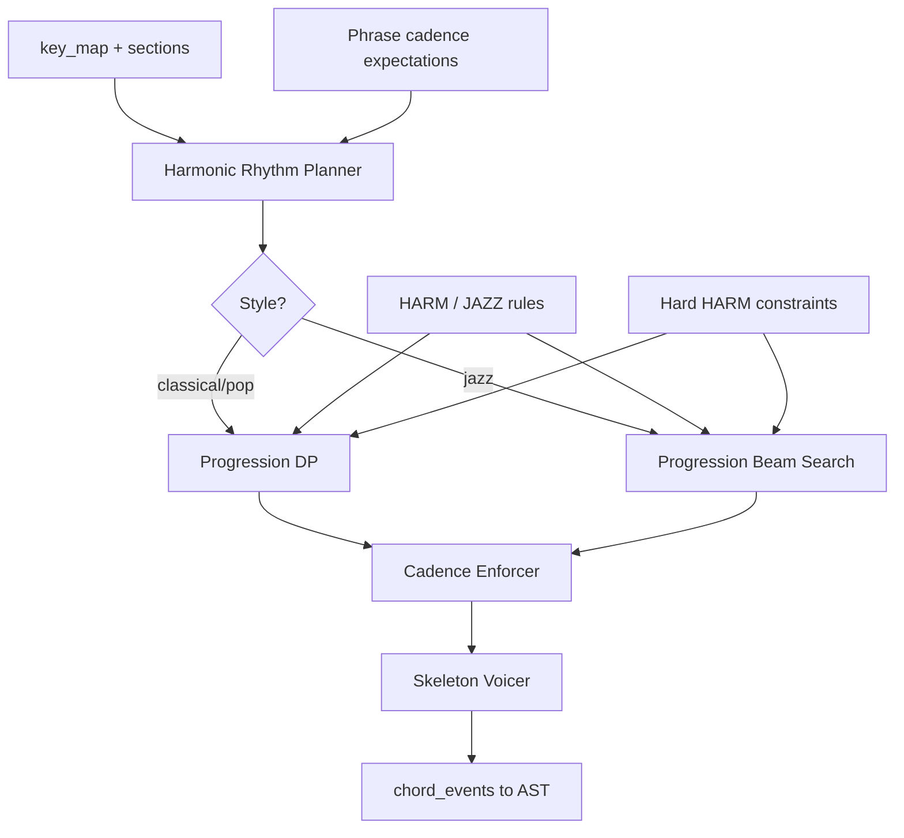

# Harmony Engine Specification

**Version:** 0.1  
**Status:** Draft  
**Agent:** Algorithm Engines Research Agent (Harmony)  
**Dependencies:** [pipeline.md](../01-architecture/pipeline.md), [ast.md](../02-music-model/ast.md), [harmony.md](../03-theory/harmony.md), [jazz.md](../03-theory/jazz.md), [phrase-engine.md](phrase-engine.md), [scoring.md](../05-rule-engine/scoring.md), [constraint.md](../05-rule-engine/constraint.md)

---

## Table of Contents

1. [Background](#1-background)
2. [Existing Solutions](#2-existing-solutions)
3. [Academic / Theoretical Foundation](#3-academic--theoretical-foundation)
4. [Engineering Analysis](#4-engineering-analysis)
5. [Comparison of Approaches](#5-comparison-of-approaches)
6. [Recommended Solution](#6-recommended-solution)
7. [Architecture](#7-architecture)
8. [Data Structures](#8-data-structures)
9. [Algorithms](#9-algorithms)
10. [Interfaces](#10-interfaces)
11. [Parameter Mappings](#11-parameter-mappings)
12. [Explainability Model](#12-explainability-model)
13. [Future Expansion](#13-future-expansion)
14. [Open Questions](#14-open-questions)
15. [References](#15-references)

**Appendices:** [A. Pipeline I/O](#appendix-a-pipeline-io) · [B. Progression Beam/DP Pseudocode](#appendix-b-progression-beamdp-pseudocode) · [C. Voicing Algorithm](#appendix-c-voicing-algorithm)

---

## 1. Background

### 1.1 Purpose

The **Harmony Engine** implements **Pipeline Stage 5: Harmony Skeleton** — chord progression generation over the formal skeleton, harmonic rhythm placement, Roman numeral / chord symbol assignment, and **skeleton voicing** (guide tones, not full SATB).

Full voice-leading realization occurs in Counterpoint (Stage 8); Melody (Stage 7) reads chord tones from harmony skeleton.

### 1.2 Pipeline I/O Summary

| Property | Value |
|----------|-------|
| **Stage** | 5 — Harmony Skeleton |
| **Search** | **Yes** — DP primary, beam optional for jazz |
| **Beam Width** | `harmony.beam_width` default **12** (range 4–32); DP for diatonic pop/classical |
| **AST Read** | `Section[]`, `Phrase[]`, `key_map`, `Phrase.cadence_expected`, emotion profile, `harmony.*` params |
| **AST Write** | `Measure.chord_events[]`, `harmonic_rhythm`, chord `Provenance` |

---

## 2. Existing Solutions

| System | Harmony Generation |
|--------|-------------------|
| **Band-in-a-Box** | Template progressions + substitutions |
| **Music21** | `roman.RomanNumeral` analysis; limited gen |
| **Strasheela** | CP over chord variables |
| **FlowComposer** | Markov + constraints |
| **Jazz standards corpus** | ii–V–I statistics |
| **Deep research** | Beam over chord sequences with rule scoring |

---

## 3. Academic / Theoretical Foundation

### 3.1 Tonal Harmony (Kostka & Payne; Aldwell & Schachter)

- Diatonic functions: T, PD, D
- Typical progressions: I–IV–V–I, I–vi–IV–V
- Secondary dominants, modulation via pivot

### 3.2 Jazz Harmony ([jazz.md](../03-theory/jazz.md))

- ii–V–I, tritone substitution, extensions (9, 11, 13)
- Separate progression graph `JAZZ-PROG-*`

### 3.3 Harmonic Rhythm

Chord change rate controlled by `harmony.harmonic_rhythm` parameter:

| Value | Typical change rate |
|-------|---------------------|
| slow | 1 chord / 2 measures |
| medium | 1 chord / measure |
| fast | 2+ chords / measure |

Phrase cadence slots **force** dominant–tonic alignment (HARM-015).

---

## 4. Engineering Analysis

### 4.1 Performance Targets

| Operation | Target |
|-----------|--------|
| DP progression (32 bars, diatonic) | < 500 ms |
| Beam progression (32 bars, jazz) | < 2 s (width 12) |
| Voicing skeleton per chord | < 5 ms |
| Full Stage 5 (64 bars) | < 3 s |

### 4.2 State Space

**DP state:** `(measure_index, roman_function, inversion)` — |S| ≈ 7–21 for diatonic; larger with extensions.

**Beam state:** `(progression_prefix, last_chord, harmonic_rhythm_position, eval_score)`

---

## 5. Comparison of Approaches

| Approach | Verdict |
|----------|---------|
| Fixed I–IV–V–I loop | Preview mode only |
| Markov chain from corpus | Style plugin data; not primary |
| **DP + rule scoring** | **Classical/pop default** |
| **Beam + jazz graph** | **Jazz / high complexity** |
| SMT single-shot | Validation only |

---

## 6. Recommended Solution

**Dual-mode harmony generator:**

```text
Mode A (Diatonic): DP over roman numerals with HARM-PROG-* transitions
Mode B (Jazz/Complex): Beam search over chord symbol graph with JAZZ-* rules
Post-process: Insert cadence chords from PhraseEngine expectations
Voicing: Skeleton guide-tone voicing (3rd + 7th for 7ths, root + 3rd for triads)
```

---

## 7. Architecture



---

## 8. Data Structures

```rust
struct HarmonicRhythmGrid {
    slots: Vec<HarmonySlot>,  // (measure, beat_offset, duration)
}

struct HarmonySlot {
    measure_id: MeasureId,
    beat: Rational,
    duration: Rational,
    cadence_locked: bool,     // from PhraseEngine
    expected_function: Option<RomanFunction>,
}

struct ChordEvent {
    symbol: ChordSymbol,
    roman: RomanNumeral,
    root: PitchClass,
    bass: PitchClass,         // skeleton bass for Stage 9
    guide_tones: Vec<PitchClass>,
    inversion: Inversion,
    provenance: Provenance,
}

struct ProgressionSearchState {
    slots_filled: u32,
    last_roman: RomanNumeral,
    key_context: KeyArea,
    eval_score: f64,
    chords: Vec<ChordSymbol>,
}
```

---

## 9. Algorithms

### 9.1 Main Entry

```text
function harmony_skeleton(ast, params, emotion_deltas):
    grid = plan_harmonic_rhythm(ast, params.harmony.harmonic_rhythm)
    grid = apply_cadence_locks(grid, ast.phrases)

    if params.style.genre in JAZZ_GENRES or params.harmony.complexity > 0.7:
        progression = beam_search_progression(grid, ast.key_map, params, width=params.harmony.beam_width)
    else:
        progression = dp_progression(grid, ast.key_map, params)

    progression = enforce_phrase_cadences(progression, ast.phrases, params)
    voicings = skeleton_voicing(progression, params)

    write_chord_events(ast, progression, voicings)
    return ast
```

### 9.2 Harmonic Rhythm Planner

```text
function plan_harmonic_rhythm(ast, rhythm_param):
    grid = []
    for measure in ast.all_measures:
        changes = changes_per_measure(rhythm_param, measure.section.energy)
        offsets = distribute_offsets(changes, measure.time_sig)
        for off in offsets:
            grid.push(HarmonySlot(measure, off, duration=next_offset - off))
    return grid
```

### 9.3 DP Progression (Diatonic)

```text
function dp_progression(grid, key_map, params):
    T = grid.len()
    States = diatonic_functions(key_map, params.harmony.complexity)

    Score[0][I] = 0
    for t in 1..T:
        key = key_at(grid[t], key_map)
        for s in States[key]:
            candidates = allowed_transitions(States[t-1], s, HARM-PROG-*)
            for s_prev in candidates:
                trans_score = harmonic_transition_score(s_prev, s, params, emotion_deltas)
                cadence_bonus = cadence_slot_bonus(grid[t], s, ast.phrases)
                new = Score[t-1][s_prev] + trans_score + cadence_bonus
                if new > Score[t][s]:
                    Score[t][s] = new
                    Back[t][s] = s_prev

    path = backtrack(Score, Back)
    return path_to_chord_symbols(path, key)
```

**Complexity:** O(T × |S|² × rule_eval) — tractable for T ≤ 128, |S| ≤ 14.

### 9.4 Beam Search Progression (Jazz)

```text
function beam_search_progression(grid, key_map, params, width):
    beam = [initial_state(I or ii)]

    for slot in grid:
        candidates = []
        for state in beam:
            for chord in jazz_neighbors(state.last_chord, key_map.at(slot)):
                if hard_constraints(chord, slot): continue
                child = state.extend(chord)
                child.eval_score += evaluate(HARM-*, JAZZ-*, slot, params)
                child.eval_score += cadence_slot_bonus(slot, chord, phrases)
                candidates.append(child)
        beam = top_k(candidates, width)

    return best(beam).chords
```

Default `harmony.beam_width = 12`; preview mode uses 4.

### 9.5 Cadence Enforcer

```text
function enforce_phrase_cadences(progression, phrases, params):
    for phrase in phrases:
        slot = progression.slot_at(phrase.cadence.harmonic_rhythm_slot)
        required = cadence_chords(phrase.cadence.type, phrase.key_area)
        if not matches(slot, required):
            slot = override_with_penalty(slot, required, preserve_voice_leading_hint=True)
            progression.provenance[slot] = { rule: "HARM-015", reason: "phrase cadence lock" }
    return progression
```

Overrides are **hard** at cadence slots when `harmony.cadence_strength > 0.8`.

### 9.6 Skeleton Voicing

See Appendix C. Outputs `guide_tones` and `bass` pitch classes for Melody/Bass engines — not full MIDI pitches yet.

### 9.7 Rule Integration

| Category | Role |
|----------|------|
| **HARM-PROG-*** | Allowed transitions (hard) |
| **HARM-010..050** | Extension, diatonic, borrowed chords |
| **HARM-015..020** | Cadence scoring |
| **JAZZ-*** | Jazz graph, substitutions |
| **FORM-*** | Section-final cadence type |
| **VLED-*** | Soft — voice leading hints in voicing |

Hard constraints prune illegal transitions (parallel root motion forbidden in strict mode, etc.).

---

## 10. Interfaces

```rust
pub trait HarmonyEngine {
    fn generate_skeleton(
        &self,
        ast: &mut Composition,
        params: &Parameters,
        emotion: &WeightDeltaTable,
    ) -> HarmonyResult;
}

pub trait HarmonyPlugin {
    fn transition_graph(&self, key: KeyArea) -> TransitionGraph;
    fn voicing_strategy(&self) -> VoicingStrategy;
}
```

---

## 11. Parameter Mappings

| Parameter | Internal | Beam/DP | Rules |
|-----------|----------|---------|-------|
| `harmony.complexity` | Extension chord set size | Larger \|S\| | HARM-010, JAZZ-* |
| `harmony.dissonance_tolerance` | Allow 7ths, altered | Beam only | HARM-001 |
| `harmony.cadence_strength` | Cadence bonus weight | Both | HARM-015 |
| `harmony.harmonic_rhythm` | Grid density | T size | — |
| `harmony.beam_width` | Beam width | 4–32 | — |
| `harmony.progression_style` | Template bias | Initial state | HARM-PROG-* |
| `mode.key`, `mode.modulation_policy` | Key map | State key | HARM-050 |
| `scale.borrowed_chord_tolerance` | Borrowed chord weight | Both | HARM-030 |
| `emotion.valence` | Major/minor color | Transition weights | HARM-020 |
| `emotion.tension` | Dominant prolongation | Both | HARM-025 |
| `cadence.type_preference` | Cadence override weights | Enforcer | HARM-015..020 |

**Mapping pattern:**

```text
extension_weight = lerp(0, 1, harmony.complexity) × (1 + emotion_delta[JAZZ])
cadence_bonus = lerp(5, 25, harmony.cadence_strength)
```

---

## 12. Explainability Model

Each `ChordEvent.provenance`:

```text
Provenance {
    reason: "ii-V-I approach to phrase cadence",
    rule_id: "JAZZ-012",
    score_delta: +18.5,
    eval_score_running: 142.3,
    search_mode: "beam" | "dp",
    beam_rank: 0,
    alternatives_rejected: 11,
    transition_from: "Am7",
    parameters_used: ["harmony.complexity", "cadence.type_preference"],
}
```

Inspector views: progression timeline with rule-colored transitions; cadence locks shown as pins.

---

## 13. Future Expansion

- Figured bass realization plugin (Baroque)
- Negative harmony / Coltrane changes
- User-fixed chord at measure N (constraint injection)
- Full SATB voicing in Stage 5 optional mode

---

## 14. Open Questions

1. Store skeleton voicing as pitch classes or MIDI numbers in AST?
2. DP vs beam auto-selection threshold for `harmony.complexity`?
3. Re-harmonization on section regenerate — preserve cadence locks only?

---

## 15. References

- Kostka & Payne, *Tonal Harmony*
- Levine, *Jazz Theory Book*
- [harmony.md](../03-theory/harmony.md), [jazz.md](../03-theory/jazz.md)
- [scoring.md](../05-rule-engine/scoring.md) Appendix C — harmony DP
- [deep-research-report.md](../../deep-research-report.md)

---

## Appendix A: Pipeline I/O

**Read:** Structure, phrases, key_map, emotion, harmony params.  
**Write:** `Measure.chord_events`, harmonic rhythm metadata.  
**Search:** DP (default) or beam (`harmony.beam_width` default 12).

---

## Appendix B: Progression Beam/DP Pseudocode

Combined in §9.3–9.4. Terminal condition: all `HarmonySlot` filled. Winner: max `eval_score`; ties by stable chord symbol order.

---

## Appendix C: Voicing Algorithm

```text
function skeleton_voicing(progression, params):
    for chord in progression:
        if chord.is_seventh:
            guide = [chord.third_pc, chord.seventh_pc]
            bass = chord.root_pc or chord.third_pc if slash_chord
        else:
            guide = [chord.third_pc]
            bass = chord.root_pc
        // Soft: prefer smooth bass motion (reward in voicing score, not full VLED yet)
        chord.guide_tones = guide
        chord.bass = bass
    return progression
```

Full pitch voicing deferred to Counterpoint Stage 8.

---

*End of Harmony Engine Specification v0.1*
