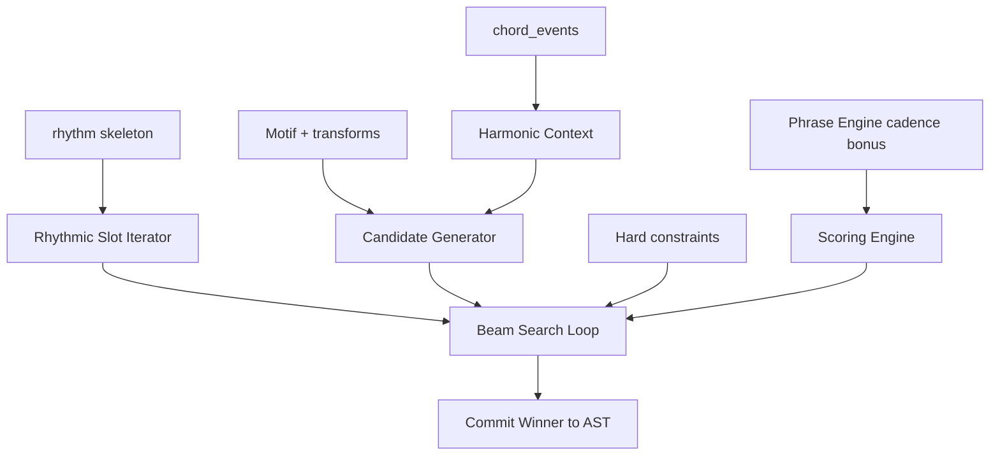

# Melody Engine Specification

**Version:** 0.1  
**Status:** Draft  
**Agent:** Algorithm Engines Research Agent (Melody)  
**Dependencies:** [pipeline.md](../01-architecture/pipeline.md), [ast.md](../02-music-model/ast.md), [harmony-engine.md](harmony-engine.md), [motif-engine.md](motif-engine.md), [phrase-engine.md](phrase-engine.md), [scoring.md](../05-rule-engine/scoring.md), [constraint.md](../05-rule-engine/constraint.md), [voice-leading.md](../03-theory/voice-leading.md)

---

## Table of Contents

1. [Background](#1-background)
2. [Existing Solutions](#2-existing-solutions)
3. [Academic / Theoretical Foundation](#3-academic--theoretical-foundation)
4. [Engineering Analysis](#4-engineering-analysis)
5. [Comparison of Approaches](#5-comparison-of-approaches)
6. [Recommended Solution](#6-recommended-solution)
7. [Architecture](#7-architecture)
8. [Data Structures](#8-data-structures)
9. [Algorithms](#9-algorithms)
10. [Interfaces](#10-interfaces)
11. [Parameter Mappings](#11-parameter-mappings)
12. [Explainability Model](#12-explainability-model)
13. [Future Expansion](#13-future-expansion)
14. [Open Questions](#14-open-questions)
15. [References](#15-references)

**Appendices:** [A. Pipeline I/O](#appendix-a-pipeline-io) · [B. Beam Search Pseudocode](#appendix-b-beam-search-pseudocode) · [C. Candidate Generation](#appendix-c-candidate-generation)

---

## 1. Background

### 1.1 Purpose

The **Melody Engine** implements **Pipeline Stage 7: Melody** — primary melodic voice generation via **beam search** over note candidates at each rhythmic slot, integrated with the Rule Engine scoring function.

This is the **core generative search stage** of Aurora Composer per ACAS Principle 3.

### 1.2 Pipeline I/O

| Property | Value |
|----------|-------|
| **Stage** | 7 — Melody |
| **Search** | **Yes — primary beam search** |
| **Beam Width** | `search.beam_width` default **16** (preview 4, high quality 32) |
| **AST Read** | `chord_events`, rhythm skeleton, `Motif[]`, `Phrase.plan`, `Section.theme_refs`, register params |
| **AST Write** | `Voice[melody].note_events[]`, `Event.provenance` |

---

## 2. Existing Solutions

| System | Melody Generation |
|--------|-------------------|
| **Strasheela** | CP pitch variables | Global constraints |
| **Markov melody** | n-gram pitch | Fast, no structure |
| **Deep research pseudocode** | Beam over chord tones | **Basis for Aurora** |
| **Music21** | `TinyNotation` import only | — |
| **AIVA** | Neural | Black box |

---

## 3. Academic / Theoretical Foundation

### 3.1 Melodic Construction (Piston; Salzer/Schachter)

- Chord tones on strong beats
- Passing/neighbor tones on weak beats
- Cadential approach: 2–1, 7–1, 4–3 over V–I

### 3.2 Register and Contour

- Climax placement often 2/3 through section (FORM-005 interaction)
- Stepwise preference; compensating motion after leaps (Fux)

### 3.3 Motivic Integration

Melody realizes `Motif` templates via `TransformOp` chain from Motif Engine — not independent random melody.

---

## 4. Engineering Analysis

### 4.1 Performance Targets

| Operation | Target |
|-----------|--------|
| Soft rule eval per candidate | < 2 ms |
| Beam step (width 16, ~12 candidates) | < 250 ms |
| 32-bar melody line | < 5 s |
| Preview 2-bar | < 800 ms (width 4) |

### 4.2 Search Granularity

**Step unit:** one **rhythmic slot** from Stage 6 rhythm skeleton (not necessarily one beat — may be eighth or sixteenth grid cell).

---

## 5. Comparison of Approaches

| Approach | Verdict |
|----------|---------|
| Pure random chord tones | Rejected |
| Greedy best-next-note | Preview fallback |
| **Beam search + rule scoring** | **Primary** |
| A* with melodic heuristic | Future research |
| Neural autoregressive | AI plugin proposes candidates |

---

## 6. Recommended Solution

```text
For each melodic voice (usually one primary):
  Initialize beam from motif seed or rest at phrase start
  For each rhythmic slot in section order:
    Generate candidates (chord tone / neighbor / passing / motif / rest)
    Hard constraint prune
    Score with full soft rule set + phrase cadence bonus
    Keep top beam_width states
  Commit winner path to AST with full provenance
```

---

## 7. Architecture



---

## 8. Data Structures

```rust
struct MelodySearchState {
    id: StateId,
    ast_snapshot: AstSnapshot,
    slot_index: u32,
    last_pitch: Option<Pitch>,
    last_interval: Option<Interval>,
    motif_position: Option<MotifCursor>,
    contour_integral: i32,
    eval_score: f64,
    parent: Option<StateId>,
    applied_rules: Vec<RuleEvalResult>,
}

struct MelodyCandidatePatch {
    note: NoteEvent,           // or Rest
    slot: RhythmicSlot,
    candidate_type: CandidateType,
}

enum CandidateType {
    ChordTone,
    NeighborTone,
    PassingTone,
    MotifRealization,
    Ornament,
    Rest,
}
```

---

## 9. Algorithms

### 9.1 Main Entry

```text
function generate_melody(ast, params, emotion_deltas):
    voice = ast.voice(Melody)
    slots = iterate_melody_slots(ast, voice, params)
    width = params.search.beam_width  // default 16

    for section in ast.sections:
        theme = resolve_theme(section)
        motif_cursor = init_motif_cursor(theme, section.development_plan)

        beam = [initial_state(section.start, motif_cursor)]

        for slot in slots.in_section(section):
            beam = beam_step(beam, slot, ast, params, width, emotion_deltas)

        winner = argmax(beam, eval_score)
        commit_melody_path(winner, voice, ast)

    return ast
```

### 9.2 Beam Step

```text
function beam_step(beam, slot, ast, params, width, emotion_deltas):
    candidates = []

    for state in beam parallel:
        chord = chord_at(slot, ast)
        patches = generate_candidates(state, slot, chord, params)

        for patch in patches:
            if !constraints.check(state, patch): continue

            score = scorer.evaluate(state, patch, emotion_deltas)
            score += phrase_engine.cadence_bonus(state, slot, ast)
            score += motif_realization_bonus(state, patch, motif_cursor)

            child = state.extend(patch, score)
            candidates.append(child)

    sort candidates by eval_score desc
    if params.search.diversity_lambda > 0:
        candidates = rerank_diversity(candidates, params.search.diversity_lambda)

    return candidates[0:width]
```

### 9.3 Candidate Generation Probabilities

Default mixture (parameterized):

| Type | Default Weight | Parameter |
|------|---------------|-----------|
| Chord tone | 70% | `melody.chord_tone_bias` |
| Neighbor tone | 15% | `melody.neighbor_tone_bias` |
| Passing tone | 10% | `melody.passing_tone_bias` |
| Ornament | 5% | `melody.ornament_density` |
| Motif realization | overrides when in motif region | `theme.repetition_ratio` |
| Rest | from rhythm density | `rhythm.density` |

```text
function generate_candidates(state, slot, chord, params):
    pool = []
    if state.in_motif_region:
        pool += motif_realization_candidates(state, slot)  // priority
    else:
        pool += weighted_sample(chord_tones(chord), params.melody.chord_tone_bias)
        pool += neighbor_tones(state.last_pitch, chord, params.melody.neighbor_tone_bias)
        pool += passing_tones(state, slot, params.melody.passing_tone_bias)
        if random() < params.melody.ornament_density:
            pool += ornaments(state, slot)
    pool += rest_candidate if allow_rest(slot, params)
    return dedupe_by_pitch_duration(pool)
```

### 9.4 Hard Constraints (Prune Before Score)

| Constraint | Source |
|------------|--------|
| Register min/max | REG-001 |
| Rhythm slot alignment | RHYT-* |
| Avoid augmented leap chain | VLED-hard |
| Motif rhythm mismatch | MOTI-hard |
| Unresolved leading tone at phrase end | HARM-hard (strict) |

### 9.5 Soft Scoring Rules (Primary)

| Category | Examples |
|----------|----------|
| **HARM-*** | Chord tone on strong beat (+), unresolved dissonance (−) |
| **VLED-*** | Stepwise motion (+), large leap (−), leap compensation |
| **MOTI-*** | Motif match (+), contour consistency |
| **FORM-*** | Cadence degree match at phrase end |
| **RHYT-*** | Syncopation per param, downbeat accent |
| **REG-*** | Preferred register center |

### 9.6 Leap Compensation Rule

```text
if abs(interval) > params.melody.leap_limit_semitones:
    mark state.requires_stepwise_next = true
    // Next candidate generator restricts to stepwise return unless rest
```

From deep-research-report: leap > M6 requires compensating stepwise motion.

### 9.7 Commit and Provenance

Uses standard `commit_search_result` from [scoring.md](../05-rule-engine/scoring.md) §12.4.

---

## 10. Interfaces

```rust
pub trait MelodyEngine {
    fn generate(
        &self,
        ast: &mut Composition,
        params: &Parameters,
        emotion: &WeightDeltaTable,
    ) -> MelodyResult;
}

pub trait MelodyPlugin {
    fn augment_candidates(&self, state: &MelodySearchState, slot: &RhythmicSlot) -> Vec<MelodyCandidatePatch>;
}
```

---

## 11. Parameter Mappings

| Parameter | Effect | Rules |
|-----------|--------|-------|
| `search.beam_width` | Beam size | default 16 |
| `search.temperature` | Tie-breaking randomness | — |
| `search.diversity_lambda` | Beam diversity | — |
| `melody.chord_tone_bias` | Chord tone candidate weight | HARM-001 |
| `melody.neighbor_tone_bias` | Neighbor weight | HARM-002 |
| `melody.passing_tone_bias` | Passing weight | HARM-003 |
| `melody.ornament_density` | Ornament candidates | MOTI-005 |
| `melody.leap_limit_semitones` | Leap penalty threshold | VLED-010 |
| `register.melody_min/max` | Hard register | REG-001 |
| `voice.stepwise_preference` | Stepwise reward weight | VLED-003 |
| `harmony.dissonance_tolerance` | Non-chord tone penalty scale | HARM-001 else |
| `theme.repetition_ratio` | Motif realization priority | MOTI-001 |
| `rhythm.syncopation` | Off-beat reward | RHYT-005 |
| `emotion.valence` | Ascending contour bias | MOTI-003 |
| `emotion.arousal` | Leap penalty reduction | VLED-010 |

**Score equation (per candidate):**

```text
eval_score = parent.eval_score
           + Σ soft_rule_rewards
           − Σ soft_rule_penalties
           + phrase_cadence_bonus
           + motif_match_bonus
```

---

## 12. Explainability Model

Every melody `Note` event receives:

```text
Provenance {
    reason: "chord tone on downbeat (Am)",
    rule_id: "HARM-001",
    score_delta: +15.0,
    eval_score_running: 87.5,
    search_step: 42,
    beam_rank: 2,
    parent_state_id: "...",
    search_mode: "beam",
    alternatives_rejected: 143,
    candidate_type: "ChordTone",
    motif_id: Option<MotifId>,
}
```

**Inspector:**

- "Why G4 here?" → highest delta rule + parameter influence
- "Alternatives?" → SearchTrace beam frame at step 42
- Counterfactual: re-score with `melody.chord_tone_bias` +10%

---

## 13. Future Expansion

- Multi-voice melody (duet) parallel beams
- AI plugin candidate injection (still rule-scored)
- Adaptive beam width by section energy
- User pinned notes as hard constraints

---

## 14. Open Questions

1. Separate beam per phrase or continuous across section?
   - **v0.1:** Continuous within section; reset at section boundary optional
2. Maximum beam trace storage for 128-bar pieces?
3. Melody on multiple tracks (lead + counter-melody) — second pass or parallel?

---

## 15. References

- Piston, *Orchestration* — melodic line
- [scoring.md](../05-rule-engine/scoring.md) — beam search appendix
- [deep-research-report.md](../../deep-research-report.md) — melody pseudocode
- [motif-engine.md](motif-engine.md), [phrase-engine.md](phrase-engine.md)

---

## Appendix A: Pipeline I/O

Stage 7 · Beam width default 16 · Writes `Voice[melody].note_events` with full provenance.

---

## Appendix B: Beam Search Pseudocode

See [scoring.md](../05-rule-engine/scoring.md) Appendix A and §9.2 above. Terminal: all slots in section filled or rest accepted.

---

## Appendix C: Candidate Generation

See §9.3. Domain narrowing: pitch classes from current chord + scale + passing paths between last and target chord tones.

```text
function chord_tones(chord, register):
    return pitches in [melody_min, melody_max] matching chord.guide_tones + root + fifth
```

---

*End of Melody Engine Specification v0.1*
