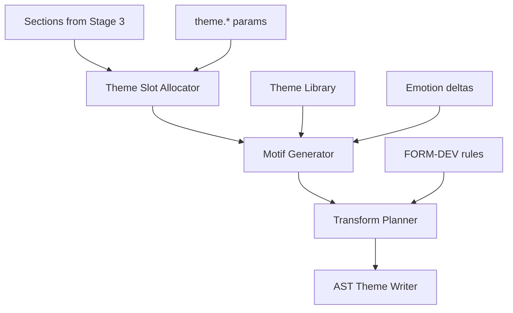

# Motif Engine Specification

**Version:** 0.1  
**Status:** Draft  
**Agent:** Algorithm Engines Research Agent (Motif / Theme)  
**Dependencies:** [pipeline.md](../01-architecture/pipeline.md), [ast.md](../02-music-model/ast.md), [form.md](../03-theory/form.md), [scoring.md](../05-rule-engine/scoring.md), [melody-engine.md](melody-engine.md)

---

## Table of Contents

1. [Background](#1-background)
2. [Existing Solutions](#2-existing-solutions)
3. [Academic / Theoretical Foundation](#3-academic--theoretical-foundation)
4. [Engineering Analysis](#4-engineering-analysis)
5. [Comparison of Approaches](#5-comparison-of-approaches)
6. [Recommended Solution](#6-recommended-solution)
7. [Architecture](#7-architecture)
8. [Data Structures](#8-data-structures)
9. [Algorithms](#9-algorithms)
10. [Interfaces](#10-interfaces)
11. [Parameter Mappings](#11-parameter-mappings)
12. [Explainability Model](#12-explainability-model)
13. [Future Expansion](#13-future-expansion)
14. [Open Questions](#14-open-questions)
15. [References](#15-references)

---

## 1. Background

### 1.1 Purpose

The **Motif Engine** implements core logic of **Pipeline Stage 4: Theme Planning** — motif definition, theme library management, transformation operators, and section-to-theme assignment. It produces **Motif** AST definitions and `Section.theme_refs` consumed by Melody Engine (Stage 7) and Phrase Engine.

### 1.2 Pipeline I/O

| Property | Value |
|----------|-------|
| **Stage** | 4 — Theme Planning |
| **Search** | Optional A* for theme slot assignment |
| **Beam Width** | N/A (A* or greedy default) |
| **AST Read** | `Section[]`, structure from Stage 3, `parameters.theme.*`, emotion profile |
| **AST Write** | `Motif[]`, `Theme[]`, `Section.theme_refs`, `Section.development_strategy` |

---

## 2. Existing Solutions

| System | Motif Handling |
|--------|----------------|
| **OpenMusic** | User-defined chord-seq patterns |
| **Lenardo** | Clip duplication |
| **Deep research** | Theme library + similarity metric + transforms |
| **Music21** | `Stream.recurse().motifs` analysis only |
| **Bol Processor** | Grammar rules for motivic development |

---

## 3. Academic / Theoretical Foundation

### 3.1 Motif vs Theme vs Phrase

| Term | Length | Aurora AST |
|------|--------|------------|
| **Motif** | 1–4 beats of distinctive material | `Motif` node |
| **Theme** | 1–4 measures; may contain motifs | `Theme` node |
| **Phrase** | 2–8 measures; structural | `Phrase` (Stage 3) |

### 3.2 Development Techniques (Schoenberg; FORM-DEV-*)

| Transform | Operator | Rule ID |
|-----------|----------|---------|
| Repetition | identity | FORM-DEV-001 |
| Sequence | transpose interval | FORM-DEV-002 |
| Inversion | interval mirror around axis | FORM-DEV-003 |
| Retrograde | reverse pitch order | FORM-DEV-004 |
| Augmentation | scale durations × factor | FORM-DEV-005 |
| Diminution | scale durations ÷ factor | FORM-DEV-006 |
| Fragmentation | use subset of motif | FORM-DEV-007 |
| Extension | append sequence tail | FORM-DEV-008 |

### 3.3 Similarity Metrics

Motif similarity for bridge detection and variation degree:

```text
sim(m1, m2) = w_interval × contour_match(m1, m2)
            + w_rhythm × rhythm_match(m1, m2)
            + w_pc × pitch_class_overlap(m1, m2)
```

Used by Phrase Engine and Theme Planner for `development_level` selection.

---

## 4. Engineering Analysis

Motif Engine operates on **symbolic pitch-duration sequences**, not full AST note events (those are Stage 7). Motifs stored as relative pitch intervals + rhythmic pattern grid.

Performance: theme planning for 8 themes × 4 sections < 500 ms.

---

## 5. Comparison of Approaches

| Approach | Verdict |
|----------|---------|
| Pre-seeded motif library only | Fast; limited originality |
| Generate motifs via mini beam search | **Recommended for primary themes** |
| ML motif VAE | Optional AI plugin |
| User-imported MIDI snippets | Theme plugin extension |

---

## 6. Recommended Solution

```text
1. Allocate theme slots per section (from structure + theme.count)
2. Generate or select primary motifs (beam or library)
3. Plan development path per section (transform chain)
4. Write Motif/Theme nodes + theme_refs to AST
```

Melody Engine **realizes** motifs as note events; Motif Engine defines **abstract templates**.

---

## 7. Architecture



---

## 8. Data Structures

```rust
struct Motif {
    id: MotifId,
    intervals: Vec<Interval>,       // semitones from first pitch
    rhythm: RhythmPattern,            // grid of duration classes
    contour: ContourSignature,
    source: MotifSource,              // generated | library | user
    provenance: MotifProvenance,
}

struct Theme {
    id: ThemeId,
    primary_motif: MotifId,
    secondary_motifs: Vec<MotifId>,
    length_measures: u32,
}

struct DevelopmentPlan {
    section_id: SectionId,
    theme_id: ThemeId,
    transforms: Vec<TransformOp>,   // ordered chain
    development_level: f32,           // 0=exact .. 1=fragmented
    similarity_target: f32,           // vs primary theme
}

enum TransformOp {
    Identity,
    Sequence { interval: Interval },
    Inversion { axis: PitchClass },
    Retrograde,
    Augmentation { factor: Rational },
    Diminution { factor: Rational },
    Fragment { segment: Range<usize> },
}
```

### AST Write Set

- `Composition.motifs: Motif[]`
- `Composition.themes: Theme[]`
- `Section.theme_refs: ThemeId[]`
- `Section.development_plan: DevelopmentPlan`

---

## 9. Algorithms

### 9.1 Theme Slot Allocation

```text
function allocate_theme_slots(sections, theme_count, params):
    slots = []
    primary_themes = min(theme_count, params.theme.max_primary)

    // Assign primary theme to first occurrence of each major section role
    for section in sections:
        if section.role in [verse, expo, A]:
            slots[section] = ThemeSlot(primary=next_theme_id(), ...)
        elif section.role in [chorus, B, bridge]:
            slots[section] = ThemeSlot(contrast=true, ...)

    // A′ sections: link to A with development_plan
    for section in sections where section.role.is_reprise:
        slots[section] = ThemeSlot(base=find_original_A(sections), dev_level=params.theme.repetition_ratio)

    return slots
```

Optional **A*** when `theme_count > 3`: minimize contrast violations (FORM-ABA-003) + maximize coverage.

### 9.2 Motif Generation (Mini Beam Search)

```text
function generate_motif(params, key, length_beats, emotion_deltas):
    beam = [empty_motif_state]
    width = param(search.motif_beam_width) default 8

    for beat in 1..length_beats:
        candidates = []
        for state in beam:
            for (pitch, dur) in motif_candidate_generator(state, key, params):
                patch = state.add(pitch, dur)
                if hard_constraints(patch): continue
                score = evaluate_motif_rules(patch, MOTI-*, FORM-DEV-*)
                candidates.append(patch)
        beam = top_k(candidates, width)

    return best(beam).to_motif()
```

**Motif candidate generator:** chord tones + passing tones on weak beats; contour diversity rewarded (MOTI-003).

### 9.3 Transform Application (Abstract)

```text
function apply_transform(motif, op: TransformOp) -> Motif:
    match op:
        Inversion(axis) => invert_intervals(motif.intervals, axis)
        Retrograde => reverse(motif.intervals)  // rhythm may retrograde or keep
        Augmentation(f) => scale_durations(motif.rhythm, f)
        Sequence(i) => transpose_intervals(motif.intervals, i)
        Fragment(seg) => slice(motif, seg)
```

Melody Engine applies same operators when realizing notes (must stay consistent).

### 9.4 Theme Library

```text
ThemeLibrary {
    entries: Vec<LibraryMotif>,  // tagged by genre, emotion, length
    index: HashMap<Tag, Vec<MotifId>>,
}

function select_from_library(criteria, params):
    candidates = library.query(genre, emotion.valence, motif_length)
    score each by similarity_to_existing(themes)  // avoid duplicate
    return weighted_random(candidates, params.theme.library_bias)
```

Library seeded from Bach chorale incipits, folk ABC fragments, Groove-unrelated melodic snippets (see research notes).

### 9.5 Development Path Planning

```text
function plan_development(section, base_theme, dev_level):
    if dev_level < 0.2:
        return [Identity]
    elif dev_level < 0.5:
        return [Sequence(+M2)] or [Identity, Sequence(+M2)]
    elif dev_level < 0.8:
        return [Fragment(0..2), Sequence(+m2), Augmentation(3/2)]
    else:
        return [Fragment, Inversion, Diminution(1/2)]  // highly varied

    // Weight transforms by FORM-DEV-* soft scores
```

---

## 10. Interfaces

```rust
pub trait MotifEngine {
    fn plan_themes(
        &self,
        ast: &Composition,
        params: &Parameters,
        emotion: &WeightDeltaTable,
    ) -> ThemePlanResult;
}

pub trait ThemePlugin {
    fn library_entries(&self) -> Vec<LibraryMotif>;
    fn custom_transform(&self, motif: &Motif, op: &str) -> Option<Motif>;
}
```

---

## 11. Parameter Mappings

| Parameter | Effect | Rules |
|-----------|--------|-------|
| `theme.count` | Number of distinct themes | — |
| `theme.motif_length` | Beats in primary motif | MOTI-002 |
| `theme.repetition_ratio` | development_level inverse | FORM-DEV-001 |
| `theme.library_bias` | 0=generate, 1=library | — |
| `theme.contrast_strength` | Inter-theme interval distance min | MOTI-004 |
| `theme.transform_allow[]` | Enabled TransformOps | FORM-DEV-* |
| `search.motif_beam_width` | Motif generation beam | default 8 |
| `emotion.valence` | Contour direction (ascending bias) | MOTI-003 |

---

## 12. Explainability Model

```text
MotifProvenance {
    engine: "motif",
    stage: 4,
    source: "generated" | "library:{id}" | "transform",
    motif_id, theme_id,
    transforms_applied: TransformOp[],
    rule_ids: [MOTI-001, FORM-DEV-003, ...],
    similarity_to_primary: f32,
    search_trace: Option<MotifSearchTrace>,  // if generated
}
```

Melody events reference `motif_id` + `transform_chain` in provenance when realizing motif material.

---

## 13. Future Expansion

- User motif sketch input (piano roll → Motif node)
- Cross-composition motif reuse cache
- ML motif completion plugin (proposes intervals; rules select)
- Hierarchical motifs (motif within motif)

---

## 14. Open Questions

1. Store rhythmic retrograde separately from pitch retrograde?
2. Maximum motif length before treated as full theme phrase?
3. Conflict when library motif violates current key — transpose or reject?

---

## 15. References

- Schoenberg, *Fundamentals of Musical Composition*
- [form.md](../03-theory/form.md) — FORM-DEV rules
- [melody-engine.md](melody-engine.md) — realization
- [deep-research-report.md](../../deep-research-report.md) — theme library

---

*End of Motif Engine Specification v0.1*
