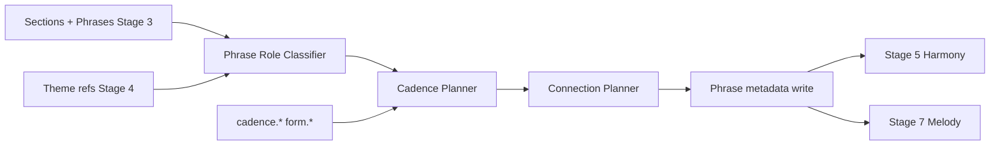

# Phrase Engine Specification

**Version:** 0.1  
**Status:** Draft  
**Agent:** Algorithm Engines Research Agent (Phrase)  
**Dependencies:** [structure-engine.md](structure-engine.md), [motif-engine.md](motif-engine.md), [harmony-engine.md](harmony-engine.md), [melody-engine.md](melody-engine.md), [form.md](../03-theory/form.md), [scoring.md](../05-rule-engine/scoring.md)

---

## Table of Contents

1. [Background](#1-background)
2. [Existing Solutions](#2-existing-solutions)
3. [Academic / Theoretical Foundation](#3-academic--theoretical-foundation)
4. [Engineering Analysis](#4-engineering-analysis)
5. [Comparison of Approaches](#5-comparison-of-approaches)
6. [Recommended Solution](#6-recommended-solution)
7. [Architecture](#7-architecture)
8. [Data Structures](#8-data-structures)
9. [Algorithms](#9-algorithms)
10. [Interfaces](#10-interfaces)
11. [Parameter Mappings](#11-parameter-mappings)
12. [Explainability Model](#12-explainability-model)
13. [Future Expansion](#13-future-expansion)
14. [Open Questions](#14-open-questions)
15. [References](#15-references)

---

## 1. Background

### 1.1 Purpose

The **Phrase Engine** manages **phrase-level musical logic**: boundary confirmation, **cadence placement** expectations, **phrase connection** (elision, overlap, rest), and antecedent–consequent pairing. It spans Stages 3–7 as a **cross-cutting service** but its primary specification hook is between Theme Planning and Melody generation.

Unlike Structure Engine (macro sections) or Motif Engine (abstract cells), Phrase Engine defines **how phrases breathe, close, and connect**.

### 1.2 Pipeline Involvement

| Phase | Stage | Phrase Engine Role |
|-------|-------|-------------------|
| Structure | 3 | Initial phrase shells from structure-engine |
| Theme | 4 | Map themes to phrase groups |
| Harmony | 5 | Cadence chord templates at phrase ends |
| Melody | 7 | Beam search terminal conditions, connection scoring |

**Dedicated pipeline stage:** None (service module). **Search:** Soft scoring only in Melody beam; cadence type selection may use narrow beam (width 4).

---

## 2. Existing Solutions

| System | Phrase Model |
|--------|--------------|
| **GTTM (Lerdahl & Jackendoff)** | Time-span reduction | Theoretical basis |
| **Music21** | `Phrase` as analytical span | Borrow concepts |
| **Band-in-a-Box** | 2-bar / 4-bar phrase presets | Template alignment |
| **Deep research** | Cadence at phrase end scoring | Implemented as rules |

---

## 3. Academic / Theoretical Foundation

### 3.1 Phrase Types

| Type | Measures | Cadence |
|------|----------|---------|
| **Antecedent** | 2–4 | Half (HC) or imperfect |
| **Consequent** | 2–4 | Perfect (PAC) or strong IAC |
| **Period** | 4–8 | Ant + Cons |
| **Sentence** | 6–8 | Presentation + continuation + cadence |
| **Single phrase** | 2–8 | Any cadence per param |

### 3.2 Cadence Taxonomy (Harmony integration)

| Cadence | Harmonic | Rule IDs |
|---------|----------|----------|
| PAC | V(7)–I, soprano 1–1 or 3–1 | HARM-015, FORM-001 |
| IAC | V–I, non-tonic soprano | HARM-016 |
| HC | Ends on V | HARM-017 |
| Plagal | IV–I | HARM-018 |
| Deceptive | V–vi | HARM-019 |
| Phrygian half | iv6–V (minor) | HARM-020 |

### 3.3 Phrase Connection

| Technique | Description |
|-----------|-------------|
| **Breath rest** | Rest or caesura at boundary |
| **Elision** | Last note of phrase 1 = first of phrase 2 |
| **Overlap** | Suspension across boundary |
| **Sequential bridge** | Motif sequence connects phrases |

---

## 4. Engineering Analysis

Phrase Engine is **lightweight** — mostly metadata and constraint hooks. Heavy generation remains in Harmony/Melody engines. Performance negligible (< 10 ms planning).

---

## 5. Comparison of Approaches

| Approach | Verdict |
|----------|---------|
| Infer phrases from notes post-hoc | Rejected — too late for harmony |
| Fixed 4-bar phrases only | Default; param overrides |
| Parametric period/sentence grammar | **Recommended** |
| ML phrase boundary detection | Analysis import only |

---

## 6. Recommended Solution

Three-phase **Phrase Plan** attached to each `Phrase` AST node:

```text
1. Classify phrase role (antecedent, consequent, standalone, continuation)
2. Assign cadence_expectation (type, strength, measure offset)
3. Define connection_to_next (rest, elision, motif_link)
```

Harmony Engine reads `cadence_expectation`; Melody Engine uses connection rules in beam terminal scoring.

---

## 7. Architecture



---

## 8. Data Structures

```rust
struct PhrasePlan {
    phrase_id: PhraseId,
    role: PhraseRole,
    length_measures: u32,
    cadence: CadenceExpectation,
    connection: PhraseConnection,
    theme_ref: Option<ThemeId>,
    provenance: PhraseProvenance,
}

struct CadenceExpectation {
    cadence_type: CadenceType,
    strength: f32,                    // 0–1, maps HARM-015 weight
    harmonic_rhythm_slot: BeatOffset, // where V–I lands
    allow_deceptive: bool,
    soprano_degree_preference: Option<Degree>,  // 1 or 3 for PAC
}

struct PhraseConnection {
    mode: ConnectionMode,  // Rest | Elision | Overlap | MotifBridge
    rest_duration: Option<Rational>,
    elision_pitch: Option<Pitch>,
    bridge_motif_transform: Option<TransformOp>,
}
```

### AST Read/Write

| Operation | AST |
|-----------|-----|
| Read | `Phrase[]`, `Section.theme_refs`, `Section.key_area`, params |
| Write | `Phrase.role`, `Phrase.cadence_expected`, `Phrase.connection`, `Phrase.plan_provenance` |

---

## 9. Algorithms

### 9.1 Phrase Planning Entry

```text
function plan_phrases(ast, params):
    for section in ast.sections:
        phrases = section.phrases
        for i, phrase in enumerate(phrases):
            role = classify_phrase_role(i, phrases.len(), section.role, params)
            cadence = plan_cadence(phrase, role, section.key_area, params, i == len-1)
            connection = plan_connection(phrase, phrases[i+1] if i+1 < len else None, params)
            write_phrase_plan(phrase, role, cadence, connection)
    return ast
```

### 9.2 Phrase Role Classification

```text
function classify_phrase_role(index, count, section_role, params):
    if params.form.phrase_model == "period" and count >= 2:
        if index % 2 == 0: return Antecedent
        else: return Consequent
    if params.form.phrase_model == "sentence":
        if index == 0: return Presentation
        if index == count - 1: return Cadential
        return Continuation
    if section_role == chorus: return StandaloneStrongCadence
    return Standalone
```

### 9.3 Cadence Planner

```text
function plan_cadence(phrase, role, key_area, params, is_section_final):
    prefs = params.cadence.type_preference  // weighted list

    if role == Antecedent:
        type = weighted_choice([HC, IAC], prefs, params.cadence.half_cadence_freq)
        strength = 0.6
    elif role == Consequent:
        type = PAC
        strength = params.harmony.cadence_strength
    elif is_section_final:
        type = weighted_choice([PAC, Plagal, Deceptive], prefs)
        strength = max(params.harmony.cadence_strength, 0.8)
    else:
        type = weighted_choice([PAC, HC, IAC], prefs)
        strength = params.harmony.cadence_strength

    slot = phrase.last_measure.last_beat - harmonic_rhythm_offset(params)

    return CadenceExpectation(type, strength, slot, ...)
```

Optional narrow beam (width 4) when multiple cadence types score closely — pick max FORM + HARM soft score.

### 9.4 Connection Planner

```text
function plan_connection(phrase, next_phrase, params):
    if next_phrase is None:
        return Connection(Rest, rest_duration=quarter) if params.phrase.end_rest else Connection(None)

    sim = theme_similarity(phrase.theme_ref, next_phrase.theme_ref)

    if sim > 0.8 and params.phrase.allow_elision:
        return Connection(Elision, elision_pitch=infer_common_tone(phrase, next_phrase))
    if sim < 0.4:
        return Connection(MotifBridge, bridge_motif_transform=Sequence(+M2))
    return Connection(Rest, rest_duration=eighth)
```

### 9.5 Melody Beam Integration

At phrase-final beats, Melody beam adds terminal bonus:

```text
terminal_score(state, phrase_plan):
    bonus = 0
    if state.harmony_at_end matches phrase_plan.cadence.type:
        bonus += w_HARM_015 * phrase_plan.cadence.strength
    if state.soprano_degree matches phrase_plan.cadence.soprano_degree_preference:
        bonus += w_FORM_cadence_soprano
    if phrase_plan.connection.mode == Elision and state.last_pitch == elision_pitch:
        bonus += w_phrase_elision
    return bonus
```

### 9.6 Rule Categories

| Category | Usage |
|----------|-------|
| FORM-001, FORM-*** | Phrase boundary on measure lines |
| HARM-015..020 | Cadence type and strength |
| FORM-DEV-* | Motif bridge transforms |
| VLED-* | Melodic approach to cadence (leading tone) |
| MOTI-* | Theme recall at phrase start |

---

## 10. Interfaces

```rust
pub trait PhraseEngine {
    fn plan(&self, ast: &mut Composition, params: &Parameters) -> PhrasePlanResult;
    fn cadence_bonus(&self, ctx: &MelodySearchContext, plan: &PhrasePlan) -> f64;
    fn connection_constraint(&self, ctx: &MelodySearchContext, plan: &PhrasePlan) -> HardSoft;
}
```

Called by Pipeline Orchestrator after Stage 4 (or integrated into Stage 4 hook).

---

## 11. Parameter Mappings

| Parameter | Effect | Rules |
|-----------|--------|-------|
| `form.phrase_model` | period / sentence / free | — |
| `form.phrase_length` | Measures per phrase | FORM-SEC-004 |
| `cadence.type_preference` | Cadence type weights | HARM-015..020 |
| `cadence.half_cadence_freq` | HC vs PAC in antecedent | HARM-017 |
| `harmony.cadence_strength` | Cadence bonus multiplier | HARM-015 |
| `phrase.allow_elision` | Enable elision connections | — |
| `phrase.end_rest` | Final phrase rest | RHYT-008 |
| `theme.repetition_ratio` | Antecedent–consequent similarity | FORM-DEV-001 |

---

## 12. Explainability Model

```text
PhraseProvenance {
    engine: "phrase",
    role: PhraseRole,
    cadence: { type, strength, reason_rule: "HARM-015" },
    connection: { mode, reason: "low theme similarity → motif bridge" },
    parameters_used: [...],
}
```

Melody note at cadence beat: provenance includes `phrase_plan.cadence.type` and `HARM-015` delta.

Inspector: "Why half cadence here?" → `role=Antecedent`, `cadence.half_cadence_freq=0.7`.

---

## 13. Future Expansion

- Hypermetric phrase grouping (4+4 period within 8-bar section)
- Vocal breath marks as connection metadata
- Jazz turnaround phrases (ii–V–I at phrase end)
- User-drawn cadence overrides per phrase

---

## 14. Open Questions

1. Run phrase planning before or after harmony skeleton (cadence chords)?
   - **v0.1:** Plan metadata before Stage 5; Harmony reads expectations
2. Elision with conflicting harmony change at boundary?
3. Store phrase plan in IR for export (fermata, breath)?

---

## 15. References

- Lerdahl & Jackendoff, *A Generative Theory of Tonal Music*
- Caplin, *Classical Form* — sentence and period
- [harmony.md](../03-theory/harmony.md) — cadence rules
- [structure-engine.md](structure-engine.md) — phrase shells

---

*End of Phrase Engine Specification v0.1*
