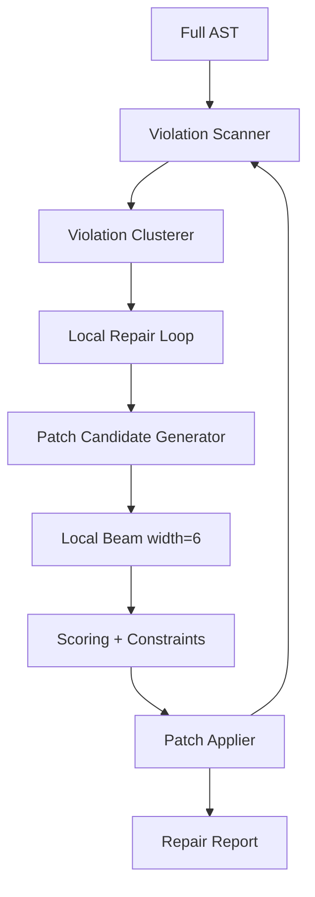

# Repair Engine Specification

**Version:** 0.1  
**Status:** Draft  
**Agent:** Algorithm Engines Research Agent (Repair)  
**Dependencies:** [pipeline.md](../01-architecture/pipeline.md), [constraint.md](../05-rule-engine/constraint.md), [scoring.md](../05-rule-engine/scoring.md), [ast.md](../02-music-model/ast.md)

---

## Table of Contents

1. [Background](#1-background)
2. [Existing Solutions](#2-existing-solutions)
3. [Academic / Theoretical Foundation](#3-academic--theoretical-foundation)
4. [Engineering Analysis](#4-engineering-analysis)
5. [Comparison of Approaches](#5-comparison-of-approaches)
6. [Recommended Solution](#6-recommended-solution)
7. [Architecture](#7-architecture)
8. [Data Structures](#8-data-structures)
9. [Algorithms](#9-algorithms)
10. [Interfaces](#10-interfaces)
11. [Parameter Mappings](#11-parameter-mappings)
12. [Explainability Model](#12-explainability-model)
13. [Future Expansion](#13-future-expansion)
14. [Open Questions](#14-open-questions)
15. [References](#15-references)

---

## 1. Background

### 1.1 Purpose

The **Repair Engine** implements **Pipeline Stage 12: Repair** — post-generation correction of **soft-constraint violations** and fixable near-misses before hard Validation (Stage 13).

Repair does not regenerate entire sections; it applies **local patches** via limited search.

### 1.2 Pipeline I/O

| Property | Value |
|----------|-------|
| **Stage** | 12 — Repair |
| **Search** | Limited local beam (width **4–8**) |
| **Beam Width** | `repair.beam_width` default **6** |
| **AST Read** | Full composition AST |
| **AST Write** | Patches to violating `Event` nodes; `RepairRecord[]` |
| **Input** | Optional pre-validation soft violation report |

---

## 2. Existing Solutions

| System | Post-hoc Repair |
|--------|-----------------|
| **Music21 fixers** | Spelling, beam groups | Analytical |
| **SMT validators** | UNSAT cores | Validation only |
| **Deep research** | Rule post-processing | Adopted locally |
| **DAW manual edit** | User fixes | UI fallback |

---

## 3. Academic / Theoretical Foundation

Repair targets **preference violations** that accumulated across stages:

- Register overflow (REG soft overflow before hard validation)
- Voice-leading parallels (CONT soft in moderate strictness)
- Unresolved non-chord tones at weak boundaries
- Rhythm alignment drift
- Drum collision (DRUM-005)

Hard violations should be rare if constraints work — Repair handles **soft backlog** and **user edits** re-entering pipeline.

---

## 4. Engineering Analysis

### 4.1 Repair Ordering

Fix in dependency order:

```text
1. Register (pitch transposition within voice)
2. Rhythm alignment (nudge offsets)
3. Voice-leading (swap pitch / insert passing)
4. Harmony spelling (enharmonic)
5. Drum collisions (drop ghost hit)
```

### 4.2 Performance

Full piece scan < 500 ms; local repair search < 2 s unless `repair.aggressive=true`.

---

## 5. Comparison of Approaches

| Approach | Verdict |
|----------|---------|
| Regenerate failing stage | Section regen mode (user triggered) |
| **Local patch search** | **Primary** |
| Global SMT repair | Too slow |
| Ignore soft violations | Rejected — export quality |

---

## 6. Recommended Solution

```text
1. Scan AST → collect ViolationReport (soft + fixable hard)
2. Cluster violations by locality (measure window)
3. For each cluster: local beam search over patch candidates
4. Accept patch if score improves and no new hard violations
5. Record RepairProvenance on modified events
6. Re-scan until stable or max_iterations
```

---

## 7. Architecture



---

## 8. Data Structures

```rust
struct ViolationReport {
    violations: Vec<Violation>,
    by_measure: HashMap<MeasureId, Vec<Violation>>,
}

struct Violation {
    rule_id: RuleId,
    severity: Severity,       // Soft | HardFixable
    events: Vec<EventId>,
    measure_id: MeasureId,
    description: String,
    suggested_fix_kind: FixKind,
}

enum FixKind {
    TransposePitch { semitones: i8 },
    ChangePitch { to: Pitch },
    NudgeRhythm { delta_beats: Rational },
    DeleteEvent,
    InsertPassingTone,
    RespellEnharmonic,
}

struct RepairPatch {
    event_patches: Vec<EventPatch>,
    eval_score_delta: f64,
}

struct RepairRecord {
    violation: Violation,
    patch: RepairPatch,
    provenance: RepairProvenance,
    iterations: u32,
}
```

---

## 9. Algorithms

### 9.1 Main Entry

```text
function repair(ast, params):
    max_iter = params.repair.max_iterations  // default 3
    width = params.repair.beam_width         // default 6

    for iter in 1..max_iter:
        report = scan_violations(ast, active_rules, mode=soft_and_fixable_hard)
        if report.violations.empty():
            break

        clusters = cluster_by_measure_window(report, window=2)

        for cluster in clusters:
            patch = local_repair_search(ast, cluster, width, params)
            if patch improves eval_score:
                apply_patch(ast, patch)
                record_repair(cluster, patch)

    return ast, repair_report
```

### 9.2 Violation Scanner

```text
function scan_violations(ast, rules, mode):
    violations = []
    for scope in ast.all_scopes(measure, phrase, voice_pair):
        for rule in rules.applicable(scope):
            result = evaluate(rule, scope)
            if result.violated and mode.allows(result.severity):
                violations.append(to_violation(result))
    return ViolationReport(violations)
```

### 9.3 Local Repair Search

```text
function local_repair_search(ast, cluster, width, params):
    state = ast.snapshot(cluster.window)
    beam = [RepairState(initial, score=eval_ast(state))]

    for step in 1..params.repair.max_patch_steps:  // default 4
        candidates = []
        for rs in beam:
            for fix in generate_fixes(cluster, rs):
                patch = apply_fix(rs, fix)
                if hard_constraints_violated(patch): continue
                new_score = eval_ast(patch)
                candidates.append(RepairState(patch, new_score))
        beam = top_k(candidates, width)

    best = argmax(beam, score)
    return best.patch if best.score > initial.score else None
```

### 9.4 Fix Generators by Violation Type

| Violation | Fix Candidates |
|-----------|----------------|
| REG overflow | Transpose ± octave; stepwise shift within register |
| VLED parallel 5th/8 | Change inner voice pitch by step |
| HARM unresolved NT | Insert resolution note or shorten duration |
| RHYT misalignment | Nudge ± smallest subdivision |
| DRUM collision | Remove lower-priority hit (ghost) |
| Spelling | Enharmonic respell |

```text
function generate_fixes(cluster, state):
    fixes = []
    for v in cluster.violations:
        match v.suggested_fix_kind:
            TransposePitch(s) => fixes += octave_transpose_candidates(v.events, s)
            ChangePitch(p) => fixes += [p, step_neighbors(p)]
            ...
    return dedupe(fixes)
```

### 9.5 Rule Categories

| Category | Repair Priority |
|----------|-----------------|
| **REG-*** | High (audible) |
| **CONT-*** | High in strict counterpoint |
| **VLED-*** | Medium |
| **HARM-*** | Medium (resolution) |
| **RHYT-*** | Medium |
| **DRUM-*** | Low (drop hit) |
| **MOTI-*** | Low (avoid breaking motif unless critical) |

Motif-breaking fixes penalized: `repair.motif_preserve_weight`.

### 9.6 Integration with Validation

Stage 13 runs **hard only**. Repair must not leave hard violations. If unfixable:

```text
return RepairFailure { violations, suggest: "regenerate section X" }
```

Pipeline aborts export; UI offers section regen.

---

## 10. Interfaces

```rust
pub trait RepairEngine {
    fn repair(
        &self,
        ast: &mut Composition,
        params: &Parameters,
    ) -> RepairResult;
}

pub trait RepairPlugin {
    fn custom_fix(&self, violation: &Violation) -> Option<RepairPatch>;
}
```

**Repair-only pipeline mode:** Stages 12–13 only (see [pipeline.md](../01-architecture/pipeline.md) §4).

---

## 11. Parameter Mappings

| Parameter | Effect |
|-----------|--------|
| `repair.beam_width` | Local search width (default 6) |
| `repair.max_iterations` | Outer scan loops (default 3) |
| `repair.max_patch_steps` | Depth per cluster (default 4) |
| `repair.aggressive` | Allow motif-breaking fixes |
| `repair.motif_preserve_weight` | Penalty for motif alteration |
| `counterpoint.strictness` | CONT violation priority |
| `register.melody_min/max` | REG fix bounds |

---

## 12. Explainability Model

```text
RepairProvenance {
    engine: "repair",
    stage: 12,
    original_violation: { rule_id, description },
    fix_applied: FixKind,
    score_before: f64,
    score_after: f64,
    search_mode: "local_beam",
    beam_width: 6,
    supersedes: Option<previous Event.provenance>,  // chain
    reason: "transpose melody +8ve to satisfy REG-001",
}
```

Modified events: provenance `reason` prefixed with `[repair]`; inspector shows before/after diff.

---

## 13. Future Expansion

- User-approved repair suggestions (interactive)
- ML pitch correction plugin
- Cross-voice joint repair (wider window)
- Repair cache for repeated parameter sets

---

## 14. Open Questions

1. Overwrite original generation provenance or append repair chain?
   - **v0.1:** Append `repair_chain[]` on event
2. Auto-repair on user manual edit before every export?
3. Maximum cluster window size for performance?

---

## 15. References

- [constraint.md](../05-rule-engine/constraint.md)
- [scoring.md](../05-rule-engine/scoring.md)
- [pipeline.md](../01-architecture/pipeline.md) — Stage 12
- Deep research — post-processing constraints

---

*End of Repair Engine Specification v0.1*
