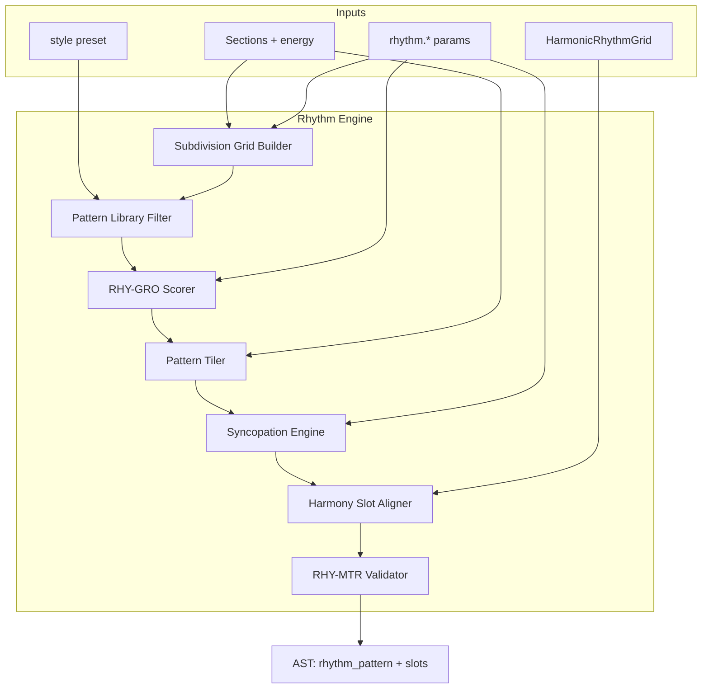

# Rhythm Engine Specification

**Version:** 0.1  
**Status:** Draft  
**Agent:** Algorithm Engines Research Agent (Rhythm)  
**Dependencies:** [pipeline.md](../01-architecture/pipeline.md), [ast.md](../02-music-model/ast.md), [timeline.md](../02-music-model/timeline.md), [harmony-engine.md](harmony-engine.md), [structure-engine.md](structure-engine.md), [rhythm.md](../03-theory/rhythm.md), [scoring.md](../05-rule-engine/scoring.md), [constraint.md](../05-rule-engine/constraint.md)

---

## Table of Contents

1. [Background](#1-background)
2. [Existing Solutions](#2-existing-solutions)
3. [Academic / Theoretical Foundation](#3-academic--theoretical-foundation)
4. [Engineering Analysis](#4-engineering-analysis)
5. [Comparison of Approaches](#5-comparison-of-approaches)
6. [Recommended Solution](#6-recommended-solution)
7. [Architecture](#7-architecture)
8. [Data Structures](#8-data-structures)
9. [Algorithms](#9-algorithms)
10. [Interfaces](#10-interfaces)
11. [Parameter Mappings](#11-parameter-mappings)
12. [Explainability Model](#12-explainability-model)
13. [Future Expansion](#13-future-expansion)
14. [Open Questions](#14-open-questions)
15. [References](#15-references)

**Appendices:** [A. Pipeline I/O](#appendix-a-pipeline-io) · [B. Pattern Library Taxonomy](#appendix-b-pattern-library-taxonomy) · [C. Harmony Skeleton Integration](#appendix-c-harmony-skeleton-integration) · [D. Worked Example](#appendix-d-worked-example)

---

## 1. Background

### 1.1 Purpose

The **Rhythm Engine** implements **Pipeline Stage 6: Rhythm Skeleton** — metric framework construction per measure before melodic and inner-voice filling. It selects rhythm patterns from the style-appropriate library defined in [rhythm.md](../03-theory/rhythm.md), applies subdivision and syncopation parameters, and **aligns melodic rhythmic slots** with the harmonic rhythm grid produced by Stage 5.

Unlike melody or counterpoint stages, Stage 6 uses **deterministic pattern selection** with soft-rule scoring over a finite candidate set — no beam search. The output is a **Rhythm Skeleton**: a grid of `RhythmicSlot` objects consumed by Stages 7–10.

### 1.2 Pipeline I/O

| Property | Value |
|----------|-------|
| **Stage** | 6 — Rhythm Skeleton |
| **Search** | **No** — scored pattern selection + perturbation |
| **Candidate Pool** | Top **5–12** patterns per section after RHY-GRO filter |
| **AST Read** | `Section[]`, `Measure.chord_events`, harmonic rhythm metadata, `tempo_map`, `time_signature`, `rhythm.*`, style preset |
| **AST Write** | `Measure.rhythm_pattern`, `RhythmicSlot[]`, subdivision attrs, swing metadata, `Event.provenance` on skeleton attrs |

### 1.3 Position in Pipeline

Stage 6 executes **after Harmony Skeleton (Stage 5)** and **before Melody (Stage 7)**:

```text
Stage 5: chord_events + HarmonicRhythmGrid (when chords change)
Stage 6: RhythmicSlot grid (when melody/bass *may* articulate)
Stage 7: Melody beam search steps one slot at a time
```

The rhythm skeleton does **not** assign pitches. It defines **attack opportunities**, accent weights, and rest placement constraints for downstream engines.

### 1.4 Design Principles

| Principle | Application |
|-----------|-------------|
| **Explainability** | Every pattern choice records `pattern_id`, matched RHY-GRO rules, parameter influence |
| **Controllability** | `rhythm.density`, `syncopation`, `subdivision`, `swing` map directly to rule weights |
| **Separation** | Harmonic rhythm (Stage 5) and melodic rhythm (Stage 6) are independent but aligned at cadences |

---

## 2. Existing Solutions

| System | Rhythm Skeleton Approach | Aurora Assessment |
|--------|--------------------------|-------------------|
| **Groove MIDI / Magenta** | ML clustering on drum onsets | Offline library source; not runtime ML |
| **Band-in-a-Box** | Style-specific rhythmic templates | Adopt template tiling model |
| **DAW groove pools** | User-selected clip loops | Similar to pattern family selection |
| **Euclidean rhythm generators** | Mathematical onset distribution | Supplement for electronic presets only |
| **Music21** | Meter analysis, no generation | Analysis reference |
| **Strasheela** | CP over duration variables | Too expensive for skeleton stage |
| **Deep research report** | Template + parametric syncopation | **Basis for Aurora** |

---

## 3. Academic / Theoretical Foundation

### 3.1 Metric Hierarchy (Lerdahl & Jackendoff)

In common time (4/4), beat strength follows:

| Beat | Strength | Typical melodic role |
|------|----------|---------------------|
| 1 | Strongest (1.0) | Chord tone, downbeat accent |
| 2 | Weak (0.4) | Passing tone, syncopation target |
| 3 | Medium (0.7) | Secondary accent |
| 4 | Weak (0.4) | Anticipation, backbeat context |

The rhythm skeleton stores `accent_weight` per slot from this hierarchy, modified by `rhythm.accent_strength` and syncopation perturbations.

### 3.2 Subdivision Grid (Kostka & Payne)

Subdivision level determines minimum note duration and slot granularity:

| `rhythm.subdivision` | Grid unit | Slots per 4/4 measure |
|---------------------|-----------|----------------------|
| 0.2 (simple) | Quarter | 4 |
| 0.5 | Eighth | 8 |
| 0.8 | Sixteenth | 16 |
| 1.0 (max) | Thirty-second / triplets | up to 32 |

Melody and counterpoint beam search iterate **one slot per step** at this resolution. Bass engine may coarsen to eighths when `register.bass_motion_style = root_only`.

### 3.3 Syncopation Theory

Syncopation displaces accent from metric strong position to weak subdivision. Aurora measures **syncopation index** per measure:

```text
syncopation_index(m) = count(slots where accent_weight < 0.5 AND event_present) / total_events(m)
```

Target index ≈ `rhythm.syncopation` parameter (RHY-SYNC-001).

### 3.4 Groove and Swing

| Groove type | `rhythm.swing` | Characteristic |
|-------------|----------------|----------------|
| Straight | 0.0 | Even eighths |
| Light swing | 0.55 | ~60:40 long-short |
| Triplet swing | 0.67 | Jazz ride feel |
| Shuffle | 0.58 | Blues shuffle |

Swing ratio stored on `RhythmSkeleton` for IR projection ([timeline.md](../02-music-model/timeline.md)); AST stores straight notation.

### 3.5 Relationship to Harmonic Rhythm

Harmonic rhythm (Stage 5) defines **when harmony changes**. Melodic rhythm (Stage 6) defines **when lines may articulate**. Rules:

- **RHY-002 [SOFT]:** Melody rhythm may be denser than harmonic rhythm (multiple notes per chord).
- **Cadence alignment [SOFT]:** Phrase-final slots should allow strong-beat resolution (RHY-SYNC-007).
- **Locked slots:** At harmonic rhythm boundaries, at least one slot must exist with `aligns_harmony_change = true` for chord-tone placement in Melody Engine.

---

## 4. Engineering Analysis

### 4.1 Performance Targets

| Operation | Target (desktop CPU) |
|-----------|---------------------|
| Pattern library filter (per section) | < 20 ms |
| Score top-12 candidates (RHY-GRO rules) | < 30 ms |
| Syncopation perturbation (32 bars) | < 50 ms |
| Full Stage 6 (64 bars, 4 sections) | < 300 ms |
| Preview mode (2 bars) | < 40 ms |

No beam search — total cost dominated by rule evaluation over ≤ 12 patterns × section count.

### 4.2 Complexity Class

Pattern selection: **O(P × R)** where P = filtered pattern count (≤ 200 per style), R = rule eval per pattern (~54 RHY rules, early exit on HARD fail).

Slot generation: **O(M × S)** where M = measures, S = slots per measure (4–32).

### 4.3 Failure Modes

| Failure | Mitigation |
|---------|------------|
| No pattern matches time signature | Fallback to generic `RHY-GRO-POP-001` |
| Syncopation param max breaks meter HARD rules | Clamp perturbation; log warning |
| Harmonic rhythm denser than subdivision | Promote subdivision level automatically (+0.1) |
| Empty section (rest-only) | Insert minimum skeleton from `rhythm.density` floor |

---

## 5. Comparison of Approaches

| Approach | Correctness | Speed | Controllability | Verdict |
|----------|-------------|-------|-----------------|---------|
| Pure Markov on IOI | Weak meter | Fast | Low | Rejected |
| Fixed 4/4 quarter grid | OK for march | Instant | None | Preview fallback |
| **Template tiling + parametric syncopation** | Strong | Fast | High | **Primary** |
| Groove MIDI k-NN retrieval | Style-accurate | Medium | Medium | Optional plugin |
| Beam search over slot onsets | Optimal local | Slow | High | Overkill for skeleton |
| L-system / generative grammar | Experimental | Medium | Low | Future research |

---

## 6. Recommended Solution

### 6.1 Five-Phase Pipeline

```text
Phase 1: Resolve meter + subdivision grid from params and time signature
Phase 2: Filter pattern library by style, time sig, density band (RHY-GRO-001 HARD)
Phase 3: Score candidates with RHY-GRO SOFT rules; select per section
Phase 4: Tile patterns across measures; insert fills at phrase boundaries (RHY-GRO-020)
Phase 5: Apply syncopation perturbations; quantize; validate RHY-MTR HARD rules
Phase 6: Align slots with HarmonicRhythmGrid from Stage 5
```

### 6.2 Section-Aware Pattern Strategy

| Section role | Pattern behavior |
|--------------|------------------|
| Intro | Sparse family (RHY-GRO-BL); density < verse |
| Verse | Base pattern; moderate variation (RHY-GRO-006) |
| Chorus | Density ≥ verse (RHY-GRO-010); optional double-time |
| Bridge | Family change (RHY-GRO-011) |
| Outro | Reduce syncopation (RHY-SYNC-004) |

### 6.3 Output Contract

Each `Measure` receives:

```text
Measure.rhythm_pattern: PatternId
Measure.rhythmic_slots: RhythmicSlot[]
Measure.subdivision_level: u8
Measure.swing_ratio: f32        // metadata for export
Measure.syncopation_index: f32  // computed, for inspector
```

---

## 7. Architecture



### 7.1 Module Decomposition

| Component | Responsibility |
|-----------|----------------|
| `SubdivisionGridBuilder` | Beat grid from time sig + `rhythm.subdivision` |
| `PatternLibraryIndex` | Style/tempo/density indexed lookup |
| `PatternSelector` | Score and rank candidates |
| `PatternTiler` | Repeat/variate across measures |
| `SyncopationEngine` | RHY-SYNC perturbations |
| `HarmonySlotAligner` | Mark `aligns_harmony_change` slots |
| `RhythmValidator` | HARD rule gate before AST write |

### 7.2 Shared Resources

Pattern library shared with Drum Engine ([drum-engine.md](drum-engine.md)) at storage layer; rhythm skeleton uses **abstract** `RhythmEvent` (no MIDI note), drums use `DrumHit`. Same pattern IDs for provenance cross-reference.

---

## 8. Data Structures

### 8.1 Core Types

```rust
struct RhythmPattern {
    id: PatternId,                    // e.g. "RHY-GRO-RK-001"
    family: PatternFamily,            // Rock, Pop, Jazz, ...
    time_sig: TimeSignature,
    length_beats: Rational,           // usually 4.0 for one bar
    events: Vec<RhythmEvent>,
    style_tags: Vec<String>,
    density_score: f32,               // 0.0–1.0
    syncopation_score: f32,           // 0.0–1.0
    source: Option<GrooveMidiRef>,
}

struct RhythmEvent {
    offset_beats: Rational,           // from pattern start
    duration_beats: Rational,
    accent_weight: f32,               // 0.0–1.0
    slot_type: SlotType,              // Attack, Sustain, Rest
    is_syncopated: bool,              // set in Phase 5
}

enum SlotType {
    Attack,       // new note may begin
    Sustain,      // tie continuation allowed
    Rest,         // rest encouraged
    Optional,     // may skip (improvisation freedom)
}

struct RhythmicSlot {
    measure_id: MeasureId,
    beat_offset: Rational,
    duration: Rational,
    accent_weight: f32,
    slot_type: SlotType,
    aligns_harmony_change: bool,
    is_downbeat: bool,
    subdivision_index: u8,
}

struct RhythmSkeleton {
    sections: Vec<SectionRhythmPlan>,
    global_subdivision: u8,
    swing_ratio: f32,
    pattern_assignments: HashMap<MeasureId, PatternId>,
}

struct SectionRhythmPlan {
    section_id: SectionId,
    base_pattern: PatternId,
    fill_pattern: Option<PatternId>,
    measures: Vec<MeasureRhythmPlan>,
    target_density: f32,
    target_syncopation: f32,
}

struct MeasureRhythmPlan {
    measure_id: MeasureId,
    slots: Vec<RhythmicSlot>,
    syncopation_index: f32,
    provenance: Provenance,
}
```

### 8.2 Harmony Integration Types

```rust
struct HarmonicRhythmGrid {
    slots: Vec<HarmonySlot>,          // from harmony-engine.md
}

struct HarmonySlot {
    measure_id: MeasureId,
    beat: Rational,
    duration: Rational,
    chord_event_id: ChordEventId,
}

// Cross-reference built in Phase 6
struct HarmonyRhythmAlignment {
    harmony_slot: HarmonySlot,
    rhythmic_slots: Vec<RhythmicSlot>,  // slots within this harmony span
    strong_beat_slots: Vec<RhythmicSlot>,
}
```

### 8.3 Pattern Selection State

```rust
struct PatternCandidate {
    pattern: RhythmPattern,
    fit_score: f32,
    rule_results: Vec<RuleEvalResult>,
    density_delta: f32,               // vs param target
    syncopation_delta: f32,
}
```

---

## 9. Algorithms

### 9.1 Main Entry

```text
function rhythm_skeleton(ast, params, emotion_deltas):
    grid = build_subdivision_grid(ast.tempo_map, ast.time_signature, params.rhythm.subdivision)
    harmony_grid = extract_harmonic_rhythm(ast)  // from Stage 5 chord_events

    skeleton = RhythmSkeleton.empty()

    for section in ast.sections:
        candidates = filter_pattern_library(
            style = params.style,
            time_sig = section.time_sig,
            density_target = params.rhythm.density,
            tempo = ast.tempo_at(section.start)
        )

        scored = score_pattern_candidates(candidates, section, params, emotion_deltas)
        base_pattern = select_top(scored, tie_break = stable_pattern_id)

        section_plan = tile_pattern_across_section(
            base_pattern, section, params, grid
        )

        section_plan = insert_phrase_fills(section_plan, ast.phrases, params)
        section_plan = apply_syncopation(section_plan, params.rhythm.syncopation)
        section_plan = quantize_to_grid(section_plan, grid)

        section_plan = align_with_harmony(section_plan, harmony_grid, section)
        validate_hard_rules(section_plan)  // RHY-MTR-*, RHY-SUB-*

        skeleton.merge(section_plan)

    write_rhythm_skeleton(ast, skeleton)
    return ast
```

### 9.2 Subdivision Grid Builder

```text
function build_subdivision_grid(tempo_map, time_sig, subdivision_param):
    ticks_per_quarter = lerp(1, 8, subdivision_param)  // 1=quarter, 8=32nd grid
    slots_per_beat = ticks_per_quarter
    beats_per_measure = time_sig.numerator * (4 / time_sig.denominator)

    grid = BeatGrid {
        slots_per_beat,
        beats_per_measure,
        slot_duration = 1.0 / (beats_per_measure * slots_per_beat) in quarter-note units
    }
    return grid
```

Auto-promotion: if harmonic rhythm has changes more frequent than grid unit, bump subdivision_param by 0.15 (cap 1.0).

### 9.3 Pattern Library Filter

Uses taxonomy from [rhythm.md Appendix A](../03-theory/rhythm.md):

```text
function filter_pattern_library(style, time_sig, density_target, tempo):
    pool = library.all()

    pool = pool.filter(p => p.time_sig == time_sig)           // RHY-GRO-001 HARD
    pool = pool.filter(p => style_matches(p.style_tags, style))
    pool = pool.filter(p => abs(p.density_score - density_target) < 0.35)
    pool = pool.filter(p => tempo_in_band(p, tempo))

    if pool.empty():
        pool = library.fallback(time_sig)  // generic pop pattern

    return pool
```

### 9.4 Pattern Scoring (Selection, Not Beam Search)

```text
function score_pattern_candidates(candidates, section, params, emotion_deltas):
    results = []

    for pattern in candidates:
        score = 0.0
        rules = []

        score += rule_eval(RHY-GRO-002, pattern.density_score, params.rhythm.density)
        score += rule_eval(RHY-GRO-003, pattern, style)  // backbeat for rock
        score += rule_eval(RHY-GRO-004, pattern.swing_hint, params.rhythm.swing)
        score += section_energy_bonus(pattern, section.energy, emotion_deltas)

        // Prefer patterns whose syncopation profile matches param
        sync_delta = abs(pattern.syncopation_score - params.rhythm.syncopation)
        score -= sync_delta * weight(RHY-SYNC-001)

        results.append(PatternCandidate(pattern, score, rules, ...))

    sort results by fit_score descending
    return results[0:12]
```

Selection: **top-1** for deterministic mode; **weighted random among top-3** when `search.temperature > 0`.

### 9.5 Pattern Tiling and Variation

```text
function tile_pattern_across_section(base_pattern, section, params, grid):
    plan = SectionRhythmPlan(section.id, base_pattern)
    pattern_len = base_pattern.length_beats
    repeat_count = 0

    for measure in section.measures:
        offset_in_pattern = (measure.index_in_section * measure.beats) mod pattern_len
        slots = extract_slots(base_pattern, offset_in_pattern, measure.beats, grid)

        if repeat_count >= 4 and not section.is_chorus:
            slots = vary_pattern(slots, max_flip_rate = 0.25)  // RHY-GRO-006
            repeat_count = 0
        else:
            repeat_count += 1

        if section.role == Chorus and params.rhythm.density > 0.6:
            slots = apply_double_time(slots)  // RHY-GRO-018 optional

        plan.measures.push(MeasureRhythmPlan(measure.id, slots, ...))

    return plan
```

### 9.6 Phrase Fill Insertion

```text
function insert_phrase_fills(section_plan, phrases, params):
    for phrase in phrases.in_section(section_plan.section_id):
        if phrase.is_final_in_section or phrase.ends_with_cadence:
            last_measures = section_plan.measures.last(1)
            fill = select_fill_pattern(section_plan.base_pattern.family)
            overlay_fill(last_measures, fill, beats = last 2 beats)  // RHY-GRO-008, RHY-GRO-020
    return section_plan
```

### 9.7 Syncopation Engine

```text
function apply_syncopation(section_plan, syncopation_param):
    for measure_plan in section_plan.measures:
        for slot in measure_plan.slots:
            if slot.is_downbeat and slot.slot_type == Attack:
                if random() < syncopation_param * 0.4:
                    // Shift accent to weak position
                    weak_neighbor = next_weak_slot(slot)
                    if validate(RHY-SYNC-002, weak_neighbor):
                        transfer_accent(slot, weak_neighbor)
                        weak_neighbor.is_syncopated = true

            if measure_plan.is_phrase_final:
                damp_syncopation(measure_plan, factor = 0.5)  // RHY-SYNC-004, RHY-SYNC-007

        measure_plan.syncopation_index = compute_syncopation_index(measure_plan.slots)
        rule_check(RHY-SYNC-001, measure_plan.syncopation_index, syncopation_param)
    return section_plan
```

Anticipation (RHY-SYNC-005): with probability `syncopation_param × 0.3`, create `Optional` slot one subdivision early before strong harmony change.

### 9.8 Harmony Skeleton Alignment

Critical integration with Stage 5:

```text
function align_with_harmony(section_plan, harmony_grid, section):
    for alignment in group_by_harmony_span(harmony_grid, section):
        slots = alignment.rhythmic_slots

        // Ensure at least one attack slot on first beat of harmony span
        first_beat = slots.filter(s => s.beat_offset == alignment.harmony_slot.beat)
        if first_beat.empty() or all_rest(first_beat):
            insert_attack_slot(first_beat[0], accent_weight = 1.0)

        // Mark harmony boundary slots
        boundary_slot = slot_at(alignment.harmony_slot.beat + alignment.harmony_slot.duration)
        if boundary_slot exists:
            boundary_slot.aligns_harmony_change = true
            boundary_slot.accent_weight = max(boundary_slot.accent_weight, 0.85)

        // Fast harmonic rhythm: ensure min 1 slot per half-beat if subdivision allows
        if alignment.harmony_slot.duration <= 0.5 beats:
            densify_slots(slots, min_gap = grid.slot_duration)

    return section_plan
```

When `harmony.harmonic_rhythm = fast` and chord changes occur every beat, melody engine receives 1+ slots per beat with the first marked for chord-tone preference (cross-ref [melody-engine.md](melody-engine.md) §9.3).

### 9.9 Quantization and Validation

```text
function quantize_to_grid(section_plan, grid):
    for slot in all_slots(section_plan):
        slot.beat_offset = snap_to_grid(slot.beat_offset, grid)
        slot.duration = snap_duration(slot.duration, grid)
    return section_plan

function validate_hard_rules(section_plan):
    for slot in all_slots(section_plan):
        assert rule(RHY-MTR-001, slot.beat_offset on grid)
        assert rule(RHY-SUB-001, slot.duration >= grid.slot_duration)
        assert rule(RHY-SUB-002, duration in allowed_set)
    // Fail stage with ViolationReport if any HARD fail
```

---

## 10. Interfaces

```rust
pub trait RhythmEngine {
    fn generate_skeleton(
        &self,
        ast: &mut Composition,
        params: &Parameters,
        emotion: &WeightDeltaTable,
    ) -> RhythmResult;
}

pub trait RhythmPlugin {
    /// Optional: supply additional patterns or override selector
    fn pattern_candidates(
        &self,
        query: &PatternQuery,
    ) -> Vec<RhythmPattern>;

    fn post_process_slots(
        &self,
        slots: &mut [RhythmicSlot],
        params: &Parameters,
    );
}

pub struct PatternQuery {
    pub style: StyleId,
    pub time_sig: TimeSignature,
    pub density: f32,
    pub tempo_bpm: f32,
    pub section_role: SectionRole,
}

pub struct RhythmResult {
    pub skeleton: RhythmSkeleton,
    pub warnings: Vec<RhythmWarning>,
}
```

### 10.1 Downstream Consumer API

```rust
/// Used by Melody, Counterpoint, Bass engines
pub fn iterate_slots(
    ast: &Composition,
    voice_role: VoiceRole,
) -> impl Iterator<Item = RhythmicSlot>;

pub fn slots_in_harmony_span(
    ast: &Composition,
    harmony_slot: &HarmonySlot,
) -> Vec<RhythmicSlot>;

pub fn accent_at(
    ast: &Composition,
    beat: Rational,
) -> f32;
```

---

## 11. Parameter Mappings

| Parameter | Effect | Rules | Default |
|-----------|--------|-------|---------|
| `rhythm.density` | Pattern filter + slot count target | RHY-GRO-002, RHY-SUB-005 | 0.5 |
| `rhythm.syncopation` | Perturbation probability + target index | RHY-SYNC-001..008 | 0.3 |
| `rhythm.subdivision` | Grid resolution, min duration | RHY-SUB-001..008 | 0.5 |
| `rhythm.swing` | Pattern family bias + metadata | RHY-GRO-004 | 0.0 |
| `rhythm.accent_strength` | Downbeat accent multiplier | RHY-MTR-003, RHY-MTR-004 | 0.8 |
| `rhythm.rest_tolerance` | Max consecutive rest slots | RHY-001 | 0.4 |
| `style.genre` | Pattern library filter | RHY-GRO-* | — |
| `style.era` | Pattern family preference | RHY-GRO-* | — |
| `harmony.harmonic_rhythm` | Alignment densification trigger | RHY-002 | medium |
| `form.repetition_ratio` | Pattern repeat before variation | RHY-GRO-007 | 0.5 |
| `emotion.arousal` | Density + syncopation delta | RHY-SYNC-001 | — |
| `emotion.valence` | Ballad vs energetic pattern bias | RHY-GRO-009/010 | — |
| `drums.density` | Cross-check only (Stage 10) | RHY-006 | — |

**Mapping functions:**

```text
target_density      = clamp(rhythm.density + 0.1 * emotion.arousal, 0.1, 1.0)
target_syncopation  = clamp(rhythm.syncopation + 0.05 * emotion.arousal, 0.0, 1.0)
variation_threshold = lerp(2, 6, form.repetition_ratio)  // bars before RHY-GRO-006
fill_probability    = lerp(0.3, 0.9, section.energy)
```

---

## 12. Explainability Model

Each measure's rhythm metadata includes provenance:

```text
Provenance {
    reason: "Selected rock backbeat pattern; syncopation shifted beat 2.5",
    rule_id: "RHY-GRO-003",
    score_delta: +12.4,
    pattern_id: "RHY-GRO-RK-001",
    parameters_used: ["rhythm.density", "rhythm.syncopation", "style.genre"],
    syncopation_events: [2.5, 3.5],
    harmony_alignments: [{ beat: 1.0, chord: "Am" }, { beat: 3.0, chord: "F" }],
    alternatives_considered: 8,
}
```

**Inspector views:**

- Rhythm lane overlay on piano roll (slot boundaries, accent heat map)
- Pattern tile visualization (which bar uses which pattern variant)
- Syncopation index graph vs. parameter target
- Harmony alignment pins at chord change boundaries

---

## 13. Future Expansion

- Polyrhythm layer (3:2 cross-rhythm) as tagged secondary skeleton
- Metric modulation at section boundaries
- Tempo rubato curve integration with `tempo_map`
- Clave-specific HARD constraints for Afro-Cuban presets (RHY-GRO-014)
- User-drawn rhythm mask as hard constraint
- AI plugin proposes pattern sequence; rule engine validates

---

## 14. Open Questions

1. **Shared vs. separate libraries:** Rhythm skeleton and drums share storage but different event types — confirm single JSON index file?
2. **Micro-timing:** Groove MIDI timing deviations apply in IR playback only, not AST — sufficient for v0.1?
3. **Independent melody rhythm:** Should `rhythm.density = 0` produce whole-note-only skeleton for chorale mode?
4. **Triple meter:** Waltz pattern family uses different fill rules — needs separate validation corpus?

---

## 15. References

- Lerdahl, F. & Jackendoff, R. — *A Generative Theory of Tonal Music*
- Kostka & Payne — *Tonal Harmony* (rhythmic vocabulary)
- Gillick, J. et al. — Groove MIDI Dataset paper
- [rhythm.md](../03-theory/rhythm.md) — RHY rule catalog (54 rules)
- [harmony-engine.md](harmony-engine.md) — HarmonicRhythmGrid
- [melody-engine.md](melody-engine.md) — slot iteration consumer
- [drum-engine.md](drum-engine.md) — shared pattern library
- [timeline.md](../02-music-model/timeline.md) — swing IR projection
- [deep-research-report.md](../../deep-research-report.md)

---

## Appendix A: Pipeline I/O

**Stage 6 · No search · Writes `Measure.rhythm_pattern`, `RhythmicSlot[]`**

| Read | Write |
|------|-------|
| `Section[]`, chord_events, harmonic rhythm | `rhythm_pattern` per measure |
| `tempo_map`, time signature | `RhythmicSlot[]` with accent weights |
| `rhythm.*`, style | subdivision attrs, swing metadata |
| Phrase boundaries | provenance per section plan |

Downstream: Melody (7), Counterpoint (8), Bass (9), Drums (10) read rhythmic slots.

---

## Appendix B: Pattern Library Taxonomy

From [rhythm.md Appendix A](../03-theory/rhythm.md). Engine indexes by:

| Index Key | Values |
|-----------|--------|
| `family` | RK, POP, JZ, BO, WZ, ED, BL, FL |
| `time_sig` | 4/4, 3/4, 6/8, 12/8, 5/4 |
| `density_band` | sparse / medium / dense |
| `tempo_band` | slow (<90), medium (90–130), fast (>130) |

Target library size: ≥ 50 patterns per family (offline Groove MIDI clustering task).

**Selection priority when scores tie:**

1. Higher RHY-GRO-012 attribution clarity (provenance)
2. Lower density delta from param
3. Stable lexicographic `pattern_id`

---

## Appendix C: Harmony Skeleton Integration

### C.1 Timing Relationship Diagram

```text
Measure 1 (4/4):
Harmony:  |---- Am ----|---- F -----|
Rhythm:   | x . x . x . x . | x . x x . x . |
          ^ beat 1        ^ beat 3 (harmony change)
          aligns_harmony_change at beat 3.0
```

### C.2 Harmonic Rhythm Modes

| `harmony.harmonic_rhythm` | Chord span | Rhythm skeleton behavior |
|---------------------------|------------|--------------------------|
| slow | 2 measures | Sparse slots; strong downbeats only |
| medium | 1 measure | Standard 8th grid |
| fast | 2+ per measure | Force 16th grid; min 2 attack slots per chord |

### C.3 Rule Cross-Reference

| Scenario | Harmony rule | Rhythm rule |
|----------|--------------|-------------|
| Phrase cadence | HARM-015 lock | RHY-SYNC-007 reduce syncopation |
| Fast ii-V-I | JAZZ-012 | Densify beats 3–4 |
| Whole-note chorale | HARM slow | `rhythm.density < 0.3` → quarter slots only |

---

## Appendix D: Worked Example

**Input:** 4/4 pop verse, 8 bars, `rhythm.density = 0.6`, `syncopation = 0.4`, harmonic rhythm = 1 chord/bar.

**Process:**

1. Grid: 8th notes (8 slots/bar)
2. Filter: `RHY-GRO-POP-*`, density 0.45–0.75
3. Winner: `RHY-GRO-POP-003` (straight eighths, moderate syncopation)
4. Tile 2-bar pattern × 4 with variation at bar 5
5. Syncopation: shift accent on bar 4 beat 2.5 (anticipation before Am→G)
6. Align: mark beat 1 and beat 3 slots where harmony changes in fast bridge sections
7. Output: 64 slots total, syncopation_index ≈ 0.38

**Provenance snippet:**

```json
{
  "pattern_id": "RHY-GRO-POP-003",
  "rules": ["RHY-GRO-002", "RHY-GRO-010", "RHY-SYNC-005"],
  "syncopation_index": 0.38,
  "target_syncopation": 0.4
}
```

---

*End of Rhythm Engine Specification v0.1*
