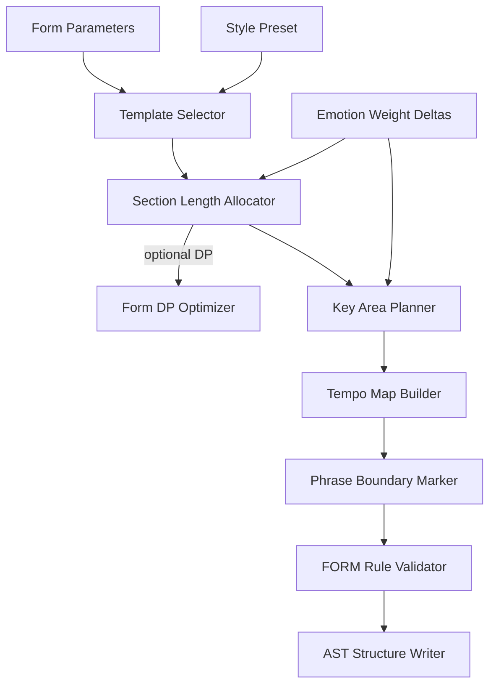

# Structure Engine Specification

**Version:** 0.1  
**Status:** Draft  
**Agent:** Algorithm Engines Research Agent (Form / Structure)  
**Dependencies:** [pipeline.md](../01-architecture/pipeline.md), [ast.md](../02-music-model/ast.md), [form.md](../03-theory/form.md), [scoring.md](../05-rule-engine/scoring.md), [acas-v0.1.md](../00-overview/acas-v0.1.md), [deep-research-report.md](../../deep-research-report.md)

---

## Table of Contents

1. [Background](#1-background)
2. [Existing Solutions](#2-existing-solutions)
3. [Academic / Theoretical Foundation](#3-academic--theoretical-foundation)
4. [Engineering Analysis](#4-engineering-analysis)
5. [Comparison of Approaches](#5-comparison-of-approaches)
6. [Recommended Solution](#6-recommended-solution)
7. [Architecture](#7-architecture)
8. [Data Structures](#8-data-structures)
9. [Algorithms](#9-algorithms)
10. [Interfaces](#10-interfaces)
11. [Parameter Mappings](#11-parameter-mappings)
12. [Explainability Model](#12-explainability-model)
13. [Future Expansion](#13-future-expansion)
14. [Open Questions](#14-open-questions)
15. [References](#15-references)

**Appendices:** [A. Pipeline I/O](#appendix-a-pipeline-io) · [B. Form DP Pseudocode](#appendix-b-form-dp-pseudocode) · [C. Worked Example](#appendix-c-worked-example)

---

## 1. Background

### 1.1 Purpose

The **Structure Engine** implements **Pipeline Stage 3: Structure Planning**. It transforms user form parameters and total duration into a hierarchical formal skeleton: movements (optional), sections with roles, phrase boundaries, **key areas** (`key_map`), and **tempo map** (`tempo_map`).

Downstream engines (Harmony, Rhythm, Melody, Drums) depend on this skeleton for scope, modulation targets, and energy curves.

### 1.2 Problem Statement

Automatic composition requires answers to:

- How many sections and what roles (verse, chorus, exposition, development)?
- Where do phrase boundaries fall within sections?
- Which keys govern each section and transition strategy?
- How does tempo evolve across the piece?
- Where should cadences and climax points occur?

The Structure Engine answers these **before** chord or note generation, using discrete planning with optional DP optimization.

### 1.3 Scope

| In Scope | Out of Scope |
|----------|--------------|
| Section tree creation | Motif content (Stage 4) |
| Phrase boundary markers | Chord progressions (Stage 5) |
| Key area planning | Note events |
| Tempo map | Drum patterns |
| Energy / tension curve per section | Full sonata thematic content |

---

## 2. Existing Solutions

| System | Structure Approach | Aurora Lesson |
|--------|-------------------|---------------|
| **OpenMusic** | User-defined patch hierarchy | Separate planning from realization |
| **AIVA** | Hidden DL section model | Reject black-box; use parametric grammar |
| **Band-in-a-Box** | Fixed 32-bar AABA templates | Templates as starting graphs, not fixed output |
| **Lenardo** | Clip-based sections | Map clip roles to `SectionMarker.role` |
| **Music21** | `Repeat`, `DaCapo` analysis | Borrow section typing, not generation |
| **Deep research report** | Multi-theme A–B–A′ planning | Energy curve + bridge detection |

---

## 3. Academic / Theoretical Foundation

### 3.1 Formal Hierarchy

From Caplin (*Classical Form*) and Schoenberg (*Fundamentals*):

```text
Composition → Movement → Section → Phrase → Measure
```

Each level carries **function**: exposition presents, development destabilizes, recapitulation resolves.

### 3.2 Sectional Forms

| Form Type | Graph Pattern | Key Behavior |
|-----------|---------------|--------------|
| Strophic | A–A–A | Tonic throughout |
| Binary | \|\|:A:\|\| \|\|:B:\|\| | B often dominant-related |
| Ternary | A–B–A | B contrasts; A′ may vary |
| Rounded binary | A–B–A′ | A′ truncated |
| Sonata | Expo–Dev–Recap (+ coda) | S in dominant → tonic in recap |
| Pop verse-chorus | V–C–V–C–B–C | Chorus = energy peak |
| 32-bar AABA | A(8)–A(8)–B(8)–A(8) | Bridge contrast in B |

### 3.3 Key Area Planning

Modulation strategies (Kostka & Payne; jazz common-tone):

- **Direct modulation** — abrupt key change at section boundary
- **Pivot chord** — shared chord between keys
- **Sequential** — sequential transposition through keys
- **Relative / parallel** — tonic ↔ relative major/minor

### 3.4 Tempo and Energy

Tempo map entries align with section boundaries. Energy curve (0.0–1.0 per section) drives:

- Harmonic rhythm density (Stage 5)
- Drum density (Stage 10)
- Dynamic range hints (metadata)

---

## 4. Engineering Analysis

### 4.1 Performance Targets

| Operation | Target |
|-----------|--------|
| Template instantiation (no DP) | < 50 ms |
| DP form optimization (32 sections max) | < 1 s |
| Key map generation | < 20 ms |
| Full Stage 3 (typical pop, 64 bars) | < 200 ms |

### 4.2 Correctness Criteria

- Sum of section lengths = total measure count (FORM-001 HARD)
- Section boundaries on measure lines (FORM-002 HARD)
- At least one identifiable climax section when `form.climax_required` (FORM-005 SOFT)
- Key map consistent with `mode.modulation_policy`

### 4.3 Search Involvement

| Mode | Algorithm | When |
|------|-----------|------|
| Default | Template + greedy allocation | `form.optimize = false` |
| Optimized | DP over section length variants | `form.optimize = true` |
| Beam | Not used in v0.1 | — |

Default beam width: **N/A**. Optional DP state space ≈ `section_count × length_variants`.

---

## 5. Comparison of Approaches

| Approach | Pros | Cons | Verdict |
|----------|------|------|---------|
| Fixed template only | Fast, predictable | Low variety | Base layer |
| Grammar + parameters | Controllable variety | Requires rule catalog | **Primary** |
| ML section boundary detection | Realistic from audio | Black-box, no theory guarantee | Import/analysis only |
| Joint structure+harmony search | Global optimum | Expensive; circular dependency | **Rejected v0.1** |
| DP on section lengths | Optimal energy curve fit | State explosion if many variants | **Optional mode** |

---

## 6. Recommended Solution

**Parametric form grammar** with three phases:

```text
Phase A: Select form template from genre + form_type parameter
Phase B: Allocate measure counts per section (greedy or DP)
Phase C: Assign key areas, tempo entries, phrase boundaries, energy values
Phase D: Validate against FORM-* rules; attach provenance to structural nodes
```

Structure Engine **does not** generate notes. It writes structural AST nodes and global maps only.

---

## 7. Architecture

### 7.1 Pipeline Position

```text
Stage 2 (Emotion Resolver) → weight deltas available
         ↓
Stage 3 (Structure Engine) ← THIS MODULE
         ↓
Stage 4 (Theme Planning) reads Section.theme_refs slots
Stage 5 (Harmony) reads key_map, section roles
Stage 6 (Rhythm) reads section lengths, time sig
Stage 10 (Drums) reads energy curve, section boundaries
```

### 7.2 Component Diagram



### 7.3 Module Dependencies

| Dependency | Usage |
|------------|-------|
| Theory Engine | Scale/key validation, pivot chord lookup |
| Rule Engine | FORM-* hard prune on invalid graphs; soft scoring in DP |
| Scoring Engine | DP transition scores |
| AST | Write Movement, Section, Phrase, GlobalAttributes |

---

## 8. Data Structures

### 8.1 Internal Planning Types

```rust
struct FormGraph {
    form_type: FormType,
    sections: Vec<SectionPlan>,
    total_measures: u32,
}

struct SectionPlan {
    id: SectionId,
    role: SectionRole,           // verse, chorus, expo, dev, coda, ...
    length_measures: u32,
    key_area: KeyArea,
    tempo_bpm: u32,
    tempo_ramp: Option<TempoRamp>,
    energy: f32,                 // 0.0–1.0
    phrase_length: u32,          // measures per phrase (default 4 or 8)
    theme_slot_ids: Vec<ThemeSlotId>,  // empty; filled Stage 4
    provenance: StructuralProvenance,
}

struct KeyArea {
    tonic: PitchClass,
    mode: Mode,
    function: KeyFunction,       // tonic, dominant, relative, borrowed
    transition_in: Option<ModulationPlan>,
}

struct ModulationPlan {
    strategy: ModulationStrategy, // pivot, direct, sequential, common_tone
    pivot_chord: Option<ChordSymbol>,
    measures_before: u32,
}

struct TempoMapEntry {
    measure_start: u32,
    bpm: u32,
    ramp_beats: u32,             // 0 = instant change
}
```

### 8.2 AST Write Set

| AST Node / Field | Written By |
|------------------|------------|
| `Composition.global_attributes.tempo_map` | Tempo Map Builder |
| `Composition.global_attributes.key` (initial) | Key Planner |
| `Movement[]` | Structure Writer (if multi-movement) |
| `Section[]` | Structure Writer |
| `Section.marker.role` | Template Selector |
| `Section.key_area` | Key Planner |
| `Section.energy` | Length Allocator / DP |
| `Phrase[]` | Phrase Boundary Marker |
| `Measure[]` (empty shells) | Structure Writer |
| `Composition.metadata.structure_provenance` | Validator |

### 8.3 AST Read Set

| AST Node / Field | Purpose |
|------------------|---------|
| `Composition.metadata.parameters` | All form.* params |
| `Composition.metadata.emotion_profile` | Energy/tempo bias |
| `Composition.metadata.style_preset` | Genre → template |
| `Composition.global_attributes.time_signature` | Phrase alignment |

---

## 9. Algorithms

### 9.1 Main Entry Point

```text
function structure_planning(ast, params, emotion_deltas):
    duration = params.total_duration_measures
    template = select_template(params.form.type, params.style.genre)
    graph = instantiate_template(template, duration)

    if params.form.optimize:
        graph = dp_optimize_sections(graph, params, emotion_deltas)
    else:
        graph = allocate_lengths_greedy(graph, duration, params)

    graph = assign_key_areas(graph, params.mode, params.mode.modulation_policy)
    graph = build_tempo_map(graph, params.tempo.base_bpm, emotion_deltas)
    graph = mark_phrase_boundaries(graph, params.form.phrase_length)

    violations = validate_form(graph, FORM_rules)
    if hard_violations(violations):
        graph = repair_structure(graph, violations)  // local adjustment

    write_structure_to_ast(ast, graph)
    return ast, graph.provenance[]
```

### 9.2 Template Selection

```text
function select_template(form_type, genre):
    candidates = FORM_TEMPLATES[form_type]
    if genre in candidates.genre_overrides:
        return candidates.genre_overrides[genre]
    return candidates.default

// Examples:
// form_type=pop_verse_chorus, genre=pop → [intro?, verse×2, chorus×2, bridge?, chorus, outro?]
// form_type=sonata → [exposition, development, recapitulation, coda?]
```

### 9.3 Greedy Length Allocation

```text
function allocate_lengths_greedy(graph, total_measures, params):
    fixed = sum(s.min_length for s in graph.sections if s.role.is_fixed)
    flexible = [s for s in graph.sections if not s.role.is_fixed]
    remaining = total_measures - fixed - params.form.intro_measures - params.form.outro_measures

    // Distribute by role weights (chorus slightly longer than verse, etc.)
    weights = role_weights(flexible, params.form.section_length_bias)
    for s in flexible:
        s.length_measures = max(s.min_length, round(remaining * weights[s] / sum(weights)))

    adjust_rounding_error(graph, total_measures)  // FORM-001
    return graph
```

### 9.4 DP Form Optimization (Optional)

```text
// State: (section_index, measures_used, energy_integral)
// Transition: choose length L for section i from allowed set

function dp_optimize_sections(graph, params, emotion_deltas):
    target_curve = params.emotion.tension_curve  // piecewise linear 0..1
    T = params.total_duration_measures

    dp[0][0] = { score: 0, backpointer: null }

    for i in 0..graph.sections.len():
        for measures_used in 0..T:
            if dp[i][measures_used] is empty: continue
            for L in allowed_lengths(graph.sections[i], params):
                if measures_used + L > T: continue
                energy = section_energy(graph.sections[i].role, L, params)
                curve_fit = -abs(energy - target_curve.at(measures_used + L/2))
                transition = curve_fit * w_FORM_006(params)
                            + role_balance_score(graph.sections[i], L)
                new_score = dp[i][measures_used].score + transition
                update dp[i+1][measures_used + L] if new_score better

    recover best path from dp[N][T]
    apply lengths to graph.sections
    return graph
```

**Complexity:** O(N × T × |L|) where N ≤ 12 sections, T ≤ 256, |L| ≤ 8 → tractable.

### 9.5 Key Area Assignment

```text
function assign_key_areas(graph, mode_params, policy):
    tonic = mode_params.key
    current_key = KeyArea(tonic, mode_params.mode, tonic)

    for i, section in enumerate(graph.sections):
        section.key_area = current_key

        if section.role.needs_modulation:
            next_key = plan_modulation(
                from=current_key,
                to_target=modulation_target(section.role, policy),
                strategy=policy.strategy,
                section_length=section.length_measures
            )
            section.key_area.transition_out = next_key.plan
            current_key = next_key.key_area

    return graph
```

**Sonata-specific:** Exposition S-group in dominant (major) or relative (minor); Development may visit ♭VI, ♭III; Recapitulation S in tonic (FORM-SON-003).

### 9.6 Tempo Map Construction

```text
function build_tempo_map(graph, base_bpm, emotion_deltas):
    map = []
    arousal_scale = 1.0 + emotion_deltas.arousal_tempo * 0.3  // ±30% max

    for section in graph.sections:
        bpm = base_bpm * section_energy_tempo_factor(section.energy) * arousal_scale
        bpm = clamp(bpm, params.tempo.min_bpm, params.tempo.max_bpm)
        entry = TempoMapEntry(section.measure_start, round(bpm), ramp=0)
        map.push(entry)

        // Ritard at section endings (optional)
        if params.form.ritard_at_cadence and section.has_phrase_end:
            add_ritard(map, section.last_measure, params.form.ritard_amount)

    return map
```

### 9.7 Phrase Boundary Placement

```text
function mark_phrase_boundaries(graph, phrase_length_default):
    for section in graph.sections:
        phrase_len = section.phrase_length or phrase_length_default
        // FORM-SEC-004: prefer multiples of 4 or 8
        phrase_len = align_to_phrase_grid(phrase_len, section.length_measures)

        offset = 0
        while offset < section.length_measures:
            end = min(offset + phrase_len, section.length_measures)
            create_phrase(section, measures[offset..end])
            if end < section.length_measures:
                mark_phrase_boundary(section, measure=end)  // cadence slot
            offset = end
    return graph
```

Phrase boundaries are **structural markers** only; cadence harmony is Stage 5 responsibility, guided by `Phrase.cadence_expected` flag.

### 9.8 Rule Engine Integration

| Rule Category | Role in Structure Engine |
|---------------|-------------------------|
| **FORM-*** | Primary validation and DP scoring |
| **FORM-SEC-*** | Pop/sectional constraints |
| **FORM-SON-*** | Sonata key area rules |
| **FORM-ABA-*** | Bridge/contrast requirements |
| **HARM-050** | Key area diatonic validity (read-only check) |
| **ORCH-TEX-*** | Energy → texture hints (metadata only) |

Hard rules prune invalid DP transitions. Soft rules contribute to DP transition score and structural provenance.

---

## 10. Interfaces

### 10.1 Rust Trait

```rust
pub trait StructureEngine {
    fn plan(
        &self,
        ast: &Composition,
        params: &Parameters,
        emotion: &WeightDeltaTable,
    ) -> Result<StructurePlanResult, StructureError>;
}

pub struct StructurePlanResult {
    pub graph: FormGraph,
    pub ast_patch: AstPatch,
    pub provenance: Vec<StructuralProvenance>,
    pub stats: StructureStats,
}
```

### 10.2 Plugin Hook

```rust
pub trait StructurePlugin {
    fn override_template(&self, form_type: FormType, genre: Genre) -> Option<FormTemplate>;
    fn score_section_transition(&self, prev: &SectionPlan, next: &SectionPlan) -> f64;
}
```

Style plugins (e.g., "Jazz Standard 32-bar") supply alternate templates without bypassing FORM hard rules.

### 10.3 Progress Reporting

```text
StageProgress { stage_index: 3, percent: i / N_sections, message: "Planning section {role}" }
```

---

## 11. Parameter Mappings

| User Parameter | Internal Control | Rule IDs | Default |
|----------------|------------------|----------|---------|
| `form.type` | Template selector key | FORM-008 | `pop_verse_chorus` |
| `form.section_count` | Max/fixed section count | FORM-001 | auto from template |
| `form.section_lengths` | Length allocation weights | FORM-SEC-004 | equal |
| `form.intro_measures` | Intro section length | FORM-003 | 0 |
| `form.outro_measures` | Outro/coda length | FORM-004 | 0 |
| `form.phrase_length` | Phrase boundary grid | FORM-SEC-004 | 4 |
| `form.optimize` | Enable DP optimizer | — | false |
| `form.climax_section` | Energy peak placement | FORM-005 | auto (chorus) |
| `form.repetition_ratio` | Section repeat pattern | FORM-ABA-002 | 0.5 |
| `mode.key` | Initial tonic | HARM-050 | C |
| `mode.mode` | Major/minor/etc. | HARM-050 | major |
| `mode.modulation_policy` | Key area graph | FORM-SON-* | `limited` |
| `tempo.base_bpm` | Tempo map baseline | — | 120 |
| `tempo.min_bpm`, `tempo.max_bpm` | Tempo clamps | — | 60–200 |
| `emotion.tension_curve` | DP target energy curve | FORM-006 | linear rise |
| `emotion.arousal` | Tempo scale via deltas | — | 0.5 |
| `total_duration_measures` | FORM-001 constraint | FORM-001 | 32 |

**Mapping function:**

```text
section_energy(role) = base_energy(role) × (1 + emotion_delta.form_energy)
w_FORM_006 = lerp(0.5, 2.0, params.form.tension_curve_weight)
```

---

## 12. Explainability Model

### 12.1 Structural Provenance

Every `Section` and `Phrase` node carries `StructuralProvenance`:

```text
StructuralProvenance {
    engine: "structure",
    stage: 3,
    template_id: "pop_verse_chorus_v1",
    decision: "section_length" | "key_area" | "phrase_boundary" | "tempo",
    reason: string,              // human-readable
    rule_ids: RuleId[],          // contributing FORM rules
    score: f64,                  // DP score if applicable
    parameters_used: ParamRef[], // e.g., form.type, mode.key
    alternatives_rejected: u32,  // DP: count of worse length choices
}
```

### 12.2 Inspector Views

| User Question | Data Source |
|---------------|-------------|
| Why 16-bar chorus? | `Section.provenance.decision=section_length`, template + FORM-SEC-002 |
| Why modulate to G major? | `KeyArea.transition_in`, FORM-SON-004 |
| Why tempo 132 here? | `tempo_map` entry + emotion.arousal delta |
| Why phrase ends at m.8? | `Phrase.provenance`, FORM-SEC-004 |

### 12.3 Provenance Recording

```text
function write_structure_to_ast(ast, graph):
    for section in graph.sections:
        node = ast.create_section(section)
        node.provenance = {
            reason: primary_rule_reason(section),
            rule_id: top_contributing_FORM_rule(section),
            template_id: graph.template_id,
            parameters_used: snapshot(form_params)
        }
```

No note-level provenance at this stage — structural only.

---

## 13. Future Expansion

| Feature | Description |
|---------|-------------|
| Multi-movement planning | Symphony/concerto movement breaks |
| User-drawn form graph | UI editor → FormGraph import |
| Learned section lengths | ML suggests weights; rules validate |
| Adaptive re-planning | Mid-generation section extend on user edit |
| Through-composed mode | No repeat template; single arc |

---

## 14. Open Questions

1. Should empty `Measure` shells include time signature changes per section or only at Movement level?
2. Maximum section count before DP disabled (performance guard)?
3. Store full DP backtrace in project file or discard after Stage 3?
4. How to reconcile user-fixed section lengths with FORM-001 when sum ≠ total duration?

---

## 15. References

- Caplin, W. E. *Classical Form* (1998)
- Schoenberg, A. *Fundamentals of Musical Composition* (1967)
- Kostka & Payne, *Tonal Harmony*
- [form.md](../03-theory/form.md) — FORM rule catalog
- [pipeline.md](../01-architecture/pipeline.md) — Stage 3 definition
- [scoring.md](../05-rule-engine/scoring.md) — DP scoring integration
- [deep-research-report.md](../../deep-research-report.md) §2.2 — multi-theme structure

---

## Appendix A: Pipeline I/O

### Stage 3 Summary Table

| Property | Value |
|----------|-------|
| **Pipeline Stage** | 3 — Structure Planning |
| **Search** | Optional DP (`form.optimize`); no beam |
| **Beam Width** | N/A |
| **Typical Duration** | < 200 ms |

### AST Read Set

`Composition.metadata.*`, `Composition.global_attributes.time_signature`, emotion profile from Stage 2.

### AST Write Set

`Movement[]`, `Section[]`, `Phrase[]`, empty `Measure[]`, `tempo_map`, initial `key`, `structure_provenance`.

---

## Appendix B: Form DP Pseudocode

See §9.4. DP state key: `(section_index, measures_consumed)`. Recovery walks backpointers; provenance stores rejected alternative lengths per section.

---

## Appendix C: Worked Example

**Input:** Pop, 64 bars, C major, `form.type=pop_verse_chorus`, `emotion.tension_curve=arc` (low→high→peak→release)

**Output graph:**

| Section | Role | Measures | Key | Energy | Tempo |
|---------|------|----------|-----|--------|-------|
| 1 | intro | 4 | C major | 0.3 | 120 |
| 2 | verse | 16 | C major | 0.5 | 120 |
| 3 | chorus | 16 | C major | 0.9 | 128 |
| 4 | verse | 16 | C major | 0.5 | 120 |
| 5 | chorus | 12 | C major | 0.95 | 132 |

Phrases: 4-bar groups within each section. Phrase boundaries at m. 4, 8, 12, … Provenance on Section 3 (chorus): `FORM-SEC-002` (chorus energy ≥ verse), `FORM-005` (climax).

---

*End of Structure Engine Specification v0.1*
