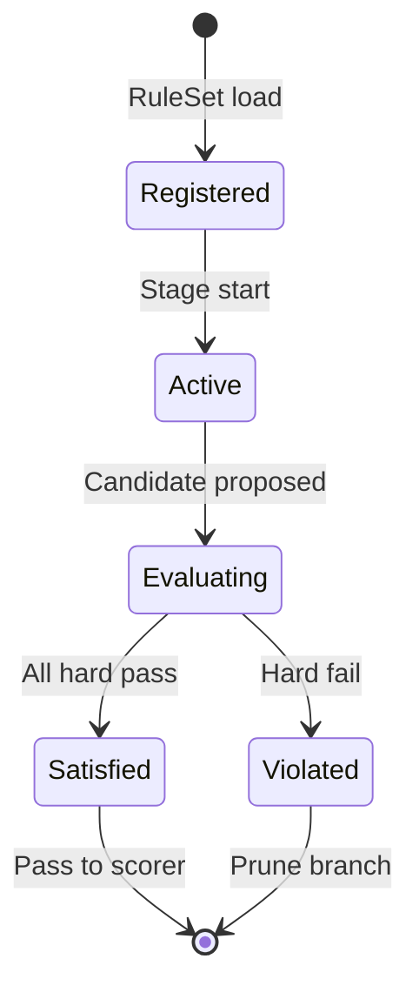

# Constraint System Specification

**Version:** 0.1  
**Status:** Draft  
**Agent:** Rule Engine Research Agent  
**Dependencies:** [rule-dsl.md](rule-dsl.md), `docs/00-overview/philosophy.md`, `docs/01-architecture/architecture.md`, `research/rule-engine-research-notes.md`

---

## Table of Contents

1. [Background](#1-background)
2. [Existing Solutions](#2-existing-solutions)
3. [Academic / Theoretical Foundation](#3-academic--theoretical-foundation)
4. [Engineering Analysis](#4-engineering-analysis)
5. [Comparison of Approaches](#5-comparison-of-approaches)
6. [Recommended Solution](#6-recommended-solution)
7. [Architecture](#7-architecture)
8. [Data Structures](#8-data-structures)
9. [Algorithms](#9-algorithms)
10. [Interfaces](#10-interfaces)
11. [Parameter Mappings](#11-parameter-mappings)
12. [Explainability Model](#12-explainability-model)
13. [Future Expansion](#13-future-expansion)
14. [Open Questions](#14-open-questions)
15. [References](#15-references)

---

## 1. Background

### 1.1 Purpose

The **Constraint System** is Aurora Composer's subsystem for enforcing music-theoretic predicates on candidate AST states during generation. It sits between the Rule Engine (which evaluates individual rules) and the Search Engine (which explores candidates).

Constraints answer: *Is this candidate musically admissible, and if not, can we prune early?*

### 1.2 Hard vs Soft Distinction

| Type | Source | On Violation | Search Effect |
|------|--------|--------------|---------------|
| **Hard constraint** | Rule DSL `mode: hard` / `constraint` | Reject candidate immediately | **Prune** — branch not expanded |
| **Soft constraint** | Rule DSL `mode: soft` | Apply penalty to `eval_score` | **Continue** — scored, not pruned |

Per **Principle 6 (Music Theory First):**

```text
Priority 1: Hard constraints (theory prohibitions)
Priority 2: Soft scoring (theory preferences)
Priority 3: ML augmentation (optional, never overrides hard without opt-in)
```

### 1.3 Relationship to Rule DSL

Every constraint is a **rule** with `mode: hard`. The Constraint System provides:

- Efficient batch evaluation
- Domain propagation (narrowing candidate pitch sets)
- Integration with AST node lifecycle
- Unsatisfiability reporting

Soft rules are evaluated by the **Scoring Engine** ([scoring.md](scoring.md)), not the Constraint Solver — though both share the Rule Evaluator infrastructure.

---

## 2. Existing Solutions

### 2.1 Strasheela / OpenMusic CP

Full constraint propagation over finite domains. Variables represent pitches and durations; constraints arc-consistent reduce domains before search. **Lesson:** propagation is powerful for voice-leading but expensive globally.

### 2.2 Pure Backtracking (Score-PMC)

Prolog-style generate-and-test without propagation. Simple but exponential. **Lesson:** Aurora needs at least local propagation for register and parallel-fifth detection.

### 2.3 SMT (Z3, etc.)

Encode constraints as logical formulas; solver finds satisfying assignment or proves UNSAT. **Lesson:** excellent for post-hoc validation; too slow for incremental melody search.

### 2.4 Weighted CSP (WCSP)

Soft constraints as cost functions — equivalent to Aurora's scoring model. **Lesson:** Aurora separates hard pruning from soft scoring explicitly rather than unified cost.

See [research/rule-engine-research-notes.md](../../research/rule-engine-research-notes.md) §5.

---

## 3. Academic / Theoretical Foundation

### 3.1 Constraint Classification in Music

| Class | Music Example | Aurora Handling |
|-------|---------------|-----------------|
| **Unary** | Pitch in scale | Domain filter on candidate generator |
| **Binary** | Interval between consecutive notes | Event-pair constraint |
| **Global** | No parallel fifths in phrase | Voice-pair-consecutive constraint |
| **Structural** | Cadence at phrase boundary | Measure-pair / phrase scope |
| **Conditional** | Leading tone resolution when in strict mode | `when` clause guards |

### 3.2 Constraint Satisfaction Problem (CSP) Formulation

For a pipeline stage with search:

```text
Variables:     X = { x_1, ..., x_n }  (candidate decisions: next pitch, duration, voicing)
Domains:       D_i = feasible values for x_i (from Theory Engine + parameters)
Constraints:   C = { c_1, ..., c_m }  (hard rules compiled to predicates)
Solution:      Assignment a: X → ⋃D_i such that ∀c ∈ C: c(a) = true
```

Aurora solves **sequential CSPs** — variables assigned one search step at a time (next note, next voicing), not all-at-once global CSP.

### 3.3 Reified Soft Constraints

In WCSP literature, soft constraints are *reified* as cost variables. Aurora's equivalent:

```text
violation_j ∈ {0, 1}
penalty_j = w_j × violation_j
eval_score = Σ rewards − Σ penalty_j
```

Hard constraints are not reified — they eliminate assignments.

---

## 4. Engineering Analysis

### 4.1 Evaluation Points

Constraints apply at three integration points:

| Point | When | Purpose |
|-------|------|---------|
| **Candidate generation** | Before rule eval | Domain filtering (don't generate illegal pitches) |
| **Search expansion** | After partial AST mutation | Hard prune before scoring |
| **Validation stage** | After pipeline complete | Final hard check before export |
| **Repair stage** | Post-generation | Detect soft→hard escalation fixes |

### 4.2 AST Integration Model

Constraints operate on **AST snapshots** (copy-on-write during search):

```text
AstSnapshot
├── composition_ref
├── focus_path: Path         // where candidate attaches
├── window: ContextWindow    // local neighborhood for cross-voice rules
└── frozen_prefix: AstRef    // immutable committed material
```

**Principle 1:** Constraints never mutate committed AST; they approve or reject **candidate patches**.

### 4.3 Constraint Propagation Scope

Full arc consistency (AC-3) on entire score is **not feasible** for interactive generation. Aurora implements **local propagation**:

| Propagator | Scope | Effect |
|------------|-------|--------|
| Register propagator | Per voice | Filter pitch domain |
| Scale propagator | Per key/mode | Filter chromatic pitches |
| Parallel motion detector | Voice pair at step | Block specific (v1,p1,v2,p2) combos |
| Rhythmic grid | Measure | Filter invalid onset positions |
| Voice spacing | Chord voicing | Filter assignments with spacing < min |

---

## 5. Comparison of Approaches

### 5.1 Pure Constraint Programming

**Approach:** All rules hard; search = CSP solver.

| Pros | Cons |
|------|------|
| Guaranteed satisfaction | No graceful "best effort" |
| Clean theory | Parameter "preferences" awkward |
| | UNSAT common in tight registers |

**Verdict:** Rejected as sole paradigm. Used for hard subset only.

### 5.2 Weighted Scoring Only

**Approach:** All rules soft; never prune.

| Pros | Cons |
|------|------|
| Always returns result | Parallel fifths may appear at low strictness |
| Simple | Violates Principle 6 priority |

**Verdict:** Rejected. Soft-only mode available as **user opt-in** (`counterpoint.strictness: 0`) for experimental styles.

### 5.3 SMT Solvers

**Approach:** Encode to Z3; `check-sat`.

| Pros | Cons |
|------|------|
| Proof of correctness | Encoding cost |
| Good for validation | Unpredictable latency |

**Verdict:** Optional validation plugin. Not search-time solver.

### 5.4 Aurora Hybrid (Recommended)

```text
Local propagation (domains)
    + Hard constraint prune (search)
    + Soft scoring (rank survivors)
    + Optional SMT validation (export gate)
```

---

## 6. Recommended Solution

### 6.1 Constraint Solver Responsibilities

1. **Load** hard rules from active RuleSet
2. **Register** propagators with candidate generators
3. **Evaluate** hard constraints on candidate AST patches
4. **Report** rejection with rule ID and reason
5. **Track** constraint statistics for diagnostics

### 6.2 Constraint Lifecycle



### 6.3 Hard Constraint Categories (Default Core Set)

| ID | Constraint | Scope |
|----|------------|-------|
| REG-001 | Melody register | event |
| REG-002 | Bass register | event |
| CONT-001 | No parallel P5 (strict) | voice_pair_consecutive |
| CONT-002 | No parallel P8 (strict) | voice_pair_consecutive |
| HARM-050 | Chord must be diatonic (simple mode) | measure |
| RHYT-010 | Onset on grid subdivision | event |
| DRUM-001 | Drum hits on grid | event |

Soft variants exist for each where parameters allow (see [rule-dsl.md](rule-dsl.md) Appendix B).

---

## 7. Architecture

### 7.1 Component Diagram

```text
┌─────────────────────────────────────────────────────────┐
│                   Pipeline Stage                         │
│  CandidateGenerator ──► ConstraintSolver ──► Scorer       │
│         ▲                      │                         │
│         │                      ▼                         │
│    Propagators            RuleEvaluator                  │
│    (domain filters)       (hard rules only)              │
└─────────────────────────────────────────────────────────┘
         │                              │
         ▼                              ▼
   Theory Engine                   Search Engine
```

### 7.2 Layer Boundaries (Architecture §2)

| Layer | Constraint Access |
|-------|-------------------|
| L3 Pipeline | Invokes solver per candidate |
| L2 Rule/Search | Owns solver; read-only AST |
| L1 Music Model | AST structure; no constraint logic |

### 7.3 Interaction with Search

```text
for state in beam:
    candidates = generate(state)           // propagation applied here
    for cand in candidates:
        if !constraint_solver.check(cand):  // hard prune
            log_rejection(cand)
            continue
        score = scorer.evaluate(cand)       // soft rules
        next_beam.push(cand, score)
    beam = top_k(next_beam)
```

---

## 8. Data Structures

### 8.1 Constraint Registry

```rust
struct ConstraintRegistry {
    hard_rules: Vec<CompiledRule>,
    propagators: Vec<Box<dyn Propagator>>,
    stage_mask: StageBitset,
}

struct ConstraintViolation {
    rule_id: RuleId,
    reason: String,
    evidence: Vec<Evidence>,
    focus: AstPath,
}
```

### 8.2 Propagator Interface

```rust
trait Propagator {
    fn name(&self) -> &str;
    fn scope(&self) -> PropagatorScope;
    fn filter_domain(&self, ctx: &GenContext, domain: &mut PitchDomain) -> PropagationResult;
}

enum PropagationResult {
    Unchanged,
    Reduced { removed: Vec<Pitch> },
    Empty,  // UNSAT — generator should not proceed
}
```

### 8.3 Context Window

Cross-voice constraints need temporal context:

```text
ContextWindow
├── time_range: [t_prev, t_curr]
├── voices: VoiceSnapshot[]
├── chords: ChordTimeline slice
└── prev_events: EventRef[] per voice
```

Window size parameterized:

| Parameter | Default | Effect |
|-----------|---------|--------|
| `search.context_beats` | 2.0 | Lookback for voice-leading |
| `search.context_measures` | 1 | Harmonic rhythm context |

### 8.4 Candidate Patch

```text
CandidatePatch
├── attach_path: AstPath
├── nodes_to_add: Event[]
├── nodes_to_modify: (EventRef, FieldDelta)[]
├── derived_state: SearchStateMeta
└── provisional: true
```

Constraint solver evaluates `AstSnapshot.apply(patch)` without committing.

---

## 9. Algorithms

### 9.1 Hard Constraint Evaluation

```text
function check_hard_constraints(snapshot, patch, registry):
    trial = snapshot.apply(patch)

    for rule in registry.hard_rules ordered by scope_narrowest:
        if !rule.stage_matches(current_stage): continue
        if rule.when && !eval(rule.when, trial): continue

        if !eval(rule.check, trial):
            return Violation(rule.id, interpolate(rule.on_fail.reason))

    return Satisfied
```

**Short-circuit:** First violation returns immediately (production). Debug mode collects all violations.

### 9.2 Constraint Propagation

#### 9.2.1 Register Propagation

```text
function propagate_register(voice, params):
    domain = all_pitches()
    domain = domain.filter(p => p >= params.register.min && p <= params.register.max)
    return domain
```

Applied at candidate generation — never generates out-of-range pitches.

#### 9.2.2 Scale Propagation

```text
function propagate_scale(key, mode, tolerance):
    diatonic = scale_pitches(key, mode)
    if tolerance == 0:
        return diatonic
    else:
        return diatonic ∪ borrowed_pitches(tolerance)
```

#### 9.2.3 Parallel Motion Blocking

For voice pair (v1, v2) at step t with previous intervals I_prev:

```text
function blocked_pairs(v1_prev, v2_prev, v1_domain, v2_domain):
    blocked = []
    for p1 in v1_domain:
        for p2 in v2_domain:
            if parallel_perfect(v1_prev, p1, v2_prev, p2):
                blocked.append((p1, p2))
    return blocked
```

Generator excludes blocked combinations before constraint re-check.

#### 9.2.4 Rhythmic Grid Propagation

```text
function valid_onsets(measure, subdivision_param):
    grid = measure.duration / subdivision_param
    return { i * grid | i in 0..measure.beats }
```

### 9.3 Pruning Strategies

| Strategy | Description | When Used |
|----------|-------------|-----------|
| **Early reject** | Hard fail → skip scoring | Always |
| **Domain wipe** | Empty propagated domain → skip generator call | Always |
| **Bounding** | Partial score + upper bound < beam min → prune | Optional (A* mode) |
| **Duplicate state** | Hash AST window → skip redundant | Beam search |
| **Constraint caching** | Memoize (window_hash, patch_hash) → result | High rule count |
| **Lazy evaluation** | Cheap constraints first (register before global) | Always (rule order) |

### 9.3.1 Constraint Ordering Heuristic

```text
sort hard_rules by:
  1. propagator-integrated first (already filtered at gen)
  2. scope narrowest (event < voice_pair < phrase < score)
  3. declared cost (low < medium < high)
  4. historical fail rate descending (adaptive, optional)
```

### 9.4 Unsatisfiability Handling

When beam empties after pruning:

```text
1. Log unsat report: conflicting constraint IDs + parameters
2. Attempt relaxation ladder:
   a. Widen beam (search.beam_width × 1.5)
   b. Switch soft variants for lowest-priority hard rules (if user allows)
   c. Relax register by 1 semitone (if register was binding)
   d. Abort stage with user-visible error
```

Relaxation requires explicit `search.auto_relax: bool` parameter (default: false for strict mode).

### 9.5 Integration with AST Nodes

#### 9.5.1 Event Attachment

When melody engine proposes `Note` at path `Measure[3].Voice[0]`:

1. Build `CandidatePatch` with new Note node (provisional)
2. Constraint solver receives `focus = Event(new_note)`
3. Unary constraints (register, scale, grid) evaluate on focus
4. Binary constraints compare focus to `prev_event(voice)` 
5. Global constraints scan `ContextWindow` for voice pairs

#### 9.5.2 Chord Voicing

Harmony engine assigns chord tones to voices:

```text
Variables: assignment[voice_i] → pitch from chord_tone_set
Constraints:
  - REG-* per voice
  - VLED spacing (min semitones between adjacent voices)
  - CONT hidden fifths (hard in strict mode)
Propagation: forward checking with MRV heuristic on tightest voice
```

#### 9.5.3 Provenance on Rejection

Rejections are **not** attached to AST events (event never committed). Logged in search trace:

```text
SearchTraceEntry
├── step: 14
├── parent_state: s-8f3a
├── rejection: { rule: CONT-001, reason: "Parallel fifth..." }
└── candidate_hash: ...
```

Available in debug UI "Why was this note not chosen?"

---

## 10. Interfaces

### 10.1 Constraint Solver API

```rust
trait ConstraintSolver {
    fn load_ruleset(&mut self, registry: &ConstraintRegistry);

    /// Returns Ok(()) or first violation
    fn check(&self, snapshot: &AstSnapshot, patch: &CandidatePatch)
        -> Result<(), ConstraintViolation>;

    /// Batch check for parallel evaluation
    fn check_batch(&self, snapshot: &AstSnapshot, patches: &[CandidatePatch])
        -> Vec<Result<(), ConstraintViolation>>;

    fn register_propagator(&mut self, p: Box<dyn Propagator>);

    fn unsat_report(&self) -> UnsatReport;
}
```

### 10.2 Candidate Generator Integration

```rust
trait CandidateGenerator {
    fn generate(&self, state: &SearchState, domains: &DomainStore) -> Vec<CandidatePatch>;
}

struct DomainStore {
    pitch_domains: HashMap<VoiceId, PitchDomain>,
    onset_domain: OnsetSet,
}
```

Generators **must** consult `DomainStore` updated by propagators before enumeration.

### 10.3 Validation Stage Interface

```rust
trait CompositionValidator {
    fn validate_hard(&self, composition: &Composition) -> ValidationReport;
}
```

Re-runs all hard constraints on final AST — catches stage boundary gaps.

---

## 11. Parameter Mappings

### 11.1 Strictness → Hard Rule Activation

| Parameter | Threshold | Effect |
|-----------|-----------|--------|
| `counterpoint.strictness` | ≥ 0.8 | CONT-001, CONT-002 hard |
| `counterpoint.strictness` | 0.4–0.8 | Soft variants only |
| `harmony.complexity` | ≤ 0.2 | HARM-050 hard (diatonic only) |
| `harmony.dissonance_tolerance` | 0 | Non-chord tones hard-blocked on strong beats |
| `register.*` | always | REG-* hard unless `register.enforcement: soft` |

### 11.2 Propagation Parameters

| Parameter | Default | Maps To |
|-----------|---------|---------|
| `melody.leap_limit_semitones` | 7 | Leap propagator max interval |
| `scale.borrowed_chord_tolerance` | 0.2 | Scale propagator chromatic allowance |
| `rhythm.subdivision` | 16 | Grid propagator resolution |
| `voice.min_spacing_semitones` | 3 | Voicing spacing constraint |
| `search.context_beats` | 2.0 | Context window size |

### 11.3 Search Relaxation Parameters

| Parameter | Default | Description |
|-----------|---------|-------------|
| `search.auto_relax` | false | Enable relaxation ladder |
| `search.max_relax_steps` | 3 | Cap relaxation attempts |
| `search.relax_register_semitones` | 1 | Max register expansion |

---

## 12. Explainability Model

### 12.1 Violation Records

Hard violations produce structured records for debug:

```json
{
  "rule_id": "CONT-001",
  "reason": "Parallel perfect fifth between soprano and alto",
  "evidence": [
    { "voice": "soprano", "prev": "G4", "curr": "A4" },
    { "voice": "alto", "prev": "C4", "curr": "D4" }
  ],
  "parameter_context": { "counterpoint.strictness": 0.85 }
}
```

### 12.2 Inspector: Rejected Alternatives

When user enables "Show search alternatives" in UI:

- Display top-N rejected candidates per step
- Group rejections by constraint ID
- Histogram of binding constraints

### 12.3 Validation Report

Post-generation validation attaches to Composition metadata:

```text
ValidationReport
├── passed: bool
├── violations: ConstraintViolation[]
└── repaired: RepairAction[]  // if Repair stage ran
```

---

## 13. Future Expansion

| Feature | Description |
|---------|-------------|
| Adaptive constraint ordering | Reorder by measured prune rate |
| Incremental SAT | Add clauses as composition grows |
| Z3 validation plugin | Export-time proof mode |
| Constraint learning | Analyze corpus → suggest new hard rules |
| Multi-threaded check_batch | Parallel hard eval on Rayon |

---

## 14. Open Questions

1. Should `register.enforcement: soft` be a supported user parameter?
2. Cross-stage constraint visibility — counterpoint checking melody decisions made 2 stages earlier?
3. Maximum context window size vs memory for long compositions?
4. Cache invalidation strategy when parameters change mid-regeneration?

---

## 15. References

- [Rule DSL Specification](rule-dsl.md)
- [Scoring Specification](scoring.md)
- `docs/00-overview/philosophy.md` — Principles 1, 2, 6
- `docs/01-architecture/architecture.md` — Layer 2
- Anders, T. (2007). *Composing Music by Composing Rules.*
- Russell & Norvig. *AI: A Modern Approach* — CSP chapter
- `research/rule-engine-research-notes.md`

---

## Appendix A: Propagation vs Check Matrix

| Constraint | Propagation | Explicit Check | Rationale |
|------------|-------------|----------------|-----------|
| Register | ✓ | ✓ | Defense in depth |
| Scale | ✓ | optional | Gen filters most |
| Parallel P5/P8 | partial block | ✓ | Cross-product blocking expensive |
| Rhythmic grid | ✓ | ✓ | |
| Phrase cadence | ✗ | ✓ | Global, not local domain |
| Motif match | ✗ | soft only | Scoring not constraint |

---

## Appendix B: UNSAT Report Example

```text
Stage: Counterpoint (measure 12)
Beam exhausted after 3 relaxation attempts

Binding constraints:
  REG-001 (melody): 34% of candidates rejected
  CONT-001: 61% of candidates rejected  ← primary binder

Suggested actions:
  - Reduce counterpoint.strictness to 0.7
  - Widen register.melody_min/max by 2 semitones
  - Increase search.beam_width from 16 to 32
```

---

*End of Constraint System Specification v0.1*
