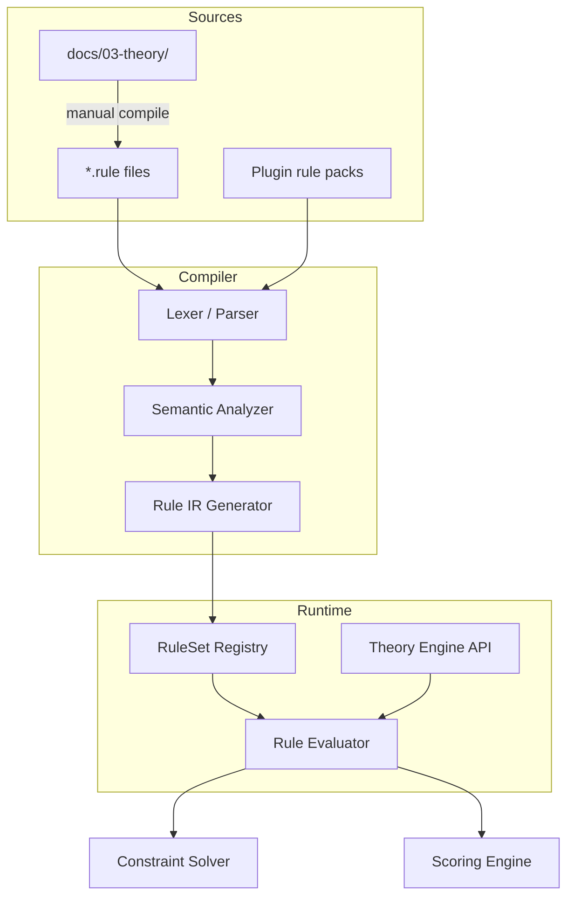

# Rule DSL Specification

**Version:** 0.1  
**Status:** Draft  
**Agent:** Rule Engine Research Agent  
**Dependencies:** `docs/00-overview/philosophy.md`, `docs/00-overview/terminology.md`, `docs/00-overview/acas-v0.1.md`, `docs/01-architecture/architecture.md`, `docs/03-theory/*` (partial), `research/rule-engine-research-notes.md`

---

## Table of Contents

1. [Background](#1-background)
2. [Existing Solutions](#2-existing-solutions)
3. [Academic / Theoretical Foundation](#3-academic--theoretical-foundation)
4. [Engineering Analysis](#4-engineering-analysis)
5. [Comparison of Approaches](#5-comparison-of-approaches)
6. [Recommended Solution](#6-recommended-solution)
7. [Architecture](#7-architecture)
8. [Data Structures](#8-data-structures)
9. [Algorithms](#9-algorithms)
10. [Interfaces](#10-interfaces)
11. [Parameter Mappings](#11-parameter-mappings)
12. [Explainability Model](#12-explainability-model)
13. [Future Expansion](#13-future-expansion)
14. [Open Questions](#14-open-questions)
15. [References](#15-references)

**Appendices:** [A. Grammar](#appendix-a-formal-grammar-ebnf) · [B. Compilation](#appendix-b-theory-to-dsl-compilation) · [C. Examples](#appendix-c-complete-rule-examples)

---

## 1. Background

### 1.1 Purpose

The **Rule DSL** (Domain-Specific Language) is Aurora Composer's declarative language for defining music-theoretic rules that drive constraint checking and scoring. Every generative decision in the pipeline ultimately resolves to one or more rules evaluated against **Music AST** snapshots.

The Rule DSL serves three audiences:

| Audience | Use |
|----------|-----|
| **Core engine** | Compile rules to executable predicates + score functions |
| **Plugin authors** | Ship style-specific rule packs (`.rule` files) |
| **Researchers / educators** | Read, audit, and extend theory rules with provenance |

### 1.2 Position in Architecture

```text
docs/03-theory/          Human-readable theory catalog
        │
        ▼ compile
Rule DSL (.rule files)   Declarative rule definitions
        │
        ▼ compile
RuleSet (binary/IR)      Runtime artifact loaded by Rule Engine
        │
        ▼ evaluate
Constraint Solver + Scoring → Search Engine
```

Per **Principle 1 (Everything Is Music AST)**, rules never inspect MIDI or MusicXML directly. All predicates operate on typed AST paths and Theory Engine queries.

Per **Principle 2 (Everything Is Explainable)**, every rule definition must include a human-readable `reason` template populated at evaluation time.

### 1.3 Scope

**In scope:**

- Syntax and semantics of rule definitions
- Rule categories, IDs, metadata schema
- Compilation from theory documents and `.rule` sources
- Integration with constraint modes (hard/soft)
- Weight binding to user parameters

**Out of scope:**

- Search algorithms (see [scoring.md](scoring.md))
- Constraint propagation internals (see [constraint.md](constraint.md))
- Theory content itself (see `docs/03-theory/`)

### 1.4 Non-Goals

- Turing-complete general programming (no arbitrary loops in v0.1)
- Real-time performance rule editing during playback
- Natural-language rule input ("make it sadder")

---

## 2. Existing Solutions

### 2.1 OpenMusic / PW-Constraint

OpenMusic encodes constraints as visual patch nodes connected to variables. Rules are implicit in patch topology. **Limitation:** not serializable, not version-controllable, no per-event provenance.

### 2.2 Strasheela

Strasheela provides textual constraint definitions over score variables in Oz. Closest prior art to Aurora's goals. **Limitation:** tied to OpenMusic runtime; no parameter system; search strategy coupled to constraint language.

### 2.3 Music21 (Python)

Rules are imperative Python using analysis classes. **Limitation:** no declarative DSL; rules are code, not data; violates Principle 5 for plugin authors without Python expertise.

### 2.4 MiniZinc / Custom CP

Generic constraint languages can encode music rules but require verbose encodings and lack music-specific primitives. **Use case:** optional validation backend only.

### 2.5 Aurora Requirements Gap

No surveyed system combines: declarative rules + AST centrality + parameter mapping + provenance + plugin-pack delivery. The Rule DSL fills this gap.

See [research/rule-engine-research-notes.md](../../research/rule-engine-research-notes.md) for full survey.

---

## 3. Academic / Theoretical Foundation

### 3.1 Rule Types in Music Theory

| Theory Domain | Rule Nature | Typical Mode |
|---------------|-------------|--------------|
| Counterpoint | Prohibition (parallel P5/P8) | Hard (strict) / Soft (free) |
| Harmony | Preference (chord tone on strong beat) | Soft |
| Voice leading | Preference (common tone retention) | Soft |
| Rhythm | Constraint (downbeat alignment) | Hard / Soft |
| Form | Structural (cadence at phrase end) | Soft |
| Range | Boundary (register limits) | Hard |

### 3.2 Mapping Theory to Logic

Each theory rule decomposes into:

1. **Scope** — what AST subtree is evaluated (event, measure pair, voice pair)
2. **Antecedent** — when the rule applies (`when` clause)
3. **Predicate** — boolean condition on musical properties
4. **Consequent** — score delta or constraint violation (`then` / `else`)
5. **Metadata** — ID, category, citation, parameter bindings

Example from Fux (species counterpoint):

> *No two consecutive harmonic intervals between the same two voices may be perfect fifths or perfect octaves.*

DSL encoding (preview):

```rule
rule CONT-001 {
  id: "CONT-001"
  name: "No parallel perfect fifths"
  category: counterpoint
  mode: hard
  scope: voice_pair_consecutive
  when: voices(v1, v2) && both_moving(v1, v2)
  check: !parallel_perfect(v1, v2, prev, curr)
  on_fail: reject(reason: "Parallel perfect fifth between {v1} and {v2}")
}
```

### 3.3 Priority Hierarchy (Principle 6)

```text
Hard constraints (theory prohibitions)
    ↓ prune in search
Soft rules (theory preferences)
    ↓ contribute to eval_score
Statistical / ML plugins (optional)
    ↓ candidate proposal or weight nudge only
```

---

## 4. Engineering Analysis

### 4.1 Design Criteria

| Criterion | Target | DSL Feature |
|-----------|--------|-------------|
| Readability | Musician-readable with training | Named clauses, theory citations |
| Auditability | Diff-friendly text format | `.rule` files, stable IDs |
| Performance | < 1ms per candidate per rule (typical) | Compiled predicates, no interpretation |
| Safety | No side effects | Pure functional evaluation |
| Extensibility | Plugin rule packs | `import` / `package` directives |
| Testability | Unit test per rule | `fixture` blocks in rule files |

### 4.2 Evaluation Context

Rules evaluate within an **EvaluationContext**:

```text
EvaluationContext
├── ast_snapshot: AstSnapshot
├── focus: EventRef | VoiceRef | MeasureRef | PairRef
├── parameters: ParameterSnapshot
├── theory: TheoryQueryHandle
├── step: SearchStepMeta
└── accumulated: PartialScore
```

### 4.3 Performance Considerations

- Rules compiled once per RuleSet load; hot path is predicate dispatch
- Scope narrowing reduces evaluations: melody stage loads `category: melody | harmony` subset
- Rules with expensive predicates (cross-voice all-pairs) declare `cost: high` for scheduler hints

---

## 5. Comparison of Approaches

### 5.1 DSL Style Options

| Approach | Example | Pros | Cons | Decision |
|----------|---------|------|------|----------|
| **YAML/JSON config** | `{"id":"HARM-001",...}` | Easy parsing | Verbose conditions; weak expressivity | Rejected as primary |
| **Embedded Lisp** | `(rule 'HARM-001 ...)` | Powerful | Host language lock-in; not musician-friendly | Rejected |
| **Custom declarative** | `rule HARM-001 { ... }` | Music-specific; readable | Parser implementation cost | **Selected** |
| **Visual (OpenMusic)** | Patch nodes | Intuitive for some | Not text-diffable; no git workflow | Rejected |

### 5.2 Rule Execution Model

| Model | Description | Aurora Choice |
|-------|-------------|---------------|
| Interpreted AST | Parse `.rule` each evaluation | Too slow |
| Compiled bytecode | Rule → IR → VM | **Selected** |
| JIT to Rust | Rule → native code | Future optimization |

### 5.3 Weight Expression

| Style | Example | Decision |
|-------|---------|----------|
| Fixed constant | `weight: 10` | Allowed for unit tests only |
| Parameter ref | `weight: param(counterpoint.parallel_penalty)` | **Required for production rules** |
| Expression | `weight: param(x) * 1.5 + 2` | Allowed v0.1 |

---

## 6. Recommended Solution

### 6.1 Language Summary

Aurora Rule DSL (`.rule` files) uses a **block-oriented syntax**:

```rule
@version "0.1"
@package "core.classical"

import theory.harmony as harm
import theory.counterpoint as cont

rule HARM-001 {
  id: "HARM-001"
  name: "Chord tone on strong beat"
  category: harmony
  mode: soft
  weight: param(harmony.chord_tone_weight)
  scope: event
  stage: [melody, counterpoint, bass]
  citation: "Aldwell & Schachter, Ch. 4"

  when: event.type == Note
     && beat_strength(event) >= Strong
     && !is_rest(event)

  then: chord_tone(event, current_chord(event))
     => score(+weight, reason: "Chord tone {pitch} on strong beat")

  else: score(-weight * 0.5, reason: "Non-chord tone on strong beat")
}
```

### 6.2 Core Constructs

| Construct | Purpose |
|-----------|---------|
| `rule` | Single evaluable rule block |
| `constraint` | Shorthand for `mode: hard` rules |
| `bundle` | Named group activated by style preset |
| `import` | Include theory primitives or other packs |
| `param()` | Bind to user parameter |
| `scope` | Evaluation granularity |
| `when` | Guard (rule applies iff true) |
| `then` / `else` | Outcome branches |
| `check` | Hard constraint predicate (must hold) |
| `on_fail` | Hard constraint rejection handler |

### 6.3 Rule Categories and ID Scheme

**Format:** `{CATEGORY}-{NNN}` where NNN is zero-padded decimal.

| Prefix | Category | Description | Example IDs |
|--------|----------|-------------|-------------|
| `HARM` | Harmony | Chord tones, progressions, cadences | HARM-001–HARM-099 |
| `CONT` | Counterpoint | Parallel motion, species rules | CONT-001–CONT-049 |
| `VLED` | Voice leading | Common tone, stepwise preference | VLED-001–VLED-049 |
| `RHYT` | Rhythm | Metric placement, syncopation | RHYT-001–RHYT-049 |
| `FORM` | Form | Phrase boundaries, repetition | FORM-001–FORM-049 |
| `REG` | Register | Range limits | REG-001–REG-029 |
| `MOTI` | Motif / theme | Motif match, sequence | MOTI-001–MOTI-049 |
| `TEXT` | Texture | Voice density, spacing | TEXT-001–TEXT-029 |
| `DRUM` | Percussion | Drum grid, backbeat | DRUM-001–DRUM-029 |
| `JAZZ` | Jazz-specific | Extensions, voicing | JAZZ-001–JAZZ-099 |
| `ORCH` | Orchestration | Doubling, range by instrument | ORCH-001–ORCH-049 |
| `CUST` | Custom / plugin | Plugin-defined | CUST-{plugin}-{NNN} |

**Reserved:** IDs `TEST-*` for unit tests; `CORE-*` for engine meta-rules.

### 6.4 Metadata Schema

Every rule **must** declare:

| Field | Required | Type | Description |
|-------|----------|------|-------------|
| `id` | yes | string | Unique stable identifier |
| `name` | yes | string | Human display name |
| `category` | yes | enum | From category table |
| `mode` | yes | `hard` \| `soft` | Constraint vs scoring |
| `scope` | yes | enum | Evaluation granularity |
| `stage` | no | stage[] | Pipeline stages where active |
| `weight` | soft only | expr | Score magnitude binding |
| `penalty` | soft alt | expr | Violation magnitude (alias) |
| `citation` | recommended | string | Theory source |
| `version` | recommended | semver | Rule pack version |
| `deprecated` | no | bool | Superseded flag |
| `supersedes` | no | id | Previous rule ID |
| `cost` | no | `low`\|`medium`\|`high` | Eval cost hint |
| `tags` | no | string[] | Filter labels |

### 6.5 Scope Types

| Scope | Evaluates | AST Focus |
|-------|-----------|-----------|
| `event` | Single candidate event | `Event` node + local context |
| `event_pair` | Event and predecessor | Two consecutive events in voice |
| `measure` | All events in measure | `Measure` subtree |
| `measure_pair` | Two consecutive measures | Harmonic rhythm context |
| `phrase` | Phrase boundary | `Phrase` subtree |
| `voice` | Entire voice in scope window | `Voice` slice |
| `voice_pair` | Two voices at same time | Cross-voice interval |
| `voice_pair_consecutive` | Two voices across time step | Voice-leading window |
| `score` | Global | Full AST snapshot (expensive) |

### 6.6 Expression Language

Predicates use a **pure expression sub-language**:

```rule
// Types: bool, int, float, pitch, interval, duration, string
// Operators: &&, ||, !, ==, !=, <, <=, >, >=, +, -, in

when: pitch(event) in scale(current_key)
   && interval(prev(event), event) <= param(melody.leap_limit_semitones)
   && !hidden_fifth(voice, prev, event)
```

**Built-in functions** (non-exhaustive):

| Function | Returns | Description |
|----------|---------|-------------|
| `pitch(e)` | pitch | Event pitch |
| `chord_tone(e, c)` | bool | e is member of chord c |
| `beat_strength(e)` | enum | Strong / Medium / Weak |
| `current_chord(ctx)` | Chord | Harmony at focus time |
| `parallel_perfect(v1,v2,t1,t2)` | bool | Parallel P5/P8 detector |
| `common_tone(c1,c2,v)` | pitch? | Shared chord tone |
| `motif_match(e, motif_id)` | float | Similarity 0..1 |
| `in_register(p, min, max)` | bool | Range check |
| `cadence_type(measure)` | enum | Authentic, half, etc. |

Functions delegate to **Theory Engine** (`docs/03-theory/`) for pitch-class set logic, interval class, Roman numeral analysis.

### 6.7 Hard vs Soft in DSL

**Soft rule** — contributes to score:

```rule
rule VLED-003 {
  mode: soft
  weight: param(voice.stepwise_preference)
  when: prev_note(v) != null
  then: stepwise(prev_note(v), candidate)
     => score(+weight, reason: "Stepwise motion in {v}")
  else: score(0)
}
```

**Hard constraint** — prunes candidate:

```rule
constraint REG-001 {
  mode: hard
  scope: event
  check: in_register(pitch(event),
          param(register.melody_min),
          param(register.melody_max))
  on_fail: reject(reason: "Pitch {pitch} outside melody register")
}
```

`constraint` is syntactic sugar for `rule` with `mode: hard` and mandatory `check`/`on_fail`.

---

## 7. Architecture

### 7.1 Component Diagram



### 7.2 Compilation Pipeline

```text
1. Parse .rule → AST (RuleDef[])
2. Resolve imports and bundles
3. Validate IDs unique within RuleSet
4. Type-check expressions (bool contexts, pitch types)
5. Bind param() refs to ParameterRegistry schema
6. Lower to Rule IR (bytecode)
7. Emit RuleSet artifact + manifest.json
8. Register with Rule Engine at pipeline init
```

### 7.3 RuleSet Manifest

```json
{
  "name": "core.classical",
  "version": "0.1.0",
  "rules": 47,
  "constraints": 12,
  "categories": ["harmony", "counterpoint", "voice_leading"],
  "parameters_consumed": [
    "counterpoint.strictness",
    "counterpoint.parallel_penalty",
    "harmony.chord_tone_weight"
  ],
  "checksum": "sha256:..."
}
```

### 7.4 Stage-Filtered Loading

Pipeline stages request **active rule subsets**:

| Stage | Default Categories | Hard Constraints |
|-------|-------------------|------------------|
| Harmony Skeleton | HARM, FORM | HARM progression rules |
| Melody | HARM, VLED, MOTI, REG | REG range |
| Counterpoint | CONT, VLED, HARM | CONT (if strict) |
| Bass | HARM, VLED, REG | REG |
| Drums | DRUM, RHYT | DRUM grid |
| Validation | ALL | ALL hard |

---

## 8. Data Structures

### 8.1 Rule Definition (Compile-Time AST)

```rust
// Illustrative schema — specification only, not production code

struct RuleDef {
    id: RuleId,
    name: String,
    category: Category,
    mode: RuleMode,           // Hard | Soft
    scope: Scope,
    stages: Vec<PipelineStage>,
    metadata: RuleMetadata,
    when: Option<Expr>,
    then_branch: Option<Outcome>,
    else_branch: Option<Outcome>,
    check: Option<Expr>,      // hard only
    on_fail: Option<RejectSpec>,
    weight: Option<Expr>,
}

struct RuleMetadata {
    citation: Option<String>,
    version: Option<SemVer>,
    tags: Vec<String>,
    cost: EvalCost,
}
```

### 8.2 Rule IR (Runtime)

```text
RuleIR
├── header (id, mode, scope, stage_mask)
├── weight_fn: ParamSlot | Const
├── guard: bytecode[]
├── body: bytecode[]
└── reason_template: string_id
```

### 8.3 Evaluation Result

```text
RuleEvalResult
├── rule_id: RuleId
├── applied: bool
├── outcome: Satisfied | Violated | Rejected
├── score_delta: f64          // soft only
├── reason: string            // interpolated
└── evidence: Evidence[]     // pitch refs, voice ids
```

### 8.4 Bundle Activation

```rule
bundle classical_strict {
  activate: [
    "core.classical/*",
    "-JAZZ-*"
  ]
  parameter_overrides: {
    counterpoint.strictness: 0.9
  }
}
```

Style Resolver maps genre preset → bundle name.

---

## 9. Algorithms

### 9.1 Rule Evaluation Algorithm

```text
function evaluate_rules(context, rule_subset):
    results = []
    for rule in rule_subset ordered by (mode desc, cost asc):
        if not stage_matches(rule, context.stage): continue
        if rule.when && !eval(rule.when, context): continue

        focus = resolve_scope(rule.scope, context)

        if rule.mode == Hard:
            if !eval(rule.check, focus, context):
                return Reject(rule.on_fail.reason, rule.id)
        else:
            delta, reason = eval_branches(rule.then, rule.else, focus, context)
            results.append(RuleEvalResult(rule.id, delta, reason))

    return Aggregate(results)
```

Hard constraint failure **short-circuits** — no further soft rules evaluated for that candidate (optimization: optional continue for provenance collection in debug mode).

### 9.2 Expression Evaluation

- Stack-based bytecode interpreter (v0.1)
- Constant folding at compile time where `param()` absent
- Pitch operations delegate to Theory Engine (cached scale sets per key)

### 9.3 Rule Ordering

Default order within a RuleSet:

1. All `mode: hard` by scope (narrowest first — event before score)
2. All `mode: soft` by category priority: REG → CONT → HARM → VLED → RHYT → MOTI → FORM

Plugins may insert `priority: N` override.

### 9.4 Compilation from Theory Documents

See [Appendix B](#appendix-b-theory-to-dsl-compilation).

---

## 10. Interfaces

### 10.1 Rule Compiler API

```rust
trait RuleCompiler {
    fn compile(source: &str, path: &Path) -> Result<RuleSet, CompileError>;
    fn compile_file(path: &Path) -> Result<RuleSet, CompileError>;
    fn validate_manifest(manifest: &RuleSetManifest) -> Result<(), ValidationError>;
}
```

### 10.2 Rule Evaluator API

```rust
trait RuleEvaluator {
    fn evaluate_candidate(
        &self,
        ctx: &EvaluationContext,
        subset: RuleSubset,
    ) -> EvaluationResult;

    fn evaluate_hard_only(&self, ctx: &EvaluationContext) -> Result<(), Rejection>;

    fn explain(&self, event_ref: EventRef) -> Vec<RuleEvalResult>;
}
```

### 10.3 Plugin Interface

```rust
trait RulePackPlugin {
    fn rule_pack_paths(&self) -> Vec<PathBuf>;
    fn bundle_name(&self) -> &str;
    fn parameter_extensions(&self) -> Vec<ParameterDef>;
}
```

### 10.4 IPC (Inspector)

Frontend requests provenance by event ID; Tauri returns serialized `RuleEvalResult[]` with reason strings.

---

## 11. Parameter Mappings

All production rules **must** bind magnitudes to parameters. Fixed weights forbidden except `TEST-*`.

### 11.1 Core Parameter → Rule Weight Table

| Parameter | Default | Range | Rules Affected |
|-----------|---------|-------|----------------|
| `counterpoint.strictness` | 0.5 | 0..1 | CONT-* mode flip threshold |
| `counterpoint.parallel_penalty` | 50 | 0..100 | CONT-001..010 soft weight |
| `harmony.chord_tone_weight` | 15 | 0..50 | HARM-001, HARM-002 |
| `harmony.dissonance_tolerance` | 0.3 | 0..1 | HARM-010..020 penalty scale |
| `melody.leap_limit_semitones` | 7 | 1..12 | REG-010 hard threshold |
| `melody.ornament_density` | 0.2 | 0..1 | MOTI-005 weight |
| `voice.stepwise_preference` | 10 | 0..30 | VLED-003 |
| `rhythm.syncopation` | 0.3 | 0..1 | RHYT-005 reward scale |
| `form.repetition_ratio` | 0.6 | 0..1 | FORM-003, MOTI-001 |
| `register.melody_min` | 60 | 21..127 | REG-001 (MIDI) |
| `register.melody_max` | 84 | 21..127 | REG-001 |

### 11.2 Strictness → Hard/Soft Mode Mapping

```text
counterpoint.strictness >= 0.8  → CONT-001..005 mode: hard
counterpoint.strictness 0.4..0.8 → mode: soft, weight scaled
counterpoint.strictness < 0.4   → CONT-001..003 disabled via bundle
```

Implemented via **bundle variants**, not runtime rule mutation.

### 11.3 Emotion Resolver Deltas

Emotion stage applies deltas to base weights (see emotion-engine spec):

```text
effective_weight = base_weight * (1 + emotion_delta[rule.category])
```

Rule DSL references base parameters only; deltas applied in EvaluationContext construction.

---

## 12. Explainability Model

### 12.1 Provenance Chain (Principle 2)

Every scored event records:

```text
Event.provenance
├── reason: "Stepwise motion in melody"
├── rule_id: "VLED-003"
├── score_delta: +10.0
├── eval_score_running: 142.5
└── search
    ├── step_index: 14
    ├── beam_rank: 2
    └── parent_state_id: "s-8f3a..."
```

### 12.2 Reason Templates

DSL `reason` strings support interpolation:

```rule
then: ... => score(+weight, reason: "Chord tone {pitch_name} on beat {beat}")
```

Compiler validates placeholder names against scope-available bindings.

### 12.3 Inspector Display

UI groups by category:

```text
Melody note G4 @ beat 1.0  (+23.5 total)
  ✓ HARM-001  Chord tone G on strong beat     +15.0
  ✓ VLED-003  Stepwise motion in melody       +10.0
  ✗ RHYT-002  Weak-beat accent preference     -1.5
```

Hard rejections surface in search log, not on committed events.

### 12.4 Debug Mode

When `search.debug_provenance: true`, collect **all** rule evaluations including non-applicable (when=false) for diagnosis.

---

## 13. Future Expansion

| Feature | Version | Description |
|---------|---------|-------------|
| Temporal operators | v0.2 | `eventually`, `until` over measure sequence |
| Rule learning | plugin | AI plugin proposes weight adjustments |
| Native JIT | v0.3 | Compile hot Rule IR to Rust |
| SMT export | plugin | Hard rules → Z3 for validation |
| Visual rule editor | UI v2 | Edit `.rule` with form-based UI |
| LSP for Rule DSL | tooling | Autocomplete theory functions |

---

## 14. Open Questions

1. **Import syntax:** `@import` vs `import` — finalize in parser spec?
2. **Rule hot-reload:** Reload plugin rules without restarting job?
3. **Cross-stage rules:** Rules spanning melody + counterpoint — single evaluation or split?
4. **Conflict resolution:** Two soft rules contradict — last-wins or explicit priority only?
5. **Internationalization:** Reason strings — English only v0.1?

---

## 15. References

- Aurora Composer Design Philosophy: `docs/00-overview/philosophy.md`
- ACAS v0.1 §7: `docs/00-overview/acas-v0.1.md`
- Constraint Specification: [constraint.md](constraint.md)
- Scoring Specification: [scoring.md](scoring.md)
- Research Notes: `research/rule-engine-research-notes.md`
- Anders, T. (2007). *Composing Music by Composing Rules.*
- Aldwell & Schachter. *Harmony and Voice Leading.*
- Fux, J. J. *Gradus ad Parnassum.*

---

## Appendix A: Formal Grammar (EBNF)

```ebnf
file           = { directive | import | bundle | rule | constraint } ;
directive      = "@version" string | "@package" string ;
import         = "import" module_path [ "as" ident ] ";" ;
bundle         = "bundle" ident "{" bundle_body "}" ;
rule           = "rule" rule_id "{" rule_body "}" ;
constraint     = "constraint" rule_id "{" constraint_body "}" ;

rule_id        = ident | string ;
rule_body      = { metadata_field | when_clause | then_clause
                 | else_clause | check_clause | on_fail_clause } ;
metadata_field = ident ":" value ";" ;

when_clause    = "when:" expr ;
then_clause    = "then:" expr "=>" outcome ;
else_clause    = "else:" outcome ;
check_clause   = "check:" expr ;
on_fail_clause = "on_fail:" reject_spec ;

outcome        = "score" "(" signed_expr "," "reason:" string ")"
               | "score" "(" signed_expr ")" ;
reject_spec    = "reject" "(" "reason:" string ")" ;

expr           = or_expr ;
or_expr        = and_expr { "||" and_expr } ;
and_expr       = compare { "&&" compare } ;
compare        = additive [ comp_op additive ] ;
comp_op        = "==" | "!=" | "<" | "<=" | ">" | ">=" | "in" ;
additive       = mult { ("+" | "-") mult } ;
mult           = unary { ("*" | "/") unary } ;
unary          = ("!" | "-") unary | primary ;
primary        = literal | ident | call | "(" expr ")" ;
call           = ident "(" [ arg_list ] ")" ;

value          = string | number | bool | ident | array | object ;
signed_expr    = [ "+" | "-" ] expr ;
```

---

## Appendix B: Theory-to-DSL Compilation

Theory documents in `docs/03-theory/` follow a **Theory Rule Record** template:

```markdown
### CONT-001: No Parallel Perfect Fifths
- **Mode:** hard (strict) / soft (free)
- **Scope:** voice_pair_consecutive
- **Predicate:** ...
- **Citation:** Fux, Species I
```

Compilation workflow:

```text
Theory Agent writes docs/03-theory/counterpoint.md
        │
        ▼ (Architecture Agent review)
Rule Engine Agent extracts Theory Rule Records
        │
        ▼
Generate docs/05-rule-engine/rules/core/cont-*.rule
        │
        ▼
Rule Compiler → RuleSet
        │
        ▼
Golden tests against Bach chorale fixtures
```

### B.1 Extraction Mapping

| Theory Field | DSL Field |
|--------------|-----------|
| Rule ID | `id` |
| Title | `name` |
| Category | `category` |
| Mode | `mode` |
| Scope | `scope` |
| Predicate (pseudo) | `when` + `check` / `then` |
| Citation | `citation` |
| Parameter notes | `weight: param(...)` |

### B.2 Harmony Example (from theory doc)

Theory (`docs/03-theory/harmony.md` — pending):

> **HARM-015:** Prefer resolution of leading tone by semitone upward to tonic.

Generated DSL:

```rule
rule HARM-015 {
  id: "HARM-015"
  name: "Leading tone resolves up to tonic"
  category: harmony
  mode: soft
  weight: param(harmony.cadence_strength) * 0.8
  scope: event_pair
  stage: [melody, counterpoint]
  citation: "Kostka & Payne, Tonal Harmony"

  when: degree(prev) == 7
     && degree(candidate) == 1
     && same_key(prev, candidate)

  then: semitone_up(prev, candidate)
     => score(+weight, reason: "Leading tone {prev} resolves to {candidate}")

  else: score(-weight * 0.3, reason: "Leading tone unresolved")
}
```

### B.3 Counterpoint Example

```rule
constraint CONT-001 {
  id: "CONT-001"
  name: "No parallel perfect fifths"
  category: counterpoint
  mode: hard
  scope: voice_pair_consecutive
  stage: [counterpoint]
  citation: "Fux, Gradus ad Parnassum"

  when: voices(v1, v2)
     && both_moving(v1, v2)
     && param(counterpoint.strictness) >= 0.8

  check: !parallel_perfect(v1, v2, prev_slice, curr_slice)

  on_fail: reject(reason: "Parallel perfect fifth between {v1} and {v2}")
}

rule CONT-001-soft {
  id: "CONT-001-soft"
  name: "Parallel perfect fifth penalty"
  category: counterpoint
  mode: soft
  weight: param(counterpoint.parallel_penalty)
  scope: voice_pair_consecutive
  stage: [counterpoint]

  when: voices(v1, v2)
     && param(counterpoint.strictness) < 0.8
     && parallel_perfect(v1, v2, prev_slice, curr_slice)

  then: score(-weight, reason: "Parallel fifth between {v1} and {v2}")
}
```

Strictness selects bundle containing hard OR soft variant — never both active.

---

## Appendix C: Complete Rule Examples

### C.1 Rhythm — Downbeat Accent

```rule
rule RHYT-001 {
  id: "RHYT-001"
  name: "Accent on downbeat"
  category: rhythm
  mode: soft
  weight: param(rhythm.accent_strength)
  scope: event
  stage: [melody, bass]

  when: event.type == Note
     && beat_strength(event) == Strong
     && !is_syncopated(event)

  then: velocity(event) >= param(dynamics.accent_velocity_min)
     => score(+weight * 0.5, reason: "Strong beat accent")

  else: score(0)
}
```

### C.2 Form — Authentic Cadence at Phrase End

```rule
rule FORM-001 {
  id: "FORM-001"
  name: "Authentic cadence at phrase end"
  category: form
  mode: soft
  weight: param(cadence.authentic_weight)
  scope: measure_pair
  stage: [melody, harmony]

  when: is_phrase_end(measure)
     && cadence_type(measure, next) == Authentic

  then: score(+weight, reason: "Authentic cadence closes phrase")

  else: is_phrase_end(measure)
     => score(-weight * 0.4, reason: "Phrase end without authentic cadence")
}
```

### C.3 Motif — Theme Repetition

```rule
rule MOTI-001 {
  id: "MOTI-001"
  name: "Motif recurrence reward"
  category: motif
  mode: soft
  weight: param(form.repetition_ratio) * 20
  scope: phrase
  stage: [melody]

  when: active_motif(m) != null

  then: let sim = motif_match(phrase_events, active_motif(m))
     => score(+weight * sim, reason: "Motif {m} similarity {sim}")

  else: score(0)
}
```

### C.4 Jazz — Chord Extension

```rule
rule JAZZ-007 {
  id: "JAZZ-007"
  name: "Extension tone on dominant"
  category: jazz
  mode: soft
  weight: param(harmony.complexity) * 12
  scope: event
  stage: [melody, counterpoint]
  tags: ["jazz", "harmony"]

  when: chord_function(current_chord) == Dominant
     && is_extension_tone(event, current_chord)

  then: score(+weight, reason: "Extension on V chord")

  else: score(0)
}
```

### C.5 Register — Hard Bass Range

```rule
constraint REG-002 {
  id: "REG-002"
  name: "Bass register limit"
  category: register
  mode: hard
  scope: event
  stage: [bass]

  when: voice_role(event) == Bass

  check: in_register(pitch(event),
          param(register.bass_min),
          param(register.bass_max))

  on_fail: reject(reason: "Bass pitch {pitch} out of range")
}
```

### C.6 Drum — Backbeat Snare

```rule
rule DRUM-003 {
  id: "DRUM-003"
  name: "Snare on beats 2 and 4"
  category: drums
  mode: soft
  weight: param(drums.pattern_complexity) * 5
  scope: event
  stage: [drums]

  when: event.instrument == Snare
     && beat_in_measure(event) in [2, 4]

  then: score(+weight, reason: "Backbeat snare placement")

  else: event.instrument == Snare
     => score(-weight * 0.2, reason: "Off-backbeat snare")
}
```

### C.7 Full Rule File Header

```rule
@version "0.1"
@package "core.classical"

import theory.intervals
import theory.scales

// --- Harmony ---
rule HARM-001 { ... }
rule HARM-002 { ... }

// --- Counterpoint ---
constraint CONT-001 { ... }
rule CONT-001-soft { ... }

// --- Bundles ---
bundle classical_default {
  activate: ["HARM-*", "VLED-*", "REG-*", "RHYT-*"]
}

bundle classical_strict {
  activate: ["classical_default/*", "CONT-001"]
  parameter_overrides: { counterpoint.strictness: 0.85 }
}
```

---

*End of Rule DSL Specification v0.1*
