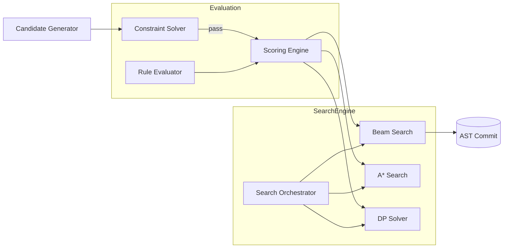

# Scoring and Search Specification

**Version:** 0.1  
**Status:** Draft  
**Agent:** Rule Engine Research Agent  
**Dependencies:** [rule-dsl.md](rule-dsl.md), [constraint.md](constraint.md), `docs/00-overview/acas-v0.1.md`, `docs/01-architecture/pipeline.md`, `research/rule-engine-research-notes.md`

---

## Table of Contents

1. [Background](#1-background)
2. [Existing Solutions](#2-existing-solutions)
3. [Academic / Theoretical Foundation](#3-academic--theoretical-foundation)
4. [Engineering Analysis](#4-engineering-analysis)
5. [Comparison of Approaches](#5-comparison-of-approaches)
6. [Recommended Solution](#6-recommended-solution)
7. [Architecture](#7-architecture)
8. [Data Structures](#8-data-structures)
9. [Algorithms](#9-algorithms)
10. [Interfaces](#10-interfaces)
11. [Parameter Mappings](#11-parameter-mappings)
12. [Explainability Model](#12-explainability-model)
13. [Future Expansion](#13-future-expansion)
14. [Open Questions](#14-open-questions)
15. [References](#15-references)

**Appendices:** [A. Beam Search Pseudocode](#appendix-a-beam-search-pseudocode) · [B. A* Specification](#appendix-b-a-search-specification) · [C. DP Specification](#appendix-c-dynamic-programming-specification)

---

## 1. Background

### 1.1 Purpose

This specification defines:

1. **Scoring function** — formal evaluation of candidate AST states
2. **Search algorithms** — beam search (primary), A*, dynamic programming
3. **Search state representation** — data carried through exploration
4. **Provenance recording** — traceability during search
5. **Parameter → weight mapping** — user control over scoring behavior

Per **Principle 3 (Generation Is Search):** composition is constraint-driven search, not random sampling.

### 1.2 Core Equation

From ACAS §7.3 and deep-research-report:

```
eval_score = Σ (weight_i × indicator_i) − Σ (penalty_j × violation_j)
```

Where:

- `indicator_i = 1` when soft rule *i* satisfied (then-branch), else 0 or fractional for partial match
- `violation_j = 1` when soft rule *j* triggered penalty (else-branch or explicit violation)
- `weight_i`, `penalty_j` derive from user parameters — **never hardcoded**

Hard constraints do not enter the score — they prune before scoring ([constraint.md](constraint.md)).

### 1.3 Search Placement in Pipeline

| Stage | Search Algorithm | Typical Beam Width |
|-------|------------------|-------------------|
| Structure Planning | DP (optional) | N/A |
| Harmony Skeleton | DP / beam | 8–16 |
| Melody | **Beam search** | 16–32 |
| Counterpoint | **Beam search** | 8–16 |
| Bass | Beam search | 8 |
| Theme Planning | A* (optional) | N/A |
| Drums | Greedy + local search | N/A |

---

## 2. Existing Solutions

### 2.1 OpenMusic / Strasheela Search

Strasheela uses Oz distribution strategies: first-fail, value ordering. Global backtracking. **Lesson:** separate search strategy from rules; Aurora uses explicit beam/A*/DP modules.

### 2.2 Markov / Probabilistic Generation

Score = log probability. Fast sampling but no guarantees. **Rejected** as primary (ADR-002 search-over-sampling implied in deep research).

### 2.3 Neural Sequence Models

Autoregressive models with implicit scoring. **Role:** optional AI plugin proposes candidates; Aurora scoring still selects.

### 2.4 Classical AI Search

Beam search, A*, DP well-understood. **Selected** as primary infrastructure.

---

## 3. Academic / Theoretical Foundation

### 3.1 Scoring as Multi-Objective Optimization

Music generation scoring is a **weighted sum scalarization** of multiple objectives:

```text
f(a) = w · g(a)   where g(a) = (g_1(a), ..., g_k(a))
```

Each soft rule contributes one dimension. Parameter changes alter *w*, not rule semantics.

**Limitation:** Pareto-optimal trade-offs not captured. Acceptable for v0.1; future: Pareto beam for advanced users.

### 3.2 Admissible Heuristics (A*)

For A* to guarantee optimal paths:

```text
h(n) ≤ h*(n)   (heuristic never overestimates remaining score potential)
f(n) = g(n) + h(n)
```

Music-specific heuristics are **difficult** — melodic "potential" is subjective. A* used only where admissible heuristics exist (structural planning, motif placement).

### 3.3 Optimal Substructure (DP)

Harmony skeleton with fixed harmonic rhythm exhibits optimal substructure: optimal progression for measures 1..N extends optimal 1..N-1 + best transition. DP applicable when state space discretized.

---

## 4. Engineering Analysis

### 4.1 Performance Targets

| Operation | Target (desktop CPU) |
|-----------|---------------------|
| Soft rule eval per candidate | < 2 ms (20 rules) |
| Beam step (width 16, 8 candidates each) | < 250 ms |
| Full 8-bar melody line | < 5 s |
| Structure DP (32 bars) | < 1 s |

Parallelize beam branch evaluation via Rayon thread pool (architecture §5).

### 4.2 Correctness vs Quality Trade-off

| Mode | Beam Width | Use Case |
|------|------------|----------|
| Preview | 4 | Real-time parameter tweak |
| Standard | 16 | Default generation |
| High quality | 32–64 | Export-ready |
| Research | 128+ | Offline batch |

### 4.3 Randomness (Principle 3)

When tie-breaking or candidate ordering needs variety:

```text
seed = hash(composition_id, stage, param_seed)
temperature = param(search.temperature)  // 0 = deterministic
```

Deterministic mode: `temperature = 0`, ties broken by stable rule ID order.

---

## 5. Comparison of Approaches

### 5.1 Search Algorithm Matrix

| Algorithm | Completeness | Optimality | Memory | Best For | Aurora Role |
|-----------|--------------|------------|--------|----------|-------------|
| **Beam Search** | No | Local optimum | O(b×w) | Sequential note generation | **Primary** |
| **A*** | Yes (with adm. h) | Global (if h adm.) | O(states) | Planned structure | Optional |
| **DP** | Yes on discretized space | Global on model | O(states×choices) | Harmonic skeleton | Skeleton stages |
| **Greedy** | No | No | O(1) | Drums, decoration | Secondary |
| **Best-first** | No | No | O(states) | Similar to beam | Alias |
| **MCMC** | asymptotic | sample quality | varies | Style exploration | **Rejected** v0.1 |

### 5.2 Pure CP vs Weighted Scoring vs SMT (Search Perspective)

| Paradigm | Search Integration | Aurora |
|----------|-------------------|--------|
| Pure CP | Embedded in solver backtracking | Hard constraints only |
| Weighted scoring | Explicit beam ranks by score | **Primary ranking** |
| SMT | Single shot `optimize` | Validation only |

### 5.3 Why Beam Search Primary

See [ADR-003](../../decisions/ADR-003-search-algorithm-primary.md). Summary:

1. Matches sequential generation model (note-by-note)
2. Bounded memory via beam width parameter
3. Natural provenance (beam rank, parent state)
4. Parallelizable branch evaluation
5. Parameter-controllable quality/speed trade-off
6. Does not require admissible heuristic (unlike A*)

---

## 6. Recommended Solution

### 6.1 Scoring Pipeline

```text
CandidatePatch (passed hard constraints)
       ↓
Load active soft rules for stage
       ↓
For each rule: evaluate when/then/else
       ↓
Accumulate score_delta, reasons
       ↓
eval_score = parent.eval_score + Σ deltas
       ↓
Return ScoredCandidate { eval_score, provenance[], rule_results[] }
```

### 6.2 Normalized Score (Optional Display)

Internal score is unbounded sum. For UI probability display:

```text
display_score = sigmoid(eval_score / temperature_scale)
```

Export and search use raw `eval_score`.

### 6.3 Search Engine Modes

```rust
enum SearchMode {
    Beam { width: usize },
    AStar { heuristic: HeuristicFn },
    DynamicProgramming { state_encoder: StateEncoder },
    Greedy,
}
```

Pipeline stages declare default mode in their module specs.

---

## 7. Architecture

### 7.1 Component Diagram



### 7.2 Scoring Engine Internals

```text
ScoringEngine
├── rule_subset: SoftRuleSet
├── parameter_snapshot: Params
├── emotion_deltas: WeightDeltaTable
└── evaluate(ctx) → ScoreResult
```

### 7.3 Search Orchestrator

Selects algorithm from stage config + parameters:

```text
if stage.search_mode == Auto:
    if stage in [Melody, Counterpoint, Bass]:
        mode = Beam(width = param(search.beam_width))
    elif stage == StructurePlanning && param(form.optimize):
        mode = DP
    else:
        mode = Greedy
```

---

## 8. Data Structures

### 8.1 Search State

```text
SearchState
├── id: StateId                    // uuid for provenance linking
├── ast_snapshot: AstSnapshot      // copy-on-write
├── step_index: u32                // search step (usually one beat or event)
├── eval_score: f64                // accumulated soft score
├── heuristic_estimate: f64        // for A* only
├── applied_rules: Vec<RuleEvalResult>  // cumulative (or delta per step)
├── beam_rank: Option<u32>         // set after beam prune
├── parent: Option<StateId>
├── depth: u32
└── metadata: StageMeta            // chord context, motif id, etc.
```

### 8.2 Scored Candidate

```text
ScoredCandidate
├── patch: CandidatePatch
├── eval_score: f64
├── step_deltas: Vec<RuleEvalResult>
└── combined_score: f64            // eval_score + heuristic (A*)
```

### 8.3 Beam Frame

```text
BeamFrame
├── step: u32
├── states: Vec<SearchState>       // width ≤ beam_width
└── stats: BeamStats               // pruned count, avg score
```

### 8.4 Provenance Record (Committed to AST)

When search selects winning state, provenance copied to events:

```text
Provenance
├── reason: String                 // primary reason (highest |delta| rule)
├── rule_id: RuleId
├── score_delta: f64
├── eval_score_running: f64
├── search_step: u32
├── beam_rank: u32
├── parent_state_id: StateId
├── search_mode: String            // "beam", "astar", "dp"
└── alternatives_rejected: u32     // count pruned at this step
```

### 8.5 DP Table Entry

```text
DpCell
├── state_key: DpStateKey          // discretized harmonic state
├── eval_score: f64
├── backpointer: DpStateKey
└── decision: Decision             // chord chosen, etc.
```

---

## 9. Algorithms

### 9.1 Scoring Function Formalization

#### 9.1.1 Indicator Rules (Rewards)

For soft rule *i* with weight `w_i(param)`:

```text
indicator_i(a) = 1  if when_i(a) ∧ then_pred_i(a)
               = α  if partial_match_i(a)     // 0 < α < 1, optional
               = 0  otherwise

reward_i(a) = w_i × indicator_i(a)
```

#### 9.1.2 Penalty Rules

```text
violation_j(a) = 1  if when_j(a) ∧ ¬then_pred_j(a)  // else-branch
               = β  if severity_j(a)                  // graded penalties

penalty_j(a) = p_j × violation_j(a)
```

#### 9.1.3 Total Score

```text
eval_score(a) = Σ_i reward_i(a) − Σ_j penalty_j(a)
```

#### 9.1.4 Emotion and Style Modifiers

```text
w_i_effective = w_i × (1 + δ_emotion[category(i)]) × style_multiplier(i)
```

Applied in ScoringEngine before evaluation.

#### 9.1.5 Worked Example

Parameters: `harmony.chord_tone_weight=15`, `melody.leap_limit` soft penalty=5

Candidate: chord tone on strong beat, leap of M6 otherwise stepwise preference satisfied

```text
HARM-001: indicator=1, reward = 15
VLED-003: indicator=1, reward = 10
VLED-010: violation=1 (large leap), penalty = 5

eval_score = 15 + 10 - 5 = 20
```

### 9.2 Beam Search Algorithm (Primary)

**Input:** initial SearchState, candidate generator, constraint solver, scorer, beam_width *w*

**Output:** best SearchState after terminal step

See [Appendix A](#appendix-a-beam-search-pseudocode).

**Key properties:**

- Maintains top-*w* states by `eval_score` each step
- Hard constraints prune before scoring
- Parent pointers enable provenance backtrace
- Terminal: all states reach phrase/measure end

**Tie-breaking:** higher score wins; ties broken by `state.id` lexicographic (deterministic).

**Diversity (optional):** `search.diversity_lambda` penalizes states too similar to existing beam members (n-gram on pitch sequence).

### 9.3 A* Search Algorithm (Alternative)

Used when:

- Admissible heuristic available
- State space moderate (theme placement, section ordering)

```text
f(n) = g(n) + h(n)
g(n) = -eval_score(n)   // cost = negative reward, or use eval_score directly with max-heap
```

**Heuristic examples:**

| Stage | h(n) |
|-------|------|
| Motif placement | remaining_slots × max_motif_reward |
| Cadence planning | distance_to_phrase_end × cadence_weight |

**Admissibility:** heuristic must not overestimate remaining achievable reward. Conservative estimates only.

See [Appendix B](#appendix-b-a-search-specification).

### 9.4 Dynamic Programming (Alternative)

**Applicable when:**

- Finite state space per step
- Optimal substructure holds
- No need for beam approximation

**Use cases in Aurora:**

1. **Harmony skeleton:** states = (roman_numeral, inversion), transitions = allowed progressions
2. **Rhythmic grid selection:** states = pattern id, cost = style mismatch
3. **Form template:** states = section type sequence

```text
dp[0][initial] = 0
for t in 1..T:
    for state in States[t]:
        dp[t][state] = max over prev (dp[t-1][prev] + transition_score(prev, state))
        backpointer[t][state] = argmax prev
```

See [Appendix C](#appendix-c-dynamic-programming-specification).

### 9.5 Algorithm Selection Guide

```text
                    ┌─────────────────┐
                    │ Sequential note  │
                    │ generation?      │
                    └────────┬────────┘
                             │ yes
                             ▼
                      Beam Search ★
                             │ no
                             ▼
                    ┌─────────────────┐
                    │ Discretized     │
                    │ finite states?  │
                    └────────┬────────┘
                      yes    │    no
                       ▼     │     ▼
                      DP      │   Admissible h?
                              │     yes → A*
                              │     no  → Beam or Greedy
```

---

## 10. Interfaces

### 10.1 Scoring Engine API

```rust
trait ScoringEngine {
    fn evaluate(
        &self,
        snapshot: &AstSnapshot,
        patch: &CandidatePatch,
        parent_score: f64,
    ) -> ScoreResult;

    fn evaluate_batch(&self, ...) -> Vec<ScoreResult>;
}
```

### 10.2 Search Engine API

```rust
trait SearchEngine {
    fn run_beam(
        &self,
        config: BeamConfig,
        initial: SearchState,
        terminal: TerminalCondition,
    ) -> SearchResult;

    fn run_astar(&self, config: AStarConfig, ...) -> SearchResult;

    fn run_dp(&self, config: DpConfig, ...) -> DpResult;
}

struct SearchResult {
    best_state: SearchState,
    trace: SearchTrace,
    stats: SearchStats,
}
```

### 10.3 Pipeline Stage Hook

```rust
trait SearchableStage {
    fn search_config(&self, params: &Parameters) -> SearchConfig;
    fn commit_winner(&self, state: SearchState, ast: &mut Composition);
}
```

---

## 11. Parameter Mappings

### 11.1 Search Parameters

| Parameter | Default | Range | Effect |
|-----------|---------|-------|--------|
| `search.beam_width` | 16 | 1–128 | Beam size *w* |
| `search.temperature` | 0.0 | 0–2 | Tie/randomness |
| `search.max_iterations` | 10000 | 100–1M | Safety cap |
| `search.mode` | auto | auto/beam/astar/dp/greedy | Force algorithm |
| `search.diversity_lambda` | 0.0 | 0–1 | Beam diversity penalty |
| `search.parallel_branches` | true | bool | Rayon parallel eval |
| `search.debug_provenance` | false | bool | Verbose trace |

### 11.2 User Parameter → Weight Mapping (Full Table)

Extends deep-research-report §2.2 and ACAS §6.

| User Parameter | Internal Weight(s) | Rule IDs |
|----------------|-------------------|----------|
| `mode.key`, `mode.mode` | Scale propagator; HARM diatonic rules | HARM-050 |
| `emotion.valence` | δ on major/minor preference rules | HARM-020..030 |
| `emotion.arousal` | Tempo map; leap weights | VLED-010 |
| `harmony.complexity` | Extension chord weights | HARM-010, JAZZ-* |
| `harmony.dissonance_tolerance` | Non-chord tone penalties | HARM-001 else |
| `harmony.cadence_strength` | Cadence rewards | FORM-001, HARM-015 |
| `melody.leap_limit_semitones` | Leap penalty threshold | VLED-010 |
| `melody.ornament_density` | Ornament rules | MOTI-005 |
| `counterpoint.strictness` | Hard/soft mode selection | CONT-* |
| `counterpoint.parallel_penalty` | Soft parallel penalty | CONT-001-soft |
| `voice.stepwise_preference` | Stepwise reward | VLED-003 |
| `rhythm.syncopation` | Syncopation rules | RHYT-005 |
| `rhythm.density` | Rest penalty | RHYT-008 |
| `form.repetition_ratio` | Motif recurrence | MOTI-001 |
| `form.theme_count` | Search depth; A* branching | — |
| `register.melody_min/max` | Hard register | REG-001 |
| `drums.density` | Drum hit rewards | DRUM-* |
| `search.beam_width` | Algorithm (not weight) | — |

### 11.3 Mapping Function Pattern

```text
weight = base(param) × category_scale × (1 + emotion_delta)

where base(param) = lerp(min_weight, max_weight, normalize(param))
```

Example:

```text
parallel_penalty = lerp(0, 100, counterpoint.strictness) × param(counterpoint.parallel_penalty) / 100
```

No magic constants — `min_weight`, `max_weight` defined in parameter schema defaults.

---

## 12. Explainability Model

### 12.1 During Search

Each `SearchState` maintains cumulative `applied_rules`. On commit:

1. Walk parent chain to step where each event added
2. Attach step's `RuleEvalResult[]` to event provenance
3. Select primary `reason` = rule with largest |score_delta| at that step

### 12.2 Search Trace (Debug)

```text
SearchTrace
├── mode: "beam"
├── beam_width: 16
├── frames: BeamFrame[]
├── rejections: RejectionLog[]
└── winner_path: StateId[]
```

### 12.3 Inspector Views

| View | Data Source |
|------|-------------|
| Why this note? | Event.provenance |
| What alternatives? | SearchTrace.rejections + beam frame |
| Score breakdown | Sum RuleEvalResult by category |
| Parameter influence | Counterfactual: re-eval with perturbed param |

### 12.4 Provenance Recording Algorithm

```text
function commit_search_result(winner, ast):
    path = backtrace(winner)
    for (state, patch) in path:
        for event in patch.nodes_to_add:
            primary = argmax(|delta|, state.step_deltas)
            event.provenance = {
                reason: primary.reason,
                rule_id: primary.rule_id,
                score_delta: primary.score_delta,
                eval_score_running: state.eval_score,
                search_step: state.step_index,
                beam_rank: state.beam_rank,
                parent_state_id: state.parent,
                search_mode: "beam"
            }
            ast.attach(event)
```

---

## 13. Future Expansion

| Feature | Description |
|---------|-------------|
| Pareto beam | Maintain non-dominated objective vectors |
| Anytime beam | Return best-so-far on timeout |
| Learned heuristic | AI plugin provides h(n) for A* |
| Monte Carlo rollouts | Estimate future score for beam ranking |
| Cross-stage search | Joint melody + harmony (expensive) |

---

## 14. Open Questions

1. Normalize scores across stages for global comparison?
2. Maximum provenance chain depth stored per event?
3. Store full beam frame in project file or discard after generation?
4. DP state explosion limit for jazz harmony?

---

## 15. References

- [Rule DSL](rule-dsl.md)
- [Constraint System](constraint.md)
- [ADR-003: Beam Search Primary](../../decisions/ADR-003-search-algorithm-primary.md)
- Deep Research Report §2.2 — scoring and search
- ACAS v0.1 §6, §7
- `docs/00-overview/philosophy.md` — Principle 3
- Pearl, J. *Heuristics* — A* foundations
- Anders, T. (2007) — constraint-based search strategies

---

## Appendix A: Beam Search Pseudocode

```text
function beam_search(initial, generator, constraints, scorer, width, terminal):
    beam = [initial]
    trace = []

    while not all(s in terminal for s in beam):
        candidates = []

        for state in beam parallel:
            for patch in generator.generate(state):
                if constraints.check(state.snapshot, patch) fails:
                    trace.log_rejection(state, patch)
                    continue

                score_result = scorer.evaluate(state, patch)
                child = state.extend(patch, score_result)

                candidates.append(child)

        sort candidates by eval_score descending

        // Optional diversity penalty
        if diversity_lambda > 0:
            candidates = rerank_with_diversity(candidates, diversity_lambda)

        beam = candidates[0 : width]

        for rank, state in enumerate(beam):
            state.beam_rank = rank

        trace.push_frame(beam)

        if candidates empty:
            raise SearchExhausted(trace)

    return argmax(beam, eval_score), trace
```

---

## Appendix B: A* Search Specification

```text
function astar(initial, generator, constraints, scorer, heuristic, terminal):
    open = PriorityQueue()  // min-heap on f = g + h
    g_score[initial] = initial.eval_score
    open.push(initial, f = -initial.eval_score + heuristic(initial))

    while open not empty:
        current = open.pop()

        if terminal(current):
            return reconstruct_path(current)

        for patch in generator.generate(current):
            if !constraints.check(current, patch): continue

            result = scorer.evaluate(current, patch)
            child = current.extend(patch, result)

            tentative_g = result.eval_score

            if tentative_g > g_score.get(child, -inf):
                g_score[child] = tentative_g
                child.parent = current.id
                f = -tentative_g + heuristic(child)  // maximize score → negate for min-heap
                open.push(child, f)

    raise SearchExhausted
```

**Note:** Aurora maximizes `eval_score`; standard A* minimizes cost. Negation maps between conventions.

---

## Appendix C: Dynamic Programming Specification

### C.1 Harmony Skeleton DP

```text
States[t] = valid roman numerals at measure t
Score[t][s] = max score of progression ending in s at t

Score[0][I] = 0
for t in 1..T:
    for s in States[t]:
        Score[t][s] = max over s' in States[t-1] where transition(s', s) allowed:
            Score[t-1][s'] + harmonic_score(s', s, params)
        Back[t][s] = argmax s'

Recover: backtrack from argmax_s Score[T][s]
```

### C.2 Complexity

```text
Time:  O(T × |S|² × rule_eval)
Space: O(T × |S|)
```

For typical pop progressions: |S| ≈ 7 diatonic functions → tractable.

---

*End of Scoring and Search Specification v0.1*
