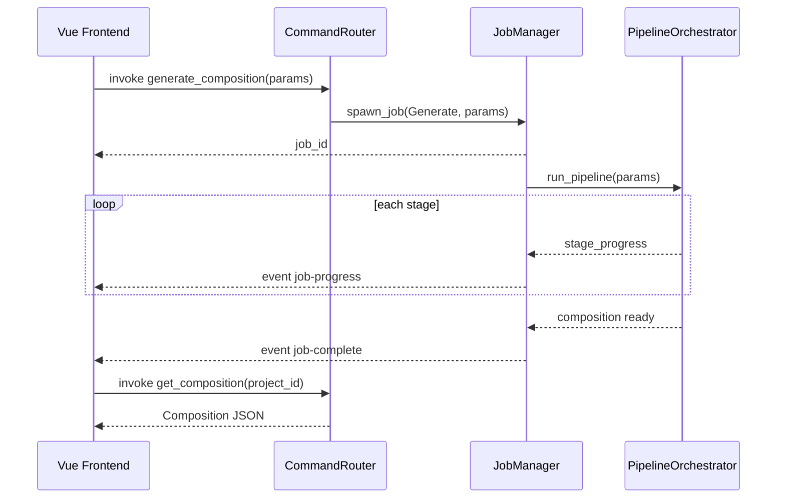

# Tauri Backend & IPC Specification

**Version:** 0.1  
**Status:** Draft  
**Agent:** Plugin & UI Research Agent  
**Dependencies:** [architecture.md](../01-architecture/architecture.md), [ast.md](../02-music-model/ast.md), [api.md](../07-plugin/api.md), [ADR-002](../decisions/ADR-002-vue3-frontend.md)

---

## Table of Contents

1. [Background](#1-background)
2. [Existing Solutions](#2-existing-solutions)
3. [Academic / Theoretical Foundation](#3-academic--theoretical-foundation)
4. [Engineering Analysis](#4-engineering-analysis)
5. [Comparison of Approaches](#5-comparison-of-approaches)
6. [Recommended Solution](#6-recommended-solution)
7. [Architecture](#7-architecture)
8. [Data Structures](#8-data-structures)
9. [Algorithms](#9-algorithms)
10. [Interfaces](#10-interfaces)
11. [Parameter Mappings](#11-parameter-mappings)
12. [Explainability Model](#12-explainability-model)
13. [Future Expansion](#13-future-expansion)
14. [Open Questions](#14-open-questions)
15. [References](#15-references)

---

## 1. Background

The Tauri shell is Aurora Composer's **Layer 4 Application Services** — the bridge between the Vue 3 frontend and the Rust composition engine. It handles IPC command routing, async job management, project persistence, plugin hosting, and event emission to the UI.

### 1.1 Problem Statement

The backend must:

- Expose a **typed, versioned command API** to the frontend
- Run **long-running generation jobs** without blocking the UI
- Stream **progress events** during pipeline execution
- Transfer **AST data** efficiently between Rust and TypeScript
- Enforce **security boundaries** (no direct engine access from frontend)
- Support **cancellation** of in-flight jobs

### 1.2 Scope

- Tauri 2.x command definitions
- IPC protocol (request/response + events)
- Async job manager
- Event bus for progress and state changes
- Error serialization

---

## 2. Existing Solutions

### 2.1 Tauri 1.x/2.x Command Pattern

`#[tauri::command]` functions invoked via `invoke()` from frontend. Async commands supported with `async fn`.

**Relevant:** Primary IPC mechanism; serde JSON serialization.

### 2.2 Electron IPC

`ipcMain` / `ipcRenderer` with channel-based messaging.

**Relevant:** Event streaming patterns.

**Insufficient:** Not Rust-native; heavier runtime.

### 2.3 gRPC / WebSocket Backend

Separate server process with streaming RPC.

**Relevant:** Progress streaming.

**Insufficient:** Overkill for desktop monolith; Tauri events sufficient.

### 2.4 Redux-Saga / Job Queue Patterns

Frontend job polling and state machines.

**Relevant:** Job status UX patterns.

---

## 3. Academic / Theoretical Foundation

### 3.1 Request-Response vs Event-Driven

Hybrid model (Fowler, 2011): commands for discrete operations; events for long-running progress. Aurora uses commands to **start** jobs and events to **report** progress.

### 3.2 Capability-Based Security

Tauri 2 capabilities restrict which commands frontend can invoke. Aurora defines `default` and `plugin-admin` capability sets.

---

## 4. Engineering Analysis

| Criterion | Design Response |
|-----------|-----------------|
| Latency | Commands < 50ms except AST transfer |
| Throughput | Chunk large compositions |
| Reliability | Job cancellation, error recovery |
| Type safety | Shared TypeScript types from JSON schema |
| Testability | Headless Tauri test harness |

---

## 5. Comparison of Approaches

| IPC Pattern | Pros | Cons | Verdict |
|-------------|------|------|---------|
| Sync invoke only | Simple | Blocks UI on generation | Rejected |
| Async invoke + events | Non-blocking, progress | Slightly complex | **Selected** |
| Shared memory | Fast | Platform-specific, unsafe | Rejected |
| WebSocket loopback | Streaming | Extra port, complexity | Rejected |

---

## 6. Recommended Solution

**Tauri 2.x** with:

1. **Synchronous commands** for CRUD, queries, small patches
2. **Async commands** returning `job_id` for generation/export
3. **Tauri events** for `job-progress`, `job-complete`, `job-error`, `ast-changed`
4. **JSON** serialization (serde) for all payloads
5. **Capability files** restricting command access

---

## 7. Architecture

### 7.1 Layer Placement

```text
┌─────────────────────────────────────────┐
│ Vue 3 Frontend                          │
│  invoke(command) / listen(event)        │
└──────────────────┬──────────────────────┘
                   │ Tauri IPC
┌──────────────────▼──────────────────────┐
│ CommandRouter                           │
│  ├── ProjectCommands                    │
│  ├── CompositionCommands                │
│  ├── GenerationCommands                 │
│  ├── ExportCommands                     │
│  ├── PluginCommands                     │
│  └── ProvenanceCommands                 │
├─────────────────────────────────────────┤
│ JobManager (tokio runtime)              │
│  ├── job queue                          │
│  ├── cancellation tokens                │
│  └── progress emitter                   │
├─────────────────────────────────────────┤
│ ProjectStore · PluginHost · AstStore  │
└──────────────────┬──────────────────────┘
                   │
┌──────────────────▼──────────────────────┐
│ Composition Engine (Pipeline, Rules)    │
└─────────────────────────────────────────┘
```

### 7.2 IPC Flow Diagram



### 7.3 Module Registration (Tauri)

```rust
// src-tauri/src/lib.rs
#[cfg_attr(mobile, tauri::mobile_entry_point)]
pub fn run() {
    tauri::Builder::default()
        .manage(AppState::default())
        .invoke_handler(tauri::generate_handler![
            // Project
            commands::project::create_project,
            commands::project::open_project,
            commands::project::save_project,
            commands::project::close_project,
            commands::project::list_recent_projects,
            // Composition
            commands::composition::get_composition,
            commands::composition::apply_patch,
            commands::composition::undo,
            commands::composition::redo,
            commands::composition::validate_ast,
            // Generation
            commands::generation::generate_composition,
            commands::generation::regenerate_section,
            commands::generation::preview_bars,
            commands::generation::cancel_job,
            commands::generation::get_job_status,
            // Export
            commands::export::project_to_ir,
            commands::export::export_musicxml,
            commands::export::export_midi,
            commands::export::export_abc,
            commands::export::export_pdf,
            // Plugins
            commands::plugin::list_plugins,
            commands::plugin::install_plugin,
            commands::plugin::enable_plugin,
            commands::plugin::disable_plugin,
            commands::plugin::get_style_presets,
            // Provenance
            commands::provenance::get_event_provenance,
            commands::provenance::get_provenance_chain,
            // Parameters
            commands::params::get_parameters,
            commands::params::set_parameters,
        ])
        .run(tauri::generate_context!())
        .expect("error running tauri application");
}
```

---

## 8. Data Structures

### 8.1 AppState

```rust
pub struct AppState {
    pub project_store: Mutex<ProjectStore>,
    pub job_manager: JobManager,
    pub plugin_host: Mutex<PluginHost>,
    pub config: ConfigStore,
}
```

### 8.2 Job Types

```rust
#[derive(Clone, Debug, Serialize, Deserialize)]
pub struct JobId(pub String);

#[derive(Clone, Debug, Serialize, Deserialize)]
pub enum JobKind {
    GenerateComposition,
    RegenerateSection { section_id: NodeId },
    PreviewBars { bar_count: u16 },
    Export { format: ExportFormat },
    Validate,
}

#[derive(Clone, Debug, Serialize, Deserialize)]
pub enum JobStatus {
    Queued,
    Running { stage: String, percent: f32 },
    Completed { result: JobResult },
    Cancelled,
    Failed { error: CommandError },
}

#[derive(Clone, Debug, Serialize, Deserialize)]
pub enum JobResult {
    Composition { project_id: String },
    Export { path: String },
    Validation { report: ValidationReport },
}
```

### 8.3 IPC Envelope

```typescript
// Shared protocol types (generated from JSON schema)
interface CommandError {
  code: string;
  message: string;
  details?: Record<string, unknown>;
}

interface InvokeResult<T> {
  ok: true;
  data: T;
} | {
  ok: false;
  error: CommandError;
}
```

### 8.4 Event Payloads

```rust
#[derive(Clone, Debug, Serialize, Deserialize)]
#[serde(tag = "type")]
pub enum AuroraEvent {
    JobProgress {
        job_id: JobId,
        stage_name: String,
        stage_index: u8,
        percent: f32,
        message: String,
    },
    JobComplete {
        job_id: JobId,
        result: JobResult,
    },
    JobError {
        job_id: JobId,
        error: CommandError,
    },
    AstChanged {
        project_id: String,
        patch_id: PatchId,
    },
    PluginStateChanged {
        plugin_id: String,
        state: PluginState,
    },
}
```

---

## 9. Algorithms

### 9.1 Job Spawn

```text
function spawn_job(kind, params, app_handle):
    job_id = generate_uuid()
    cancel_token = new CancellationToken()
    jobs.insert(job_id, { status: Queued, token: cancel_token })
    tokio.spawn:
        try:
            jobs[job_id].status = Running
            result = execute_job(kind, params, cancel_token, progress_callback)
            emit JobComplete(job_id, result)
        catch Cancelled:
            emit JobCancelled(job_id)
        catch err:
            emit JobError(job_id, err)
    return job_id
```

### 9.2 Progress Callback

```text
function progress_callback(stage, index, percent, message):
    emit_event("aurora://job-progress", JobProgress {
        job_id, stage_name: stage, stage_index: index,
        percent, message
    })
```

### 9.3 Cancellation

```text
function cancel_job(job_id):
    job = jobs.get(job_id)
    if job exists and job.status is Running:
        job.token.cancel()
        job.status = Cancelled
```

Pipeline checks `cancel_token.is_cancelled()` between stages and within search loops (every N iterations).

### 9.4 AST Transfer Optimization

For compositions > 1 MB JSON:

```text
function get_composition(project_id, options):
    if options.slice:
        return subtree only
    if options.cbor:
        return CBOR bytes (base64 in JSON wrapper)
    return full JSON
```

---

## 10. Interfaces

### 10.1 Complete Command Catalog

#### Project Commands

| Command | Args | Returns | Async |
|---------|------|---------|-------|
| `create_project` | `{ name, template? }` | `{ project_id }` | No |
| `open_project` | `{ path }` | `{ project_id, metadata }` | No |
| `save_project` | `{ project_id, path? }` | `{ path }` | No |
| `close_project` | `{ project_id }` | `()` | No |
| `list_recent_projects` | — | `RecentProject[]` | No |
| `get_project_metadata` | `{ project_id }` | `ProjectMetadata` | No |

#### Composition Commands

| Command | Args | Returns | Async |
|---------|------|---------|-------|
| `get_composition` | `{ project_id, slice?, format? }` | `Composition` | No |
| `get_composition_summary` | `{ project_id }` | `CompositionSummary` | No |
| `apply_patch` | `{ project_id, patch }` | `ValidationReport` | No |
| `undo` | `{ project_id }` | `Patch` | No |
| `redo` | `{ project_id }` | `Patch` | No |
| `validate_ast` | `{ project_id }` | `ValidationReport` | No |
| `get_timeline` | `{ project_id }` | `TimelineModel` | No |
| `get_measure_events` | `{ project_id, measure_number, voice_id? }` | `Event[]` | No |

#### Generation Commands

| Command | Args | Returns | Async |
|---------|------|---------|-------|
| `generate_composition` | `{ project_id, parameters }` | `{ job_id }` | Yes |
| `regenerate_section` | `{ project_id, section_id, parameters? }` | `{ job_id }` | Yes |
| `preview_bars` | `{ project_id, parameters, bar_count }` | `{ job_id }` | Yes |
| `cancel_job` | `{ job_id }` | `()` | No |
| `get_job_status` | `{ job_id }` | `JobStatus` | No |
| `list_active_jobs` | `{ project_id }` | `JobStatus[]` | No |

#### Export Commands

| Command | Args | Returns | Async |
|---------|------|---------|-------|
| `project_to_ir` | `{ project_id }` | `MusicIr` | No |
| `export_musicxml` | `{ project_id, path }` | `{ path }` | Yes |
| `export_midi` | `{ project_id, path }` | `{ path }` | Yes |
| `export_abc` | `{ project_id, path }` | `{ path }` | Yes |
| `export_pdf` | `{ project_id, path }` | `{ path }` | Yes |
| `export_custom` | `{ project_id, plugin_id, path }` | `{ path }` | Yes |

#### Plugin Commands

| Command | Args | Returns | Async |
|---------|------|---------|-------|
| `list_plugins` | — | `PluginDescriptor[]` | No |
| `get_plugin` | `{ plugin_id }` | `PluginDescriptor` | No |
| `install_plugin` | `{ path }` | `PluginDescriptor` | No |
| `uninstall_plugin` | `{ plugin_id }` | `()` | No |
| `enable_plugin` | `{ project_id, plugin_id }` | `()` | No |
| `disable_plugin` | `{ project_id, plugin_id }` | `()` | No |
| `get_plugin_config` | `{ plugin_id }` | `JsonValue` | No |
| `set_plugin_config` | `{ plugin_id, config }` | `()` | No |
| `get_style_presets` | — | `StylePreset[]` | No |

#### Provenance Commands

| Command | Args | Returns | Async |
|---------|------|---------|-------|
| `get_event_provenance` | `{ project_id, node_id }` | `Provenance` | No |
| `get_provenance_chain` | `{ project_id, node_id }` | `ProvenanceChain` | No |
| `get_rule_details` | `{ rule_id }` | `RuleDefinition` | No |

#### Parameter Commands

| Command | Args | Returns | Async |
|---------|------|---------|-------|
| `get_parameters` | `{ project_id }` | `ParameterSnapshot` | No |
| `set_parameters` | `{ project_id, parameters }` | `ParameterSnapshot` | No |
| `get_parameter_schema` | — | `ParameterSchema` | No |
| `reset_parameters` | `{ project_id, category? }` | `ParameterSnapshot` | No |

**Total: 42 commands**

### 10.2 Frontend Invoke Wrapper

```typescript
// src/lib/tauri/commands.ts
import { invoke } from '@tauri-apps/api/core';
import { listen, type UnlistenFn } from '@tauri-apps/api/event';

export async function generateComposition(
  projectId: string,
  parameters: ParameterSnapshot,
): Promise<JobId> {
  return invoke('generate_composition', { projectId, parameters });
}

export function onJobProgress(
  handler: (payload: JobProgressEvent) => void,
): Promise<UnlistenFn> {
  return listen<JobProgressEvent>('aurora://job-progress', (e) => handler(e.payload));
}
```

### 10.3 Event Subscription Catalog

| Event Name | Payload | When Emitted |
|------------|---------|--------------|
| `aurora://job-progress` | `JobProgress` | During pipeline stage |
| `aurora://job-complete` | `JobComplete` | Job success |
| `aurora://job-error` | `JobError` | Job failure |
| `aurora://job-cancelled` | `{ job_id }` | User cancellation |
| `aurora://ast-changed` | `AstChanged` | Patch applied |
| `aurora://plugin-state-changed` | `PluginStateChanged` | Plugin enable/disable |

### 10.4 Error Codes

| Code | HTTP Analog | Description |
|------|-------------|-------------|
| `PROJECT_NOT_FOUND` | 404 | Invalid project_id |
| `VALIDATION_FAILED` | 422 | AST invariant violation |
| `JOB_NOT_FOUND` | 404 | Invalid job_id |
| `JOB_CANCELLED` | 499 | Cancelled by user |
| `PLUGIN_LOAD_FAILED` | 500 | Plugin binary error |
| `EXPORT_FAILED` | 500 | Format export error |
| `CONSTRAINT_UNSAT` | 422 | Hard constraint failure |

### 10.5 Tauri Capabilities

```json
{
  "identifier": "default",
  "permissions": [
    "core:default",
    "aurora:allow-project-commands",
    "aurora:allow-composition-commands",
    "aurora:allow-generation-commands",
    "aurora:allow-export-commands",
    "aurora:allow-provenance-commands",
    "aurora:allow-parameter-commands"
  ]
}
```

```json
{
  "identifier": "plugin-admin",
  "permissions": [
    "aurora:allow-plugin-commands"
  ]
}
```

---

## 11. Parameter Mappings

Commands accept `ParameterSnapshot` matching ACAS §6 categories. `set_parameters` merges partial updates; full validation on `generate_composition`.

| UI Control | Command | Field |
|------------|---------|-------|
| Emotion sliders | `set_parameters` | `emotion.valence`, etc. |
| Style preset | `set_parameters` + `get_style_presets` | `style.genre` |
| Generate button | `generate_composition` | full snapshot |
| Section regen | `regenerate_section` | section_id + overrides |

---

## 12. Explainability Model

### 12.1 Provenance Commands

`get_provenance_chain` walks `Provenance.parent` links and resolves `rule_ids` to full `RuleDefinition` via rule registry.

```rust
#[derive(Clone, Debug, Serialize, Deserialize)]
pub struct ProvenanceChain {
    pub event_id: NodeId,
    pub entries: Vec<ProvenanceChainEntry>,
}

#[derive(Clone, Debug, Serialize, Deserialize)]
pub struct ProvenanceChainEntry {
    pub provenance: Provenance,
    pub rules: Vec<RuleDefinition>,
    pub display_summary: String,  // "Generated by Harmony Rule #42, Score: +13, Reason: Passing Tone"
}
```

### 12.2 Display Summary Generation (Backend)

```text
function format_provenance_summary(prov, rules):
    rule = rules.first() if rules else null
    rule_label = rule ? "Rule #{rule.id}: {rule.name}" : "Unknown rule"
  score = prov.eval_score.map(|s| format!("{:+.0}", s)).unwrap_or("—")
    reason = prov.explanation.unwrap_or("No explanation")
    return "Generated by: {rule_label}, Score: {score}, Reason: {reason}"
```

Frontend Inspector displays `display_summary` as primary line.

---

## 13. Future Expansion

| Feature | Version |
|---------|---------|
| CBOR IPC for large AST | v0.2 |
| Binary event channel | v0.3 |
| Multi-window sync via events | v0.2 |
| Headless CLI mode (same commands) | Phase 3 |
| Plugin command sandbox | ADR-005 |

---

## 14. Open Questions

| ID | Question | Status |
|----|----------|--------|
| OQ-TAU-1 | Auto-generate TS types from Rust? | `ts-rs` or `specta` — prototype |
| OQ-TAU-2 | Max concurrent jobs per project? | Propose 1 generation + N exports |
| OQ-TAU-3 | Persist job history across restarts? | No for v0.1 |

---

## 15. References

### Internal

- [architecture.md](../01-architecture/architecture.md)
- [ast.md](../02-music-model/ast.md)
- [api.md](../07-plugin/api.md)
- [vue.md](vue.md)
- [ADR-002](../decisions/ADR-002-vue3-frontend.md)

### External

- Tauri 2 Commands: https://v2.tauri.app/develop/calling-rust/
- Tauri 2 Events: https://v2.tauri.app/develop/calling-frontend/
- Tauri 2 Capabilities: https://v2.tauri.app/security/capabilities/

---

*End of Tauri Backend & IPC Specification*
